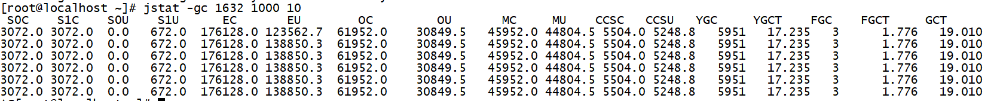
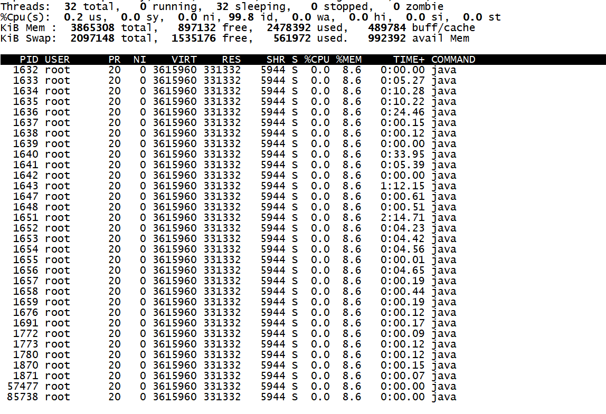
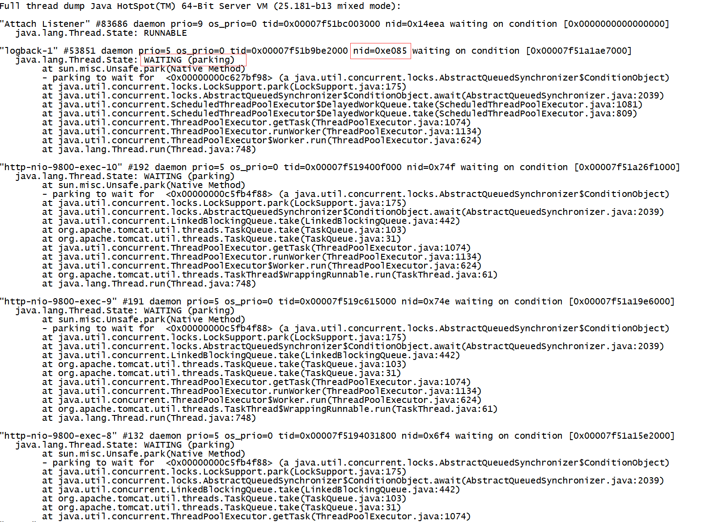
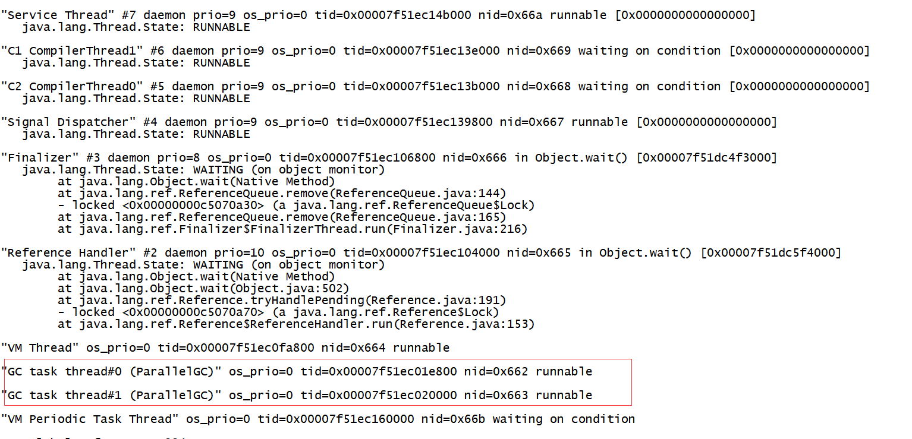
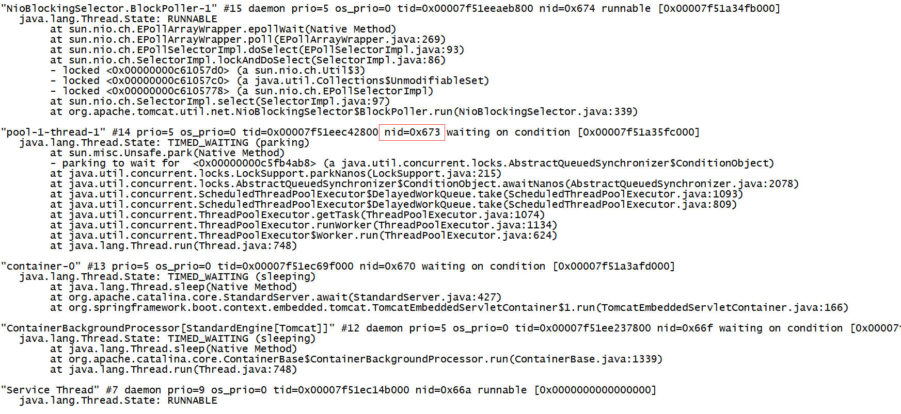

Java本身提供了丰富的工具来帮助开发人员查看和分析GC及JVM内存的状况， 通过这些分析，可以排查程序中内存泄露的问题及调优程序的性能。

# Jstat

Jstat可以分析GC的状况， 还可用于分析编译的状况、CLASS加载情况等。

## 1.查看JVM状态

```sh
[root@localhost ~]# jstat -gc 1632 1000 10 
```

-gc参数表示统计JVM信息， 1000表示统计间隔1秒， 10表示统计10次



各指标参数意义：

- **S0C：**第一个幸存区的大小
- **S1C：**第二个幸存区的大小
- **S0U：**第一个幸存区的使用大小
- **S1U：**第二个幸存区的使用大小
- **EC：**伊甸园区的大小
- **EU：**伊甸园区的使用大小
- **OC：**老年代大小
- **OU：**老年代使用大小
- **MC：**方法区大小
- **MU：**方法区使用大小
- **CCSC:**压缩类空间大小
- **CCSU:**压缩类空间使用大小
- **YGC：**年轻代垃圾回收次数
- **YGCT：**年轻代垃圾回收消耗时间
- **FGC：**老年代垃圾回收次数
- **FGCT：**老年代垃圾回收消耗时间
- **GCT：**垃圾回收消耗总时间

## 2.查看类装载信息

```sh
[root@localhost ~]# jstat -class 1632 1000 10 
```

结果：

```sh
Loaded  Bytes  Unloaded  Bytes     Time   
  7890 14721.3       59    83.3       5.67
  7890 14721.3       59    83.3       5.67
  7890 14721.3       59    83.3       5.67
  7890 14721.3       59    83.3       5.67
  7890 14721.3       59    83.3       5.67
```

## 3.新生代垃圾回收统计

```sh
[root@localhost ~]# jstat -gcnew 1632
 S0C    S1C    S0U    S1U   TT MTT  DSS      EC       EU     YGC     YGCT  
2560.0 2560.0 1464.9    0.0 15  15 2560.0 179200.0  52757.3   5964   17.268
```

- **TT:**对象在新生代存活的次数
- **MTT:**对象在新生代存活的最大次数
- **DSS:**期望的幸存区大小
- **EC：**伊甸园区的大小
- **EU：**伊甸园区的使用大小

## 4.老年代垃圾回收统计

```sh
[root@localhost ~]# jstat -gcold 1632
   MC       MU      CCSC     CCSU       OC          OU       YGC    FGC    FGCT     GCT   
 45952.0  44804.5   5504.0   5248.8     61952.0     31049.5   5966     3    1.776   19.048
```

- **MC：**方法区大小
- **MU：**方法区使用大小
- **CCSC:**压缩类空间大小
- **CCSU:**压缩类空间使用大小
- **OC：**老年代大小
- **OU：**老年代使用大小
- **YGC：**年轻代垃圾回收次数
- **FGC：**老年代垃圾回收次数
- **FGCT：**老年代垃圾回收消耗时间
- **GCT：**垃圾回收消耗总时间

# **jinfo** 

可以查看或修改jvm的运行参数。

## 1.查看JVM运行参数

```shell
[root@localhost ~]# jinfo -flags 1632
Attaching to process ID 1632, please wait...
Debugger attached successfully.
Server compiler detected.
JVM version is 25.181-b13
Non-default VM flags: -XX:CICompilerCount=2 -XX:InitialHeapSize=62914560 -XX:MaxHeapSize=989855744 -XX:MaxNewSize=329777152 -XX:MinHeapDeltaBytes=524288 -XX:NewSize=20971520 -XX:OldSize=41943040 -XX:+UseCompressedClassPointers -XX:+UseCompressedOops -XX:+UseFastUnorderedTimeStamps -XX:+UseParallelGC 
```

## 2.修改JVM参数

```shell
[root@localhost ~]# jinfo -flag PrintGC 1632
-XX:-PrintGC
[root@localhost ~]# jinfo -flag +PrintGC 1632
[root@localhost ~]# jinfo -flag PrintGC 1632 
-XX:+PrintGC
```

# **jmap**

查看统计heap区域对象与dump分析。

## 1.查看堆使用情况

```shell
[root@localhost ~]# jmap -heap 1632
Attaching to process ID 1632, please wait...
Debugger attached successfully.
Server compiler detected.
JVM version is 25.181-b13

using thread-local object allocation.
Parallel GC with 2 thread(s)

Heap Configuration:
   MinHeapFreeRatio         = 0
   MaxHeapFreeRatio         = 100
   MaxHeapSize              = 989855744 (944.0MB)
   NewSize                  = 20971520 (20.0MB)
   MaxNewSize               = 329777152 (314.5MB)
   OldSize                  = 41943040 (40.0MB)
   NewRatio                 = 2
   SurvivorRatio            = 8
   MetaspaceSize            = 21807104 (20.796875MB)
   CompressedClassSpaceSize = 1073741824 (1024.0MB)
   MaxMetaspaceSize         = 17592186044415 MB
   G1HeapRegionSize         = 0 (0.0MB)

Heap Usage:
PS Young Generation
Eden Space:
   capacity = 190316544 (181.5MB)
   used     = 9933952 (9.4737548828125MB)
   free     = 180382592 (172.0262451171875MB)
   5.21969965995179% used
From Space:
   capacity = 3670016 (3.5MB)
   used     = 1343520 (1.281280517578125MB)
   free     = 2326496 (2.218719482421875MB)
   36.60801478794643% used
To Space:
   capacity = 3670016 (3.5MB)
   used     = 0 (0.0MB)
   free     = 3670016 (3.5MB)
   0.0% used
PS Old Generation
   capacity = 63438848 (60.5MB)
   used     = 32798432 (31.279022216796875MB)
   free     = 30640416 (29.220977783203125MB)
   51.700863168259296% used

18502 interned Strings occupying 2407616 bytes.
```

## 2.查看堆中的对象数量与大小

```shell
[root@localhost ~]# jmap -histo 1632 | more

 num     #instances         #bytes  class name
----------------------------------------------
   1:        259244       67097968  [C
   2:          4866       17412160  [I
   3:          1593        7101864  [B
   4:        170087        4082088  java.lang.String
   5:         10410        1981464  [Ljava.lang.Object;
   6:         43831        1051944  java.lang.StringBuilder
   7:         10966         965008  java.lang.reflect.Method
   8:          8498         947416  java.lang.Class
   9:         28358         907456  java.util.concurrent.ConcurrentHashMap$Node
  10:         13295         531800  java.util.LinkedHashMap$Entry
  11:           365         467136  [Ljava.util.concurrent.ConcurrentHashMap$Node;
  12:          5690         422616  [Ljava.util.HashMap$Node;
  13:          6686         374416  java.util.LinkedHashMap
  14:         21613         345808  java.lang.Object
  15:         10134         324288  java.util.HashMap$Node
  16:            70         255200  [Ljava.nio.channels.SelectionKey;
  17:          5485         175520  java.lang.ref.WeakReference
  18:          6237         149688  java.util.ArrayList
  19:          6808         146896  [Ljava.lang.Class;
  20:          3032         140232  [Ljava.lang.String;
```

注意， 如果加上live参数的话， 会触发一次FUll GC，可暂时解决JVM内存不足问题。

```shell
[root@localhost ~]# jmap -histo:live 1632 | more

 num     #instances         #bytes  class name
----------------------------------------------
   1:         62902        9314560  [C
   2:         61607        1478568  java.lang.String
   3:         10964         964832  java.lang.reflect.Method
   4:          8498         947416  java.lang.Class
   5:         28295         905440  java.util.concurrent.ConcurrentHashMap$Node
   6:          1442         632240  [B
   7:         13148         525920  java.util.LinkedHashMap$Entry
   8:          7882         489368  [Ljava.lang.Object;
   9:          3550         425352  [I
  10:          5450         396312  [Ljava.util.HashMap$Node;
  11:           196         396080  [Ljava.util.concurrent.ConcurrentHashMap$Node;
  12:          6483         363048  java.util.LinkedHashMap
  13:         20905         334480  java.lang.Object
  14:          9585         306720  java.util.HashMap$Node
  15:          5483         175456  java.lang.ref.WeakReference
  16:          6802         146768  [Ljava.lang.Class;
  17:          5641         135384  java.util.ArrayList
  18:          2798         130464  [Ljava.lang.String;
  19:          2663         127824  org.aspectj.weaver.reflect.ShadowMatchImpl
  20:          2412          96480  java.lang.ref.SoftReference
```

## 3.导出JVM内存快照

```shell
[root@localhost ~]# jmap -dump:format=b,file=/usr/local/test_jvm.dump 1632
Dumping heap to /usr/local/test_jvm.dump ...
Heap dump file created
```

可以通过MAT工具或者JDK自带的jvisualvm工具进行分析：

[MAT下载地址](http://www.eclipse.org/mat/)， MAT功能比较强大， 分析速度也比较快， 建议使用MAT来分析内存快照。

# jstatck

生成Thread Dump信息， 分析JVM内部线程使用状况。

## 1.通过系统命令， 查看指定进程的线程信息

```shell
[root@localhost local]# top -Hp 1632
```



## 2.通过jstack查看线程具体状态

```shell
jstack PID
```

可能会出现提示：［The -F option can be used when the target process is not responding］要求加上-F参数

```shell
jstack -F PID
```



可以看到线程的ID和状态，最下面会显示GC线程的状态信息：



如果出现死锁， 会自动检测显示在后面。

## 3.案例：查看某个线程具体状态和调用栈信息

通过上面的top -Hp命令， 如果发现某个线程占用特别高， 我们可以在jstack里面查找其具体状态和调用栈信息

比如定位上面的PID为1651的线程状态

先将其转换为16进制：

```shell
[root@localhost local]# printf '%x\n' 1651
673
```

再通过jstack查找， 可以看到具体的线程信息：



# 其他工具

jps: 显示本地Java进程， 常看本地运行的

jhat: 分析内存快照文件， 默认端口为7000， 可以通过网页形式查看。（不建议使用， 功能薄弱）

JConsole:  图形化查看JVM中内存的变化状况，显示了JVM中很多的信息：内存、线程、类和MBean等。


