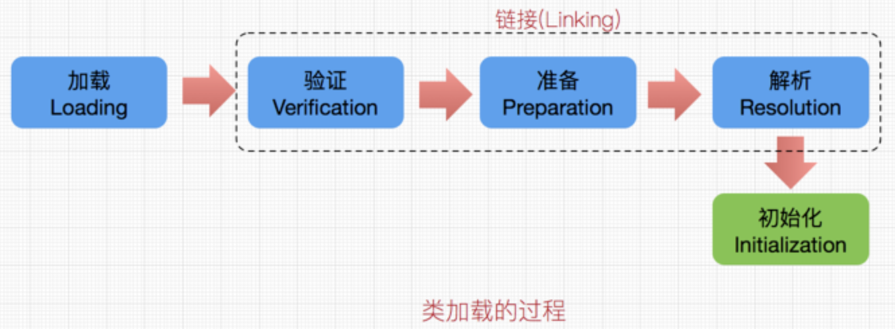
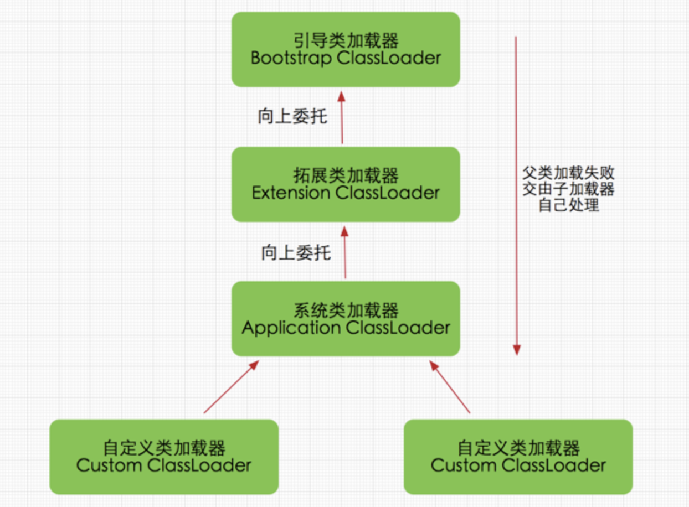
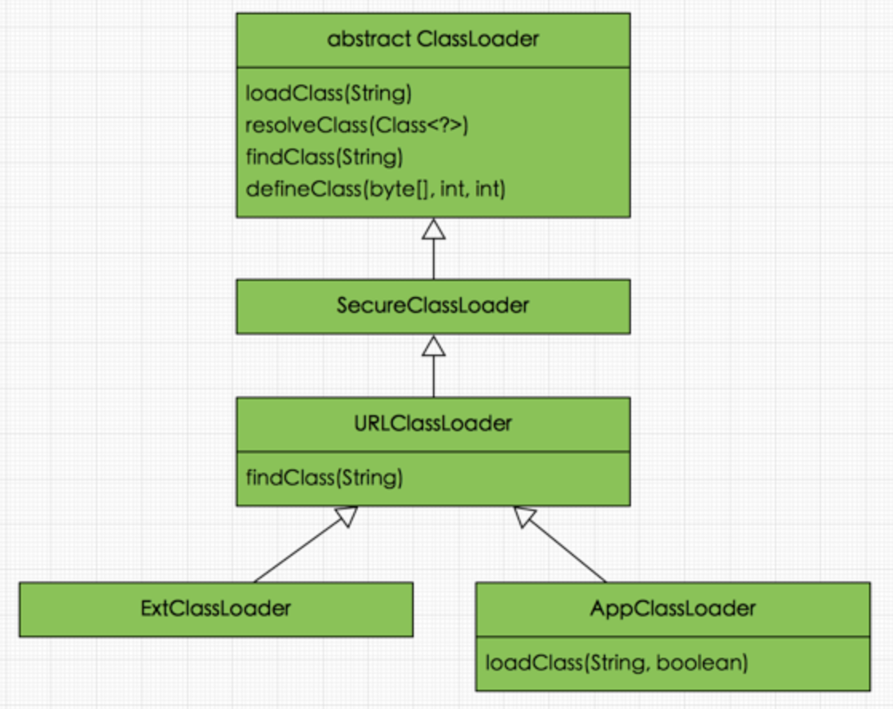
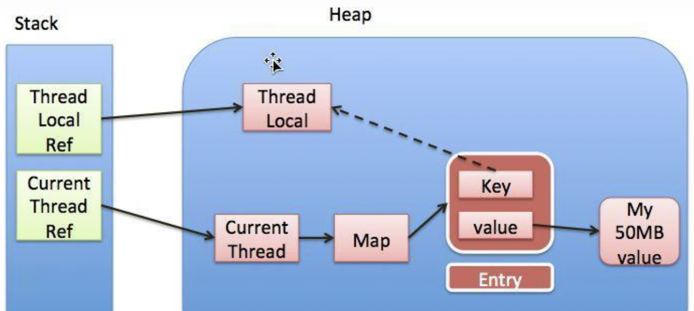

# 引用

- 强引用：普通的引用，强引用指向的对象不会被回收；
- 软引用：仅有软引用指向的对象，只有发生gc且内存不足，才会被回收；
- 弱引用：仅有弱引用指向的对象，只要发生gc就会被回收。

# 程序代理配置

当你开代理时，有可能idea工具会走代理，而程序不走代理

1.设置系统参数

```java
System.setProperty("http.proxySet", "true");
System.setProperty("http.proxyHost", "127.0.0.1");
System.setProperty("http.proxyPort", "19180");  
```

2.VM options设置

```shell
http代理： -DproxyHost=127.0.0.1 -DproxyPort=19180
socks代理： -DsocksProxyHost=127.0.0.1 -DsocksProxyPort=19181
```

# 类加载

## 1.类加载过程

".java"拓展名类文件的存储着需要执行的程序逻辑，这些".java"文件经过Java编译器编译成拓展名为".class"的文件，".class"文件中保存着Java代码经转换后的虚拟机指令，当需要使用某个类时，虚拟机将会加载它的".class"文件，并创建对应的class对象，将class文件加载到虚拟机的内存，这个过程称为类加载。



- 加载：类加载过程的一个阶段：通过一个类的完全限定查找此类字节码文件，并利用字节码文件创建一个Class对象

- 验证：目的在于确保Class文件的字节流中包含信息符合当前虚拟机要求，不会危害虚拟机自身安全。主要包括四种验证，文件格式验证，元数据验证，字节码验证，符号引用验证。

- 准备：为类变量(即static修饰的字段变量)分配内存并且设置该类变量的初始值即0(如static int i=5;这里只将i初始化为0，至于5的值将在初始化时赋值)，这里不包含用final修饰的static，因为final在编译的时候就会分配了，注意这里不会为实例变量分配初始化，类变量会分配在方法区中，而实例变量是会随着对象一起分配到Java堆中。

- 解析：主要将常量池中的符号引用替换为直接引用的过程。符号引用就是一组符号来描述目标，可以是任何字面量，而直接引用就是直接指向目标的指针、相对偏移量或一个间接定位到目标的句柄。有类或接口的解析，字段解析，类方法解析，接口方法解析(这里涉及到字节码变量的引用，如需更详细了解，可参考《深入Java虚拟机》)。

- 初始化：类加载最后阶段，若该类具有超类，则对其进行初始化，执行静态初始化器和静态初始化成员变量(如前面只初始化了默认值的static变量将会在这个阶段赋值，成员变量也将被初始化)。

## 2.类加载器

而类加载器的任务是根据一个类的全限定名来读取此类的二进制字节流到JVM中，然后转换为一个与目标类对应的java.lang.Class对象实例，在虚拟机提供了3种类加载器，引导（Bootstrap）类加载器、扩展（Extension）类加载器、系统（System）类加载器（也称应用类加载器）

- **启动（Bootstrap）类加载器**

  启动类加载器主要加载的是JVM自身需要的类，这个类加载使用C++语言实现的，是虚拟机自身的一部分，它负责将 <JAVA_HOME>/lib路径下的核心类库或-Xbootclasspath参数指定的路径下的jar包加载到内存中，注意必由于虚拟机是按照文件名识别加载jar包的，如rt.jar，如果文件名不被虚拟机识别，即使把jar包丢到lib目录下也是没有作用的(出于安全考虑，Bootstrap启动类加载器只加载包名为java、javax、sun等开头的类)。

- **扩展（Extension）类加载器**

  扩展类加载器是指Sun公司(已被Oracle收购)实现的sun.misc.Launcher$ExtClassLoader类，由Java语言实现的，是Launcher的静态内部类，它负责加载<JAVA_HOME>/lib/ext目录下或者由系统变量-Djava.ext.dir指定位路径中的类库，开发者可以直接使用标准扩展类加载器。

- **系统（System）类加载器**

  也称应用程序加载器是指 Sun公司实现的sun.misc.Launcher$AppClassLoader。它负责加载系统类路径java -classpath或-D java.class.path 指定路径下的类库，也就是我们经常用到的classpath路径，开发者可以直接使用系统类加载器，一般情况下该类加载是程序中默认的类加载器，通过ClassLoader#getSystemClassLoader()方法可以获取到该类加载器。

## 3.双亲委派机制

在Java的日常应用程序开发中，类的加载几乎是由上述3种类加载器相互配合执行的，在必要时，我们还可以自定义类加载器，需要注意的是，Java虚拟机对class文件采用的是按需加载的方式，也就是说当需要使用该类时才会将它的class文件加载到内存生成class对象，而且加载某个类的class文件时，Java虚拟机采用的是双亲委派模式即把请求交由父类处理。

双亲委派模式要求除了顶层的启动类加载器外，其余的类加载器都应当有自己的父类加载器，请注意双亲委派模式中的父子关系并非通常所说的类继承关系，而是采用组合关系来复用父类加载器的相关代码，类加载器间的关系如下：



双亲委派模式是在Java 1.2后引入的，其工作原理的是，如果一个类加载器收到了类加载请求，它并不会自己先去加载，而是把这个请求委托给父类的加载器去执行，如果父类加载器还存在其父类加载器，则进一步向上委托，依次递归，请求最终将到达顶层的启动类加载器，如果父类加载器可以完成类加载任务，就成功返回，倘若父类加载器无法完成此加载任务，子加载器才会尝试自己去加载，这就是双亲委派模式。

**双亲委派模式优势**

采用双亲委派模式的是好处是Java类随着它的类加载器一起具备了一种带有优先级的层次关系，通过这种层级关可以避免类的重复加载，当父亲已经加载了该类时，就没有必要子ClassLoader再加载一次。

其次是考虑到安全因素，java核心api中定义类型不会被随意替换，假设通过网络传递一个名为java.lang.Integer的类，通过双亲委托模式传递到启动类加载器，而启动类加载器在核心Java API发现这个名字的类，发现该类已被加载，并不会重新加载网络传递的过来的java.lang.Integer，而直接返回已加载过的Integer.class，这样便可以防止核心API库被随意篡改。可能你会想，如果我们在classpath路径下自定义一个名为java.lang.SingleInterge类(该类是胡编的)呢？该类并不存在java.lang中，经过双亲委托模式，传递到启动类加载器中，由于父类加载器路径下并没有该类，所以不会加载，将反向委托给子类加载器加载，最终会通过系统类加载器加载该类。但是这样做是不允许，因为java.lang是核心API包，需要访问权限，强制加载将会报出异常。

**类关系**



# 反射

反射的总体流程：

1. 每个java文件都会被编译成一个.class文件
2. class文件在程序运行时会被ClassLoader加载到JVM中，当一个类被加载以后，JVM就会在内存中自动产生一个Class对象。
3. 通过Class对象获取Field/Method/Construcor

我们一般平时是通过new的形式创建对象实际上就是通过这些Class来创建的，只不过这个class文件是编译的时候就生成的，程序相当于写死了给jvm去跑。

当我们的程序在运行时，需要动态的加载一些类这些类可能之前用不到所以不用加载到jvm，而是在运行时根据需要才加载。

原来使用new的时候，需要明确的指定类名，这个时候属于硬编码实现，而在使用反射的时候，可以只传入类名参数，就可以生成对象，降低了耦合性，使得程序更具灵活性。

# ThreadLocal 内存泄漏



`ThreadLocal`是一个弱引用，当为`null`时，会被当成垃圾回收 。

**假如我们ThreadLocal是null了，也就是要被垃圾回收器回收了，但是此时我们的ThreadLocalMap（thread 的内部属性）生命周期和Thread的一样，它不会回收，这时候就出现了一个现象。那就是ThreadLocalMap的key没了，但是value还在，这就造成了内存泄漏。**

解决办法：使用完`ThreadLocal`后，执行`remove`操作，避免出现内存溢出情况。

**为什么key使用弱引用？**

如果使用强引用，当`ThreadLocal` 对象的引用（强引用）被回收了，`ThreadLocalMap`本身依然还持有`ThreadLocal`的强引用，如果没有手动删除这个key ,则`ThreadLocal`不会被回收，所以只要当前线程不消亡，`ThreadLocalMap`引用的那些对象就不会被回收， 可以认为这导致`Entry`内存泄漏。


