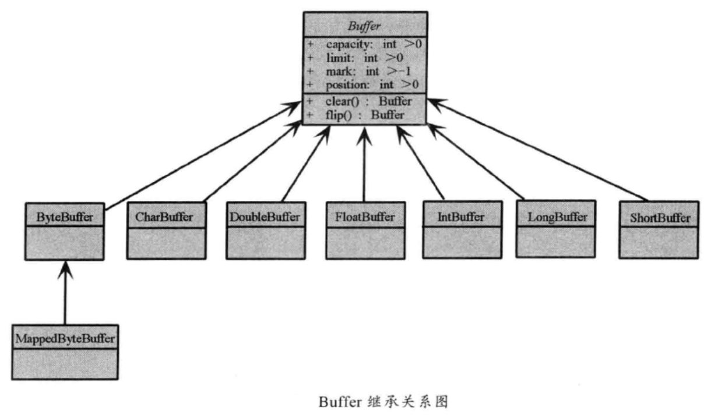
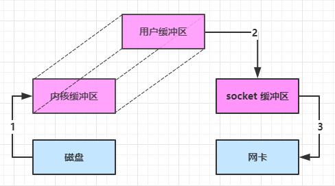
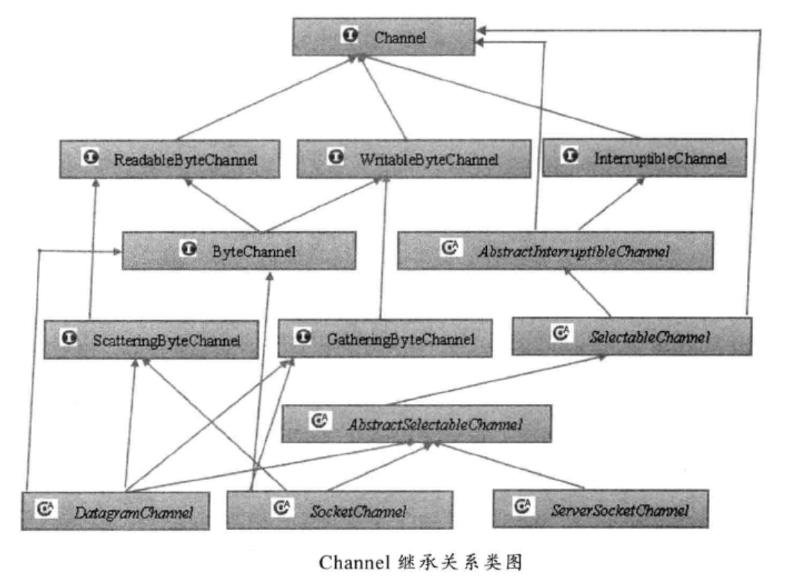
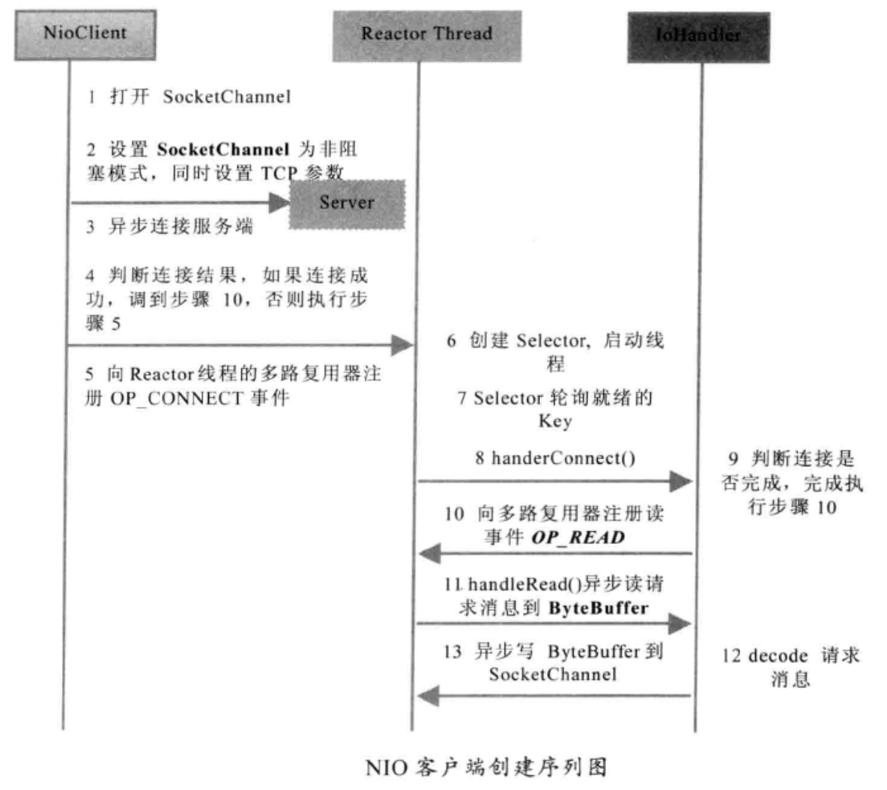

# 一.介绍

同步非阻塞 IO（non-blocking io）

基于事件驱动模型Reactor（对epoll模型的封装）

新的输入/输出(NIO) 库是在JDK 1.4中引入的。NIO弥补了原来同步阻塞I/O的不足，它在标准Java代码中提供了高速的、面向块的I/O。通过定义包含数据的类，以及通过以块的形式处理这些数据，NIO不用使用本机代码就可以利用低级优化，这是原来的I/O包无法做到的。

与Socket类和ServerSocket类相对应，NIO也提供了SocketChannel 和ServerSocketChannel两种不同的套接字通道实现。这两种新增的通道都支持阻塞和非阻塞两种模式。阻塞模式使用非常简单，但是性能和可靠性都不好，非阻塞模式则正好相反。开发人员可以根据自己的需要来选择合适的模式。一般来说，低负载、低并发的应用程序可以选择同步阻塞I/O以降低编程复杂度;对于高负载、高并发的网络应用，需要使用NIO的非阻塞模式进行开发。

JDK NIO的BUG，例如臭名昭著的epollbug,它会导致Selector空轮询，最终导，致CPU 100%。官方声称在JDK 1.6 版本的update18修复了该问题，但是直到JDK 1.7 版
本该问题仍旧存在，只不过该BUG发生概率降低了一-些而已，它并没有得到根本性解决。
该BUG以及与该BUG相关的问题单可以参见以下链接内容。

- http://bugs.java.com/bugdatabase/view_bug.do?bug_id=6403933
- http://bugs.java.com/bugdatabase/view_bug.do?bug_id=2147719

# 二.缓冲区Buffer

## 1.介绍

Buffer 是一个对象，它包含一些要写入或者要读出的数据。在NIO类库中加入Buffer对象，体现了新库与原I/O的一个重要区别。在面向流的I/O中，可以将数据直接写入或者将数据直接读到stream对象中。

在NIO库中，所有数据都是用缓冲区处理的。在读取数据时，它是直接读到缓冲区中的；在写入数据时，写入到缓冲区中。任何时候访问NIO中的数据，都是通过缓冲区进行操作。

缓冲区实质上是一个数组。通常它是一个字节数组(ByteBuffer)，也可以使用其他种类的数组。但是一个缓冲区不仅仅是一个数组，缓冲区提供了对数据的结构化访问以及维护读写位置(limit) 等信息。

最常用的缓冲区是ByteBuffer，一个ByteBuffer提供了一组功能用于操作byte数组。除了ByteBuffer， 还有其他的一些缓冲区，事实上，每一种Java基本类型(除了Boolean类型)都对应有一种缓冲区，具体如下。

- ByteBuffer：字节缓冲区
- CharBuffer：字符缓冲区

- ShortBuffer：短整型缓冲区
- IntBuffer：整型缓冲区
- LongBuffer：长整型缓冲区
- FloatBuffer：浮点型缓冲区
- DoubleBuffer：双精度浮点型缓冲区



每一个Buffer类都是Buffer接口的一个子实例。除了ByteBuffer，每一个Buffer类都有完全一样的操作，只是他们所处理的数据类型不一样。因为大多数标准I/O操作都使用ByteBuffer，所以它在具有一般缓冲区的操作之外还提供了一些特有的操作，以方便网络读写。

## 2.ByteBuffer 结构

ByteBuffer 有以下重要属性：

- capacity
- position
- limit


**写模式下**，position 是写入位置，limit 等于容量，下图表示写入了 4 个字节后的状态


flip 动作发生后，position 切换为读取位置，limit 切换为读取限制


读取 4 个字节后，状态


clear 动作发生后，状态


compact 方法，是把未读完的部分向前压缩，然后切换至写模式


ByteBuffer是线程不安全的。

## 3.ByteBuffer 大小分配

- 每个 channel 都需要记录可能被切分的消息，因为 ByteBuffer 不能被多个 channel 共同使用，因此需要为每个 channel 维护一个独立的 ByteBuffer
- ByteBuffer 不能太大，比如一个 ByteBuffer 1Mb 的话，要支持百万连接就要 1Tb 内存，因此需要设计大小可变的 ByteBuffer
  * 一种思路是首先分配一个较小的 buffer，例如 4k，如果发现数据不够，再分配 8k 的 buffer，将 4k buffer 内容拷贝至 8k buffer，优点是消息连续容易处理，缺点是数据拷贝耗费性能，参考实现 [http://tutorials.jenkov.com/java-performance/resizable-array.html](http://tutorials.jenkov.com/java-performance/resizable-array.html)
  * 另一种思路是用多个数组组成 buffer，一个数组不够，把多出来的内容写入新的数组，与前面的区别是消息存储不连续解析复杂，优点是避免了拷贝引起的性能损耗

## 4.零拷贝

- ### 传统 IO 问题

传统的 IO 将一个文件通过 socket 写出

```java
socket.getOutputStream().write(buf);
```


内部工作流程是这样的：

1. java 本身并不具备 IO 读写能力，因此 read 方法调用后，要从 java 程序的**用户态**切换至**内核态**，去调用操作系统（Kernel）的读能力，将数据从**磁盘**读入**内核缓冲区**。这期间用户线程阻塞，操作系统使用 DMA（Direct Memory Access）来实现文件读，其间也不会使用 cpu

   > DMA 也可以理解为硬件单元，用来解放 cpu 完成文件 IO

2. 从**内核态**切换回**用户态**，将数据从**内核缓冲区**读入**用户缓冲区**（即 byte[] buf），这期间 cpu 会参与拷贝，无法利用 DMA

3. 调用 write 方法，这时将数据从**用户缓冲区**（byte[] buf）写入 **socket 缓冲区**，cpu 会参与拷贝

4. 接下来要向网卡写数据，这项能力 java 又不具备，因此又得从**用户态**切换至**内核态**，调用操作系统的写能力，使用 DMA 将 **socket 缓冲区**的数据写入网卡，不会使用 cpu

可以看到中间环节较多，java 的 IO 实际不是物理设备级别的读写，而是缓存的复制，底层的真正读写是操作系统来完成的。用户态与内核态的切换发生了 3 次，这个操作比较重量级。数据拷贝了共 4 次

- ### NIO 优化

通过 DirectByteBuf：

- ByteBuffer.allocate(10)  HeapByteBuffer 使用的还是 java 内存

- ByteBuffer.allocateDirect(10)  DirectByteBuffer 使用的是操作系统内存



java 可以使用 DirectByteBuf 将堆外内存映射到 jvm 内存中来直接访问使用

* 这块内存不受 jvm 垃圾回收的影响，因此内存地址固定，有助于 IO 读写
* java 中的 DirectByteBuf 对象仅维护了此内存的虚引用，内存回收分成两步
  * DirectByteBuf 对象被垃圾回收，将虚引用加入引用队列
  * 通过专门线程访问引用队列，根据虚引用释放堆外内存
* 减少了一次数据拷贝，用户态与内核态的切换次数没有减少

进一步优化（底层采用了 linux 2.1 后提供的 sendFile 方法），java 中对应着两个 channel 调用 transferTo/transferFrom 方法拷贝数据：


1. java 调用 transferTo 方法后，要从 java 程序的**用户态**切换至**内核态**，使用 DMA将数据读入**内核缓冲区**，不会使用 cpu
2. 数据从**内核缓冲区**传输到 **socket 缓冲区**，cpu 会参与拷贝
3. 最后使用 DMA 将 **socket 缓冲区**的数据写入网卡，不会使用 cpu

可以看到：

* 只发生了一次用户态与内核态的切换
* 数据拷贝了 3 次

进一步优化（linux 2.4）


1. java 调用 transferTo 方法后，要从 java 程序的**用户态**切换至**内核态**，使用 DMA将数据读入**内核缓冲区**，不会使用 cpu
2. 只会将一些 offset 和 length 信息拷入 **socket 缓冲区**，几乎无消耗
3. 使用 DMA 将 **内核缓冲区**的数据写入网卡，不会使用 cpu

整个过程仅只发生了一次用户态与内核态的切换，数据拷贝了 2 次。所谓的【零拷贝】，并不是真正无拷贝，而是在不会拷贝重复数据到 jvm 内存中，零拷贝的优点有

* 更少的用户态与内核态的切换
* 不利用 cpu 计算，减少 cpu 缓存伪共享
* 零拷贝适合小文件传输

# 三.通道Channel

Channel是一个通道，它就像自来水管一样，网络数据通过Channel读取和写入。通道与流的不同之处在于通道是**双向**的，stream流只能在一个方向上移动(一个流必须是InputStream或者OutputStream的子类)，而通道可以用于读、写或者二者同时进行。

因为Channel是全双工的，所以它可以比流更好地映射底层操作系统的API。特别是在UNIX网络编程模型中，底层操作系统的通道都是全双工的，同时支持读写操作。

自顶向下看，前三层主要是Channel接口，用于定义它的功能，后面是一些具体的功能类(抽象类)。从类图可以看出，实际上Channel可以分为两大类：用于网络读写的SelectableChannel和用于文件操作的FileChannel。




# 四.多路复用器Selector

Selector提供选择已经就绪的任务的能力。

Selector会不断地轮询注册在其上的Channel，如果某个Channel上面发生读、写事件，这个Channel就处于就绪状态，会被Selector轮询出来，然后通过SelectionKey获取就绪Channel的集合，进行后续的I/O操作。SelectionKey关联了attachment附件。

一个多路复用器Selector可以同时轮询多个Channel，由于JDK使用了epoll()代替传统的select实现，所以它并没有最大连接句柄1024/2048的限制。这也就意味着只需要一个线程负责Selector的轮询，就可以接入成千上万的客户端，这确实是个非常巨大的进步。

.png)

下面，我们通过NIO编程的序列图和源码分析来熟悉相关的概念，以便巩固前面所学的NIO基础知识。




==注意==：如果发送区TCP缓冲区满，会导致写半包，此时，需要注册监听写操作位，循环写，直到整包消息写入TCP缓冲区。

NIO编程的优点总结如下：

1. 客户端发起的连接操作是异步的，可以通过在多路复用器注册OP_CONNECT等
   待后续结果，不需要像之前的客户端那样被同步阻塞。
2. SocketChannel 的读写操作都是异步的，如果没有可读写的数据它不会同步等待，直接返回，这样I/O通信线程就可以处理其他的链路，不需要同步等待这个链路可用。
3. 线程模型的优化：由于JDK的Selector在Linux等主流操作系统上通过epoll实现，它没有连接句柄数的限制(只受限于操作系统的最大句柄数或者对单个进程的句柄限制)，这意味着一个Selector 线程可以同时处理成千上万个客户端连接，而且性能不会随着客户端的增加而线性下降。因此，它非常适合做高性能、高负载的网络服务器。

# 五.API

```
// 测试SocketChannel是否为open状态
socketChannel.isOpen();

// 测试SocketChannel是否已经被连接
socketChannel.isConnected();

// 测试SocketChannel是否正在进行连接
socketChannel.isConnectionPending();

// 校验正在进行套接字连接的SocketChannel是否已经完成连接
socketChannel.finishConnect();

// 设置阻塞和非阻塞
socketChannel.configureBlocking(false);

// 为了确保一个进程被关闭后，即使它还没有释放该端口，同一个主机上的其他进程还可以立刻重用该端口，
socketChannel.setReuseAddress(true);

// 设置TCP接收缓冲区大小
socketChannel.setReceiveBufferSize(BUFFER_SIZE);

// 设置TCP发送缓冲区大小
socketChannel.setSendBufferSize(BUFFER_SIZE);
```
