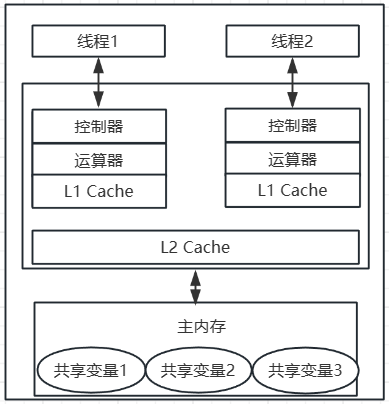

# 二.java并发安全

## 1.Java 中共享变量的内存可见性问题

Java内存模型规定，当线程要使用共享变量时，会先从主内存中拷贝一份到自己的工作内存，进行读写，然后更新到主空间。


实际实现中线程的工作内存：



这是一个双核CPU系统架构，每个核有自己的控制器、运算器。其中控制器包含一组寄存器和操作控制器，运算器执行算术逻辅运算。每个核都有自己的一级缓存，所有CPU共享的二级缓存。

假设线程A和线程B使用**不同CPU**同时处理一共享变量，并且当前两级Cache都为空，那么这时候由于Cache的存在，将导致内存不可见问题。

- 线程A首先获取共享变量X的值，由于两级Cache都没有命中，所以加载主内存的X的值，假如为0。然后把X=0缓存到两级Cache。

  线程A修改X的值为1，然后写入到两级Cache，并且刷新到主内存。

  线程A操作完后，两级Cache的X的值都是1。

- 线程B获取X的值，首先一级缓存没有命中，二级缓存命中了，返回X=1；

  线程B修改X的值为2，然后写入到两级Cache，并且刷新到主内存。

  线程B操作完后，两级Cache的X的值都是2。

- 线程A又要修改X的值，此时一级缓存命中，X=1。这就有问题了，因为主空间中X=2。

  这就是共享变量内存不可见问题，B写入的值，对A不可见。

解决办法：使用volatile关键字。

## 2.synchronized 关键字

### 2.1 介绍

synchronized块是java提供的一种原子性内置锁（监视器锁），是排它锁。每个对象都可以把他当作一个同步锁使用。

进入synchronized代码块前会自动获取内部锁，这时候其他线程访问该同步代码块就会被阻塞挂起。这种排他锁的方式保证了操作的**原子性**。

拿到内部锁的线程会在正常退出同步代码块、抛异常、同步块调用了该内置锁资源的wait系列方法时，释放该内置锁。

由于java的线程与操作系统的原生线程一一对应，所以当阻塞一个线程时，需用从用户态切换到内核态执行阻塞操作，这很耗时，而synchronized的使用就会导致上下文切换。

### 2.2 synchronized的内存语义

- 进入synchronized的内存语义是，把在synchronized块内使用到的变量从线程的工作内存中清除，这样在synchronized块内使用该变量就不会从工作空间的一级缓存中获取，而是直接从主内存中获取。
- 退出synchronized块的语义是，把在synchronized块内对共享变量的修改刷新到主内存。

这其实也是加锁和释放锁的语义。synchronized通过这种加锁的方式**解决可见性问题**。

## 3.volatile关键字

synchronized通过加锁方式解决内存可见性问题，但是使用锁太笨重，因为会带来线程上下文切换开销。

volatile关键字提供弱形式的同步，确保一个变量的更新对其他线程马上可见。采用非阻塞算法，不会带来上下文切换开销。

当一个变量被声明为volatile时，线程在写入变量时不会把值缓存在寄存器或其他地方，而是直接刷回主内存。当其他线程来读取时，回从主内存重新获取，而不是在自己的工作空间中。

volatile的内存语义是：

- 当线程读取volatile变量时，就相当于进入同步代码块（先清空本地内存变量值，再从主内存获取）
- 当线程写入volatile变量时，就相当于退出同步代码块（**把写入工作内存的变量值同步到主内存**）

volatile保证了可见性，但不保证原子性，那什么时候用volatile关键字呢：

- 写入的变量值不依赖当前值时。如果依赖当前值，将是`获取——计算——写入`三步操作。
- 读写变量值没有加锁。因为加锁本身就保证了可见性。

## 4.java中的CAS

锁会带来线程上下文切换开销，而volatile关键字只能保证可见性。

JDK提供的CAS非阻塞原子性操作，它通过硬件保证操作的原子性。

Unsafe的一系列compareAndSwapLong方法原理：比较再交换。如果比较后是预期值，则更新，否则重新读取主空间值重新处理，直到达到预期值。

但这会出现**ABA问题**，假如线程1拿到X=A，尝试CAS修改成X=B前，线程2拿到X=A，使用CAS修改为B，又使用CAS修改为A，此时线程1再去CAS修改为B肯定是成功的，但是这个A已经不是原来的哪个A了。

JDK AtomicStampedReference 类给每个变量状态值都配备了一个时间戳，避免了ABA问题。

## 5.java指令重排

java内存模型允许编译器和处理器对指令重排序以提高性能，只会对不存在数据依赖性的指令重排序。

```java
int a = 1;
int b = 2;
int c = a + b;
```

变量c依赖了a、b，所以重排序后能保证第3步在1、2之后执行，但是不能保证1、2谁先执行。

volatile可以避免指令重排序问题。

- 写volatile变量时，确保volatile写之前的操作不会被编译器重排序到volatile写之后。
- 读volatile变量时，可以确保volatile读之后的操作不会被编译器重排序到volatile读之前。

## 6.伪共享

### 6.1 介绍

为了解决主内存与CPU之间运行速度差，会再CPU与主内存之间添加一级或多级高速缓冲存储器(Cache)。

Cache内部是按行存储，每一行称为一个Cache行。是Cache与主内存进行数据交换的单位，Cache行大小是2的幂次数字节。


当CPU访问某个变量时，会先去Cache内找，找不到再去主内存拿。然后把变量所在内存的`一个Cache行大小的内存`复制到Cache中。所以可能会把多个变量放在一个Cache行中。

而缓存是有容量限制的，缓存满了后会根据淘汰算法替换缓存行。

```java
# 操作1
for (int i = 0; i < LINE_NUM; i++) {
    for (int j = 0; j < COLUM_NUM; j++) {
        arr[i][j] = i*2+j;
    }
}

# 操作2
for (int i = 0; i < LINE_NUM; i++) {
    for (int j = 0; j < COLUM_NUM; j++) {
        arr[j][i] = i*2+j;
    }
}
```

> 很明显，方式1比方式2要快很多。
>
> - 方式1中每次操作的元素，内存地址是连续的，基本每次访问都可以在缓存中命中，就不需要去主内存中找。
> - 方式2中每次操作的元素是跳跃的，所以会经常从主内存复制缓存行，而很多缓存行的变量还没被读取，就又被替换了。

当多个线程同时修改一个缓存行里面的多个变量时，由于同时只能有一个线程操作缓存行，所以性能会下降，这就是**伪共享**。


图中，变量x、y同时被放在了CPU一级和二级缓存。

当线程1对x进行更新时，首先会修改CPU1一级缓存中变量x所在缓存行，这时候再缓存一致协议下，CPU2变量x对应的缓存行失效。那么线程2再修改x时，只能去二级缓存中找。

这说明多个线程不能同时修改自己CPU中相同缓存行的变量。更坏的情况是，如果CPU只有一级缓存，则会导致频繁访问主内存。

### 6.2 如何避免伪共享

JDK8之前一般通过字节填充的方式。创建一个变量时，使用填充字段填充该变量所在缓存行，避免多个变量放在同一缓存行，如：

```java
public long value; // 变量
public long p1, p2, p3, p4, p5, p6; // 填充变量
```

> 假设缓存行为64字节，那么我们填充了6个long类型变量，每个占8字节，上面一共就是56字节。而类对象的字节码的对象头占8个，总共应该是64字节，正好放入一个缓存行。

JDK8提供了一个@sun.misc.Contended注解来解决伪共享问题，可以修饰类和变量。默认情况下只能用于java核心类，如rt包下的类。用户类需要添加JVM参数：-XX:-RestrictContended。默认填充宽度是128，可以使用-XX:ContendedPaddingWidth

## 7.锁概念

**乐观锁与悲观锁**：

- 悲观锁：值对数据被外界修改保持保守态度，认为数据很容易被其他线程修改，所以对数据处理前加锁，在处理过程中一直保持锁定状态。

- 乐观锁：相对于悲观锁说的，认为数据在一般情况下不会被其他线程修改，所以在访问前不会加排他锁，而是在进行数据提交更新时，才检测数据是否冲突。

---

根据获取锁的抢占机制，分为**公平锁与非公平锁**：

- 公平锁：表示线程获取锁的顺序是按照线程请求锁的时间早晚来决定的。
- 非公平锁：在运行时闯入，不一定先到先得。

在没有公平性需求时，尽量使用非公平锁，因为公平锁会带来性能开销。

---

根据线程持有情况，分为**独占锁与共享锁**：

- 独占锁：如何时候保证只有一个线程能得到锁。是一种悲观锁。
- 共享锁：可以被多个线程得到，是一种乐观锁，如ReadWriteLock读写锁的读锁。

**可重入锁**：一个线程获取其他线程持有的锁时，会被阻塞。那当一个线程再次获取自己的锁，如果不会被阻塞，就是可重入锁。一般都严格限制了可重入次数。

synchronized内部是可重入锁。

可重入锁的原理：

> 是锁内部维护一个线程标识，标识被哪个线程占用，如何关联了一个计数器。
>
> 一开始为0，表示没有被任何线程占用。当一个线程获取了该锁时，计数器变为1，这时其他线程再来获取该锁就会被阻塞。
>
> 但是当获取了该锁的线程再次获取锁，计数器会+1，当释放锁后计数器-1。
>
> 当计数器为0，锁的线程标识被重置为null，这时会唤醒被阻塞的线程来竞争

**自旋锁**：

由于Java中的线程与操作系统中的线程时一一对应的，所以当一个线程获取锁失败后，会被切换到内核态而被挂起。当线程获取到锁时又需要切换到内核态而唤醒该线程。从用户态切换到内核态是开销比较大的。

自旋锁则是，当线程获取锁时，如果发现锁被其他线程占有，它不会马上阻塞自己，在不放弃CPU使用权情况下，多尝试几次获取（默认10，也可以设置JVM参数），在这几次尝试期间，其他线程有可能就释放了。尝试指定次数后仍没有获取到锁，才会被阻塞挂起。

自旋锁使用CPU时间换取线程阻塞与调度开销，但是很有可能白白浪费CPU时间。