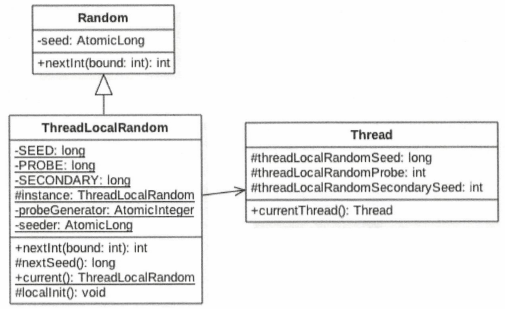

# 三.ThreadLocalRandom类

## 1.Random类及其局限性

java.util.Random会根据老种子生成新种子，多线程情况下可能就会拿到同一个老种子。

为了避免这种问题，Random每次生成的种子都保存在原子变量AtomicLong中，使用CAS进行原子更新。

由于只有一个线程更新成功，所以会造成大量线程进行自选重试，降低性能，因此ThreadLocalRandom应运而生。

## 2.ThreadLocalRandom

ThreadLocalRandom通过ThreadLocal让每个线程都有自己的一份变量，避免了对共享变量进行同步。

ThreadLocalRandom继承了Random并重写了nextInt，但并没有继承Random的原子性种子变量。具体的种子存放在具体调用线程的threadLocalRandomSeed中。

ThreadLocalRandom类似于ThreadLocal类，是个工具类。当线程调用ThreadLocalRandom的current方法时，ThreadLocalRandom负责初始化调用线程的threadLocalRandomSeed变量，也就是初始化种子。

当调用ThreadLocalRandom的nextInt方法时，就是获取当前线程的threadLocalRandomSeed变量，来计算随机数。

seeder和probeGenerator是两个原子性变量，在初始化调用线程的种子和探针变量时会用到，每个线程只会使用一次。

变量instance是ThreadLocalRandom的一个实例，当多线程通过ThreadLocalRandom的current方法获取ThreadLocalRandom实例时，获取的是同一个实例。由于具体的种子是放在线程里面的，所以在ThreadLocalRandom的实例里面只包含与线程无关的通用算法，所以是线程安全的。