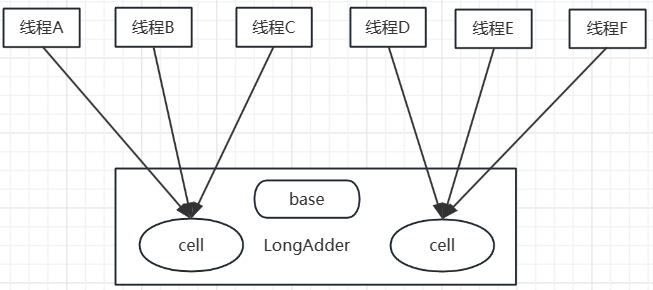

# 四.JUC包原子操作类原理

JUC包提供了一系列原子性操作类，这些类都是使用非阻塞算法CAS实现的。

## 1.AtomicLong剖析

```java
public class AtomicLong extends Number implements java.io.Serializable {
    // 获取Unsafe实例
    private static final jdk.internal.misc.Unsafe U = jdk.internal.misc.Unsafe.getUnsafe();
    
    // 存放变量value的偏移量
    private static final long VALUE = U.objectFieldOffset(AtomicLong.class, "value");
    
    // 判断JVM是否支持Long类型无锁CAS
    static final boolean VM_SUPPORTS_LONG_CAS = VMSupportsCS8();
    private static native boolean VMSupportsCS8();
    
    // 实际变量值
    private volatile long value;
}
```

方法：

```java
// 调用unsafe方法，原子性设置value加1，然后返回
public final long incrementAndGet() {
        return U.getAndAddLong(this, VALUE, 1L) + 1L;
}
```

Unsafe的getAndAddLong方法是原子性操作，param1是AtomicLong实例引用，param2是value变量在AtomicLong中的偏移量，param3是要偏移的量。

JDK7的AtomicLong使用的是循环CAS修改变量，JDK8中已经 将该操作 内置到Unsafe中了，因为考虑到其他函数也会用到。

虽然CAS阻塞算法性能比同步锁要性能好，但在高并发情况下CAS算法还会存在性能问题。

JDK8提供的LongAdder类，在高并发性能下更好。

## 2.JDK8新增原子类LongAdder

前面的AtomicLong通过CAS提供的非阻塞算法性能已经很好了，但是在高并发下大量线程会同时竞争更新同一个原子变量，但由于只有一个线程能CAS操作成功，这会造成大量线程竞争失败后，通过无限循环不断尝试CAS操作，这会白白浪费CPU资源。

因此JDK8新增LongAdder用来克服高并发下AtomicLong的缺点。

既然AtomicLong的性能瓶颈是由于过多线程同时去竞争一个变量的更新产生的，那么可以**把一个变量分解成多个变量**，让同样多的线程去竞争多个资源。



LongAdder内部维护了多个Cell，每个Cell的初始值为0。相同并发量的情况下，变相地减少了并发量。另外，多个线程在争夺同一个Cell失败，线程并不是在当前Cell上一直自旋CAS重试，而是会尝试在其他Cell上自旋，这增加了线程自旋的成功性。

最后，在获取LongAdder当前值时，是把所有Cell变量的value累加在base上返回。

LongAdder内部维护了一个Cell数组，初始是null，因为Cell数组占内存比较大，使用懒加载初始化。

Cell数组为null且并发数比较少时，所有的累加操作都是对base变量操作。

Cell类型是对AtomicLong的改进，用来减少缓存的争用，解决伪共享问题。

对于大多数孤立的多个原子操作进行字节填充是浪费，因为原子操作都是无规律地分散在内存中，多个原子变量放在同一缓存行的可能性很小。

## 3.LongAdder剖析

问题：

1. LongAdder的结构时怎么样的？
2. 当前线程应该访问Cell数组的哪一个元素？
3. 如何初始化Cell数组？
4. Cell如何扩容？
5. 线程访问分配的Cell元素有冲突如何处理？
6. 如何保证线程操作被分配的Cell原子性？


LongAdder继承自Striped64，Striped64内部维护着三个变量。

LongAdder的真实值时base的值与Cell数组所有元素 累加 的值。

base是个基础值，默认是0。

cellsBusy用来实现自旋锁，状态是0和1，当创建Cell、扩容cells、初始化cells时，使用CAS操作该变量，保证只有一个线程可以进行操作。

```java
public long sum() {
    Cell[] cs = cells;
    long sum = base;
    if (cs != null) {
        for (Cell c : cs)
            if (c != null)
                sum += c.value;
    }
    return sum;
}
```

> 返回当前值。累加所有的cell后累加base的值。
>
> 内部没有加锁，所以返回的值不精确

```java
public void reset() {
    Cell[] cs = cells;
    base = 0L;
    if (cs != null) {
        for (Cell c : cs)
            if (c != null)
                c.reset();
    }
}
```

> 将base和cell所有元素重置为0

```java
public void add(long x) {
    Cell[] cs; long b, v; int m; Cell c;
    if ((cs = cells) != null || !casBase(b = base, b + x)) { //（1）
        boolean uncontended = true;
        if (cs == null || (m = cs.length - 1) < 0 || //（2）
            (c = cs[getProbe() & m]) == null || //（3）
            !(uncontended = c.cas(v = c.value, v + x))) //（4）
            longAccumulate(x, null, uncontended); //（5）
    }
}
```

> 代码（1）判断cells是否为null，如果为null则在base上累加。如果不为null或者线程执行到代码（1）的CAS操作失败，则会执行代码（2）。
>
> 代码（2）（3）决定当前线程访问cells数组的哪个元素，如果当映射的元素存在，则执行代码（4），使用CAS操作更新该元素，如果映射的元素不存在或者CAS失败则执行代码（5）

longAccumulate很重要的一个方法，cells初始化和扩容的地方

```java
final void longAccumulate(long x, LongBinaryOperator fn,
                          boolean wasUncontended) {
	// （6）初始化当前线程的threadLocalRandomProbe
    int h;
    if ((h = getProbe()) == 0) {
        ThreadLocalRandom.current(); // force initialization
        h = getProbe();
        wasUncontended = true;
    }
    boolean collide = false;                // True if last slot nonempty
    done: for (;;) {
        Cell[] cs; Cell c; int n; long v;
        if ((cs = cells) != null && (n = cs.length) > 0) { // （7）
            if ((c = cs[(n - 1) & h]) == null) { //（8）
                if (cellsBusy == 0) {       // Try to attach new Cell
                    Cell r = new Cell(x);   // Optimistically create
                    if (cellsBusy == 0 && casCellsBusy()) {
                        try {               // Recheck under lock
                            Cell[] rs; int m, j;
                            if ((rs = cells) != null &&
                                (m = rs.length) > 0 &&
                                rs[j = (m - 1) & h] == null) {
                                rs[j] = r;
                                break done;
                            }
                        } finally {
                            cellsBusy = 0;
                        }
                        continue;           // Slot is now non-empty
                    }
                }
                collide = false;
            }
            else if (!wasUncontended)       // CAS already known to fail
                wasUncontended = true;      // Continue after rehash
            // （9）当前Cell存在，则执行CAS设置
            else if (c.cas(v = c.value,
                           (fn == null) ? v + x : fn.applyAsLong(v, x)))
                break;
            // （10）如果当前Cell数组元素个数大于CPU个数
            else if (n >= NCPU || cells != cs)
                collide = false;            // At max size or stale		
            // （11）是否有冲突
            else if (!collide)
                collide = true;
            // （12）如果元素个数没有达到CPU个数且有冲突则扩容
            else if (cellsBusy == 0 && casCellsBusy()) {
                try {
                    if (cells == cs)        // Expand table unless stale
                        // （12.1）
                        cells = Arrays.copyOf(cs, n << 1);
                } finally {
                    // （12.2）
                    cellsBusy = 0;
                }
                collide = false;
                continue;                   // Retry with expanded table
            }
            // （13）为了找到一个空闲的Cell，重新计算hash值，xorshift算法生成随机数
            h = advanceProbe(h);
        }
        // （14）初始化cell数组
        else if (cellsBusy == 0 && cells == cs && casCellsBusy()) {
            try {                           // Initialize table
                if (cells == cs) {
                    // （14.1）
                    Cell[] rs = new Cell[2];
                    // （14.2）
                    rs[h & 1] = new Cell(x);
                    cells = rs;
                    break done;
                }
            } finally {
                // （14.3）
                cellsBusy = 0;
            }
        }
        // Fall back on using base
        else if (casBase(v = base,
                         (fn == null) ? v + x : fn.applyAsLong(v, x)))
            break done;
    }
}
```

- 当每个线程第一次执行到代码（6）时，会初始化当前线程变量threadLocalRandomProbe，找个变量在计算当前线程应该被分配到哪个cell时会用到。

- cells数组初始化实在代码（14）中进行的，其中cellsBusy是一个标示。0说明cells没有被初始化或扩容，也没有心在cell元素。1说明cells被初始化或扩容，或者当前在创建新的cell元素，通过CAS操作的casCellsBusy方法来进行0、1状态切换。

- 假设当前线程通过CAS设置cellsBusy为1，则当前线程开始初始化操作，那么这时候其他线程就不能进行扩容了。

  如代码（14.1）初始化数组个数为2，然后`h & 1`计算当前线程应该访问cell哪一个位置，也就是使用当前线程的`threadLocalRandomProbe & (cells元素个数-1)`，然后标示cells已经被初始化。

  最后代码（14.3）重置了cellsBusy标记。虽然没有使用CAS操作，却是线程安全的，因为cellsBusy是volatile的，而且其他地方没有机会修改cellsBusy。

  这里初始化cells容量为2，但是两个元素都是null

- cells扩容在代码（12），对cell扩容是有条件的，就是代码（10）（11）的条件都不满足的时候。也就是当前cells元素个数小于CPU个数且当前多线程访问一个cell元素，从而导致冲突使其中一个线程CAS失败时才进行扩容。

  为什么要小于CPU个数呢，因为只有当每个CPU都运行一个线程的时候，才会使多线程效果最佳。也就是每个cell都使用一个CPU进行处理，这时的性能最佳的。

  代码（12）中的扩容操作也是先通过CAS设置cellsBusy为1，然后才进行扩容。假设CAS成功，则执行代码（12.1）将容量扩大2倍，并且复制Cell元素到扩容后的数组，这些元素目前还是null

- 代码（7）（8），计算出要访问的元素，如果为null，则新增一个Cell到cells，并且添加前要设置cellsBusy为1。

- 代码（13）对CAS失败的线程重新计算当前线程的随机值threadLocalRandomProbe，以减少访问cell元素时的冲突。

## 4.LongAccumulator类原理

LongAdder是LongAccumulator的一个特例，LongAccumulator比LongAdder更强大

```java
public class LongAccumulator extends Striped64 implements Serializable {

    private final LongBinaryOperator function;
    private final long identity;
    
    public LongAccumulator(LongBinaryOperator accumulatorFunction,
                           long identity) {
        this.function = accumulatorFunction;
        base = this.identity = identity;
    }
}
```

accumulatorFunction是一个双目运算接口，根据输入的两个参数返回一个计算值。

identity是LongAccumulator的累加值。

调用LongAdder相当于使用下面方式调用LongAccumulator：

```java
LongAdder adder = new LongAdder();

LongAccumulator accumulator = new LongAccumulator(new LongBinaryOperator() {
    @Override
    public long applyAsLong(long left, long right) {
        return left + right;
    }
}, 0);
```

LongAccumulator相比于LongAdder，可以为累加器提供非0的初始值。

另外，还可以指定累加规则。