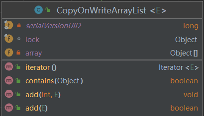

# 五.JUC包List源码解析

JUC中并发List只有CopyOnWriteArrayList。是并发安全的，对其修改操作都是在底层的一个 数组快照 上进行的，也就是写时复制策略。



- array数组用来存放具体元素，被volatile修饰
- lock独占锁用来保证只有一个线程进行修改array

问题：

1. 如何初始化list，初始元素个数多少，list有大小限制吗？
2. 如何保证线程安全？
3. 如何保证使用迭代器遍历list时的数据一致性？

```java
// 创建一个大小为0的Object数组
public CopyOnWriteArrayList() {
    setArray(new Object[0]);
}

// 将入参的数组元素拷贝到新创建的list
public CopyOnWriteArrayList(E[] toCopyIn) {
    setArray(Arrays.copyOf(toCopyIn, toCopyIn.length, Object[].class));
}

// 入参为集合，将集合中的元素复制到本地list
public CopyOnWriteArrayList(Collection<? extends E> c) {
    Object[] es;
    // 如果是同一个类型，直接将该集合的数组拿出来
    if (c.getClass() == CopyOnWriteArrayList.class)
        es = ((CopyOnWriteArrayList<?>)c).getArray();
    // 如果不是同一类型，将该集合数组元素拷贝到新数组
    else {
        es = c.toArray();
        if (c.getClass() != java.util.ArrayList.class)
            es = Arrays.copyOf(es, es.length, Object[].class);
    }
    setArray(es);
}
```

```java
public boolean add(E e) {
    // 同步锁
    synchronized (lock) {
        // 获取数组array快照
        Object[] es = getArray();
        int len = es.length;
        // 以array为副本复制新的数组，长度比原来大1
        es = Arrays.copyOf(es, len + 1);
        // 将元素保存到新数组末尾
        es[len] = e;
        // 新数组替换原来的数组
        setArray(es);
        return true;
    }
}

public void add(int index, E element) {
    // 同步锁
    synchronized (lock) {
        // 获取数组array快照
        Object[] es = getArray();
        int len = es.length;
        // 如果index大于数组长度，或者小于0，抛异常
        if (index > len || index < 0)
            throw new IndexOutOfBoundsException(outOfBounds(index, len));
        // 定义一个新数组
        Object[] newElements;
        // 计算要移动的个数
        int numMoved = len - index;
        // 说明是插入到末尾
        if (numMoved == 0)
            newElements = Arrays.copyOf(es, len + 1);
        // 说明不是插入到末尾，将旧数组元素，拷贝到新数组指定位置
        else {
            newElements = new Object[len + 1];
            System.arraycopy(es, 0, newElements, 0, index);
            System.arraycopy(es, index, newElements, index + 1,
                             numMoved);
        }
        // 插入到新数组
        newElements[index] = element;
        // 新数组替换原来的数组
        setArray(newElements);
    }
}
```

```java
public E get(int index) {
    return elementAt(getArray(), index);
}

static <E> E elementAt(Object[] a, int index) {
    return (E) a[index];
}
```

> 很明显，没有加锁，拿到的是快照元素，不管在拿到数组过程中是否有其他线程对数组进行修改。
>
> 这就是写时复制策略的弱一致性问题

```java
public E set(int index, E element) {
    // 同步锁
    synchronized (lock) {
        // 获取数组array快照
        Object[] es = getArray();
        // 拿出指定位置的元素快照
        E oldValue = elementAt(es, index);
		
        if (oldValue != element) {
            // 复制一副副本
            es = es.clone();
            // 替换指定位置的元素
            es[index] = element;
        }
        // 新数组替换旧数组，为了保证volatile语义
        setArray(es);
        return oldValue;
    }
}

static <E> E elementAt(Object[] a, int index) {
    return (E) a[index];
}
```

```java
public E remove(int index) {
    // 同步锁
    synchronized (lock) {
        // 获取数组array快照
        Object[] es = getArray();
        int len = es.length;
        // 拿出指定位置的元素快照
        E oldValue = elementAt(es, index);
        // 计算要移动的个数
        int numMoved = len - index - 1;
        Object[] newElements;
        // 说明是删除末尾元素
        if (numMoved == 0)
            newElements = Arrays.copyOf(es, len - 1);
        // 不是删除末尾元素，需要将要保留的元素拷贝到新数组去
        else {
            newElements = new Object[len - 1];
            System.arraycopy(es, 0, newElements, 0, index);
            System.arraycopy(es, index + 1, newElements, index,
                             numMoved);
        }
        // 新数组替换旧数组
        setArray(newElements);
        return oldValue;
    }
}
```

```java
public Iterator<E> iterator() {
    return new COWIterator<E>(getArray(), 0);
}

static final class COWIterator<E> implements ListIterator<E> {
        // array的快照
        private final Object[] snapshot;
		// 数组下标
        private int cursor;

        COWIterator(Object[] es, int initialCursor) {
            cursor = initialCursor;
            snapshot = es;
        }
		
        public boolean hasNext() {
            return cursor < snapshot.length;
        }

        public E next() {
            if (! hasNext())
                throw new NoSuchElementException();
            return (E) snapshot[cursor++];
        }
}
```

> 迭代器中保存了一个array数组快照，尽管是引用传递。
>
> - 如果在迭代过程中，没有其他线程对array进行修改，那保存的是同一个。
> - 如果在遍历期间，其他线程对array进行了增删改，由于每次的增删改都会用新数组替换旧数组，那么迭代器中的数组快照就是旧数组了。