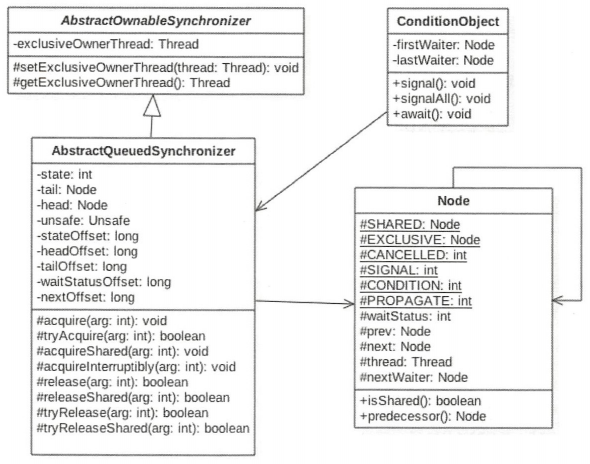
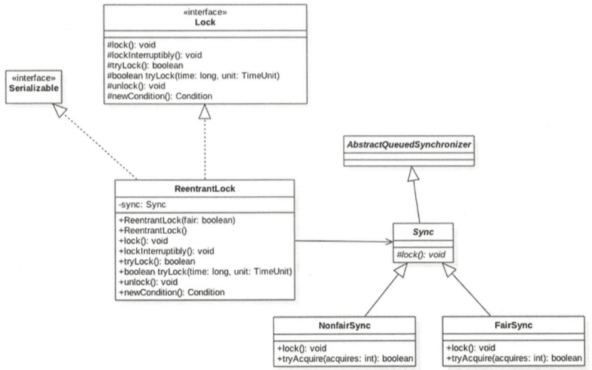
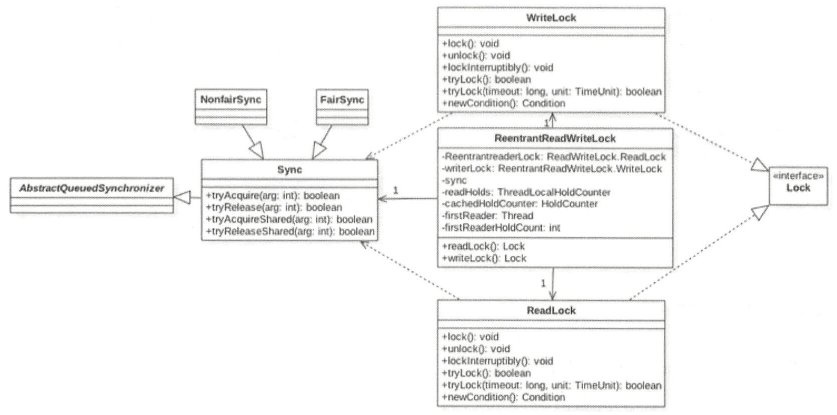

# 六.JUC包中锁原理剖析

## 1.LockSupport工具类

LockSupport是一个工具类，用于挂起和唤醒线程，是创建锁和其他同步类的基础。

- void park()：如果调用park方法的线程拿到了LockSupport关联的许可证，则调用LockSupport.park()时会马上返回，否则调用线程会被禁止参与与线程的调度，也就是被阻塞挂起。默认情况下调用线程是不持有许可证的。

  其他线程调用unpark(Thread thread)，以该线程作为参数时，可以唤醒该线程。

  如果其他线程调用了该线程的interrupt()方法，该线程会返回，不会抛异常。

- void park(Object blocker)：和park()一样，只不过blocker会被记录到线程内部。

- void unpark(Thread thread)：当一个线程调用unpark时，如果入参thread线程没有持有thread与LockSupport关联的许可证，则让thread线程持有。

  如果之前thread因为调用park()而被挂起，则会被唤醒。

  如果之前thread没有被挂起，调用park()会立刻返回。

- void parkNanos(long nanos)：与park()类似，如果调用park方法的线程拿到了LockSupport关联的许可证，则调用LockSupport.parkNanos时会马上返回。

  不同的是，如果没有拿到许可证，则调用线程会被挂起nanos时间后自动返回。找个nanos是相对时间，相对现在时间的累加。

- void parkNanos(Object blocker, long nanos)：和void parkNanos(long nanos)一样，只不过blocker会被记录到线程内部。

- void parkUntil(Object blocker， long deadline)：和void parkNanos(Object blocker, long nanos)一样，只不过deadline是绝对时间。

## 2.抽象同步队列AQS

### 2.1 AQS——锁的底层支持

AbstractQueuedSynchronizer抽象同步队列，是实现同步器的基础组件，JUC包锁底层就是使用AQS。



AQS是一个一个FIFO的双向队列，内部通过节点head和tail记录队首和队尾元素，队列元素类型是Node。

---

Node是AQS的内部类：

- Node中的thread变量用来存放进入AQS队列的线程；

- Node内部SHARED用来标记该线程是获取共享资源时被阻塞挂起后放入AQS的；

- Node内部EXCLUSIVE用来标记线程是获取独占资源时被挂起后放入AQS的；

- waitStatus记录当前线程等待状态：
  - CANCELLED=1：线程因超时或中断而被取消。节点永远不会离开此状态。特别是，具有已取消节点的线程永远不会再阻塞。
  - SIGNAL=-1：后继线程需要被唤醒；
  - CONDITION=-2：线程在条件队列里等待；
  - PROPAGATE=-3：释放共享资源时需要通知其他节点；

- prev：记录当前节点的前驱节点

- next：记录当前节点的后继节点；

---

AQS的state：单一状态信息，可以通过getState、setState、compareAndSetState方法修改其值；

**state被volatile修饰，任何线程在写入state变量前的操作对其他线程都是可见的**，所以使用了AQS锁操作的变量不要使用volatile修饰。

- 对于ReentrantLock的实现，state可以用来标识当前线程获取锁的可重入次数；

- 对于ReentrantReadWriteLock。state的高位16位表示读状态，也就是获取读锁的次数；地位16表示获取到写锁的线程的可重入次数；

- 对于semaphore，state用来表示当前可用信号的个数；

- 对于CountDownlatch，state用来表示计数器当前的值；

---

ConditionObject是AQS内部类：

- 用来结合锁实现线程同步。ConditionObject可以直接访问AQS对象内部的变量，比如state状态值和AQS队列。

- ConditionObject是条件变量，每个条件变量对应一个条件队列（单向链表队列），其用来存放 调用条件变量的await方法被阻塞的线程。

---

对于AQS来说，线程同步的关键是对状态值state进程操作。根据state是否属于一个线程，操作state的方式分为独占方式和共享方式。

- 独占方式获取和释放资源方法：
  - void acquire(int arg)
  - void acquireInterruptibly(int arg)
  - boolean release(int arg)
- 共享方式获取和释放资源方法：
  - void acquireShared(int arg)
  - void acquireSharedInterruptibly(int arg)
  - boolean releaseShared(int arg)

使用**独占方式**获取的资源是与具体线程绑定的，就是说一个线程获取到了资源，就会标记是找个线程获取到了，其他线程再尝试操作state获取资源时发现该资源不是自己持有的，就会再获取失败后阻塞。

> 比如独占锁ReentrantLock实现，当一个线程获取到ReentrantLock锁后，再AQS内部会首先使用CAS把state从0变为1，如何设置当前锁的持有者是当前线程。
>
> 当该线程再次获取锁时发现自己时锁的持有者，状态会由1变为2，也就是计数器次数，而当另一个线程获取锁时，发现锁的持有者不是自己，就会被放入AQS阻塞队列后挂起。

使用**共享方式**的资源与具体线程是不相关的，当多个线程去请求资源时通过**CAS方式竞争**，当一个线程获取到资源后，另外一个线程再去获取时，如果当前资源还能满足它的需求，则当前线程只需要使用CAS方式进行获取即可。

> 比如Semaphore信号量，当一个线程通过acquire()方法获取到信号量时，会首先看当前信号量是否满足需要，不满足则把当前线程放入阻塞队列，如果满足会自旋CAS方式获取信号量。

**独占方式下，获取和释放资源流程**：

1. 当一个线程调用acquire(int arg)获取独占资源时，会首先使用tryAcquire方法测试获取资源，就是设置state的值，成功则直接返回，失败则将当前线程封装为Node.EXCLUSIVE的Node节点插入到AQS阻塞队列的尾部，并调用LockSupport.park(this)方法挂起自己。

   ```java
   public final void acquire(int arg) {
       if (!tryAcquire(arg) &&
           acquireQueued(addWaiter(Node.EXCLUSIVE), arg))
           selfInterrupt();
   }
   
   private Node addWaiter(Node mode) {
       // 创建给定模式的节点
       Node node = new Node(mode);
   
       for (;;) {
           Node oldTail = tail;
           if (oldTail != null) { // 尾部节点存在则把新节点放在末端
               // 新节点的prev节点设置oldTail
               node.setPrevRelaxed(oldTail);
               // 用CAS操作把新节点设置为tail
               if (compareAndSetTail(oldTail, node)) {
                   // 设置oldTail的next节点为node
                   oldTail.next = node;
                   return node;
               }
           } else {
               initializeSyncQueue();
           }
       }
   }
   
   
   final boolean acquireQueued(final Node node, int arg) {
       boolean interrupted = false;
       try {
           for (;;) {
               // 获取node的prev节点
               final Node p = node.predecessor();
               // 如果p为阻塞队列头节点，尝试抢占锁
               if (p == head && tryAcquire(arg)) {
                   // 抢占成功，设置node为head
                   setHead(node);
                   p.next = null; // help GC
                   return interrupted;
               }
               // node不是阻塞队列头节点，抢锁失败
               if (shouldParkAfterFailedAcquire(p, node))
                   // 挂起当前线程
                   interrupted |= parkAndCheckInterrupt();
           }
       } catch (Throwable t) {
           cancelAcquire(node);
           if (interrupted)
               selfInterrupt();
           throw t;
       }
   }
   
   private static boolean shouldParkAfterFailedAcquire(Node pred, Node node) {
       int ws = pred.waitStatus;
       if (ws == Node.SIGNAL) // 如果前驱节点需要被唤醒，当前节点就要被挂起
           return true;
       // 前驱节点取消排队，让pred指向正常的的前驱节点，好让它唤醒自己
       if (ws > 0) {
           do {
               node.prev = pred = pred.prev;
           } while (pred.waitStatus > 0);
           pred.next = node;
       } else {
           // 此时的状态可能时0、-2、-3，但前面没有设置过waitStatus，所以此时状态应该和刚设置成tail一样，是0
           // 用CAS将pred的waitStatus设置为-1
           pred.compareAndSetWaitStatus(ws, Node.SIGNAL);
       }
       return false;
   }
   
   private final boolean parkAndCheckInterrupt() {
       LockSupport.park(this);
       return Thread.interrupted();
   }
   ```

2. 当一个线程调用release(int arg)方法尝试使用tryRelease操作释放资源，就是设置state的值，然后调用LockSupport.unpark(thread)方法激活AQS队列里被阻塞的一个线程thread。

   被激活的线程使用tryAcquire尝试，看当前state的值是否满足自己的需求，满足则该线程被激活，然后继续向下运行，否则被重新放入AQS队列被挂起。

   ```java
   public final boolean release(int arg) {
       if (tryRelease(arg)) {
           Node h = head;
           if (h != null && h.waitStatus != 0)
               unparkSuccessor(h);
           return true;
       }
       return false;
   }
   
   private void unparkSuccessor(Node node) {
       int ws = node.waitStatus;
       // 如果信号小于0，需要清除信号
       if (ws < 0)
           node.compareAndSetWaitStatus(ws, 0);
   
       // 如果后继节点为null或状态值大于0，则从尾部开始找，找到一个状态值<=0的节点
       Node s = node.next;
       if (s == null || s.waitStatus > 0) {
           s = null;
           for (Node p = tail; p != node && p != null; p = p.prev)
               if (p.waitStatus <= 0)
                   s = p;
       }
       // 如果不为null，唤醒这个节点的线程
       if (s != null)
           LockSupport.unpark(s.thread);
   }
   ```

   需要注意的是，AQS类并没有提供可用的tryAcquire和tryRelease方法，需要具体的子类实现。子类的实现要根据具体场景使用CAS算法尝试修改state状态值。成功则返回true，否则返回false。子类还需要定义调用acquire和release时state状态值的增减代表什么。

   > 比如继承自AQS实现的ReentrantLock，定义state为0表示锁空闲，1表示锁已经被占用。
   >
   > 再重写tryAcquire时，在内部需要使用CAS算法查看当前state是否为0，如果为0则使用CAS设置为1，并设置当前锁的持有者为当前线程，返回true，如果CAS失败则返回false
   >
   > 实现tryRelease时，在内部需要使用CAS算法把当前state从1修改为0，并设置当前锁的持有者为null，然后返回true，如果CAS失败则返回false。

**在共享方式下，获取与释放资源的流程**：

1. 当线程调用acquireShared(int arg)获取共享资源时，会首先使用tryAcquireShared尝试获取资源，就是设置state的值，成功则直接返回，失败则将当前线程封装为类型为Node.SHARED的Node节点后插入到AQS阻塞队列的尾部，并使用LockSupport.park(this)方法挂起自己。

   ```java
   public final void acquireShared(int arg) {
       if (tryAcquireShared(arg) < 0)
           doAcquireShared(arg);
   }
   
   private void doAcquireShared(int arg) {
       final Node node = addWaiter(Node.SHARED);
       boolean interrupted = false;
       try {
           for (;;) {
               final Node p = node.predecessor();
               if (p == head) {
                   int r = tryAcquireShared(arg);
                   if (r >= 0) {
                       setHeadAndPropagate(node, r);
                       p.next = null; // help GC
                       return;
                   }
               }
               if (shouldParkAfterFailedAcquire(p, node))
                   interrupted |= parkAndCheckInterrupt();
           }
       } catch (Throwable t) {
           cancelAcquire(node);
           throw t;
       } finally {
           if (interrupted)
               selfInterrupt();
       }
   }
   
   private final boolean parkAndCheckInterrupt() {
       LockSupport.park(this);
       return Thread.interrupted();
   }
   ```

2. 当一个线程调用releaseShared(int arg)时会尝试使用使用tryReleaseShared释放资源，就是设置state的值，然后使用LockSupport.unpark(thread)激活AQS队列里面被阻塞的一个线程。

   被激活的线程使用tryReleaseShared查看当前state是否满足自己的需求，满足则该线程被激活，然后继续运行，否则还是会被放入AQS队列被挂起。

   ```java
   public final boolean releaseShared(int arg) {
       if (tryReleaseShared(arg)) {
           doReleaseShared();
           return true;
       }
       return false;
   }
   
   private void doReleaseShared() {
       for (;;) {
           Node h = head;
           if (h != null && h != tail) {
               int ws = h.waitStatus;
               if (ws == Node.SIGNAL) {
                   if (!h.compareAndSetWaitStatus(Node.SIGNAL, 0))
                       continue;            // loop to recheck cases
                   unparkSuccessor(h);
               }
               else if (ws == 0 &&
                        !h.compareAndSetWaitStatus(0, Node.PROPAGATE))
                   continue;                // loop on failed CAS
           }
           if (h == head)                   // loop if head changed
               break;
       }
   }
   ```

   同样需要注意，AQS类并没有提供可用的tryAcquireShared和tryReleaseShared方法，需要具体的子类实现。

   子类的实现要根据具体场景使用CAS算法尝试修改state状态值。成功则返回true，否则返回false。子类还需要定义调用acquire和release时state状态值的增减代表什么。

   > 比如继承自AQS实现的读写锁ReentrantReadWriteLock，里面的读锁在重写tryAcquireShared时，首先查看写锁是否被其他线程持有，如果时则直接返回false，否则使用CAS递增state的高位16。

---

基于AQS实现的锁除了还需要重写isHeldExclusively方法，来判断锁时被当前线程独占还是被共享。

独占方式下的void acquire(int arg)、void acquireInterruptibly(int arg) 和 共享方式下的：

- 不带Interruptibly代表不对中断进行响应，也就是线程在调用不带Interruptibly的方法获取或释放资源失败被挂起时，其他线程中断了该线程，那该线程不会因为被中断而抛异常，它还是会继续获取资源或者被挂起，也就是忽略中断。
- 带Interruptibly代表获取资源或释放资源失败而被挂起时，其他线程中断了该线程，那么线程会抛InterruptedException异常而返回。

---

我们来看如何维护AQS提供的队列，主要看入队操作。

当一个线程获取锁失败后该线程会被转换为Node节点，然后使用enq(Node node)将该节点插入到AQS的阻塞队列。

```java
private Node enq(Node node) {
    for (;;) {
        Node oldTail = tail; // （1）
        if (oldTail != null) {
            // 新节点的prev节点设置为老节点
            node.setPrevRelaxed(oldTail);
            // 用CAS操作把node设置为tail
            if (compareAndSetTail(oldTail, node)) {
                oldTail.next = node;
                return oldTail;
            }
        } else {
            initializeSyncQueue();
        }
    }
}
```

### 2.2 AQS——条件变量的支持

notify和wait，是配合synchronized内置锁实现线程间同步，而条件变量signal和await方法也是用来配合锁(AQS实现锁)实现线程间同步的基础设施。

不同在于，synchronized同时只能与一个共享变量的notify或wait方法实现同步，而AQS的锁可以对应多个条件变量。

如ReentrantLock的条件变量：

```java
private Lock lock=new ReentrantLock();
private Condition condition=lock.newCondition();

while (i<20){
    lock.lock();
    try {
        if (i%2==0){
            System.out.println(Thread.currentThread().getName()+":"+i);
            i++;
            //偶数打印完，唤醒偶数打印
            condition.signal();
        }else {
            try {
                condition.await();
            } catch (InterruptedException e) {
                e.printStackTrace();
            }
        }
    } finally {
        lock.unlock();
    }
}
```

与notify和wait一样，在调用条件变量signal和await方法前，也必须获取条件变量对应的锁。

一个Lock可以创建多个条件变量，每个条件变量有自己的条件队列。

lock.newCondition();就是在AQS内部声明一个ConditionObject对象。ConditionObject是AQS的内部类，在每个条件变量**内部维护了一个条件队列**，用来存放 调用条件变量的await()方法时被阻塞的线程。

```java
public final void await() throws InterruptedException {
    // 当前锁没有被独占，抛异常
    if (Thread.interrupted())
        throw new InterruptedException();
    // 创建新的node，插入到条件队列末尾
    Node node = addConditionWaiter();
    // 释放当前线程获取的锁
    int savedState = fullyRelease(node);
    int interruptMode = 0;
    // 调用park方法阻塞挂起当前线程
    while (!isOnSyncQueue(node)) {
        LockSupport.park(this);
        if ((interruptMode = checkInterruptWhileWaiting(node)) != 0)
            break;
    }
    if (acquireQueued(node, savedState) && interruptMode != THROW_IE)
        interruptMode = REINTERRUPT;
    if (node.nextWaiter != null) // clean up if cancelled
        unlinkCancelledWaiters();
    if (interruptMode != 0)
        reportInterruptAfterWait(interruptMode);
}

private Node addConditionWaiter() {
    if (!isHeldExclusively())
        throw new IllegalMonitorStateException();
    // 获取条件队列最后一个元素
    Node t = lastWaiter;
    
    // 如果lastWaiter被取消了，则清除被取消的节点
    if (t != null && t.waitStatus != Node.CONDITION) {
        unlinkCancelledWaiters();
        t = lastWaiter;
    }
    
	// 创建一个Node.CONDITION的节点
    Node node = new Node(Node.CONDITION);
	
    // 设置新节点的位置
    if (t == null)
        firstWaiter = node;
    else
        t.nextWaiter = node;
    lastWaiter = node;
    return node;
}
```

> 当线程调用await()方法时（必须先获取锁），在内部会构造一个类型为Node.CONDITION的node节点，然后将该节点插入条件队列末尾，之后当前线程会释放锁，并被阻塞挂起。

```java
public final void signal() {
    // 当前锁没有被独占，抛异常
    if (!isHeldExclusively())
        throw new IllegalMonitorStateException();
    Node first = firstWaiter;
    if (first != null)
        // 将条件队列头元素移动到AQS阻塞队列，等待唤醒
        doSignal(first);
}

private void doSignal(Node first) {
    do {
        // 如果first.nextWaiter为null，则lastWaiter为null
        if ( (firstWaiter = first.nextWaiter) == null)
            lastWaiter = null;
        first.nextWaiter = null;
    } while (!transferForSignal(first) &&
             (first = firstWaiter) != null);
}

final boolean transferForSignal(Node node) {
	// 将node的waitStatus设置为0
    if (!node.compareAndSetWaitStatus(Node.CONDITION, 0))
        return false;
	// 将该节点加入到AQS阻塞队列
    Node p = enq(node);
    int ws = p.waitStatus;
    // 如果是阻塞状态 或 CAS失败，则唤醒改节点
    if (ws > 0 || !p.compareAndSetWaitStatus(ws, Node.SIGNAL))
        LockSupport.unpark(node.thread);
    return true;
}
```

需要注意，AQS值提供了ConditionObject的实现，没有提供newCondition函数。需要由AQS的子类来提供。

## 3.独占锁ReentrantLock原理

### 3.1 结构



ReentrantLock最终还是使用AQS来实现的，并根据参数来决定内部是一个公平锁还是非公平锁，默认非公平锁。

```java
public ReentrantLock(boolean fair) {
    sync = fair ? new FairSync() : new NonfairSync();
}
```

Sync直接继承自AQS，他的子类NonfairSync核FairSync分别实现了获取锁的非公平与公平策略。

这里的AQS的state状态值表示线程获取该锁的可重入次数，在默认情况下，state的值为0，表示当前锁没有被任何线程持有。当第一个线程获取该锁时，会尝试使用CAS设置state为1，如果成功则当前线程获取到该锁，然后记录该锁的持有者为当前线程。在该线程没有释放锁的情况下第二次获取了该锁后，state被设置为2，这就是可重入次数。

在该线程释放该锁时，会尝试使用CAS让state减1，如果减1成功后状态值为0，则当前线程释放该锁。

### 3.2 获取锁

**void lock()**：

获取锁，如果获取成功则state加1，否则被阻塞。如果再次获取锁，发现锁的持有这已经是自己则state再加1。

- 非公平方式：

```java
// ReentrantLock方法
public void lock() {
    // 交给sync来做
    sync.acquire(1);
}

// AQS方法
public final void acquire(int arg) {
    if (!tryAcquire(arg) &&
        acquireQueued(addWaiter(Node.EXCLUSIVE), arg))
        selfInterrupt();
}

// 非公平sync的tryAcquire
protected final boolean tryAcquire(int acquires) {
    return nonfairTryAcquire(acquires);
}

// 非公平获取资源
final boolean nonfairTryAcquire(int acquires) {
    final Thread current = Thread.currentThread();
    int c = getState();
    // 如果锁空闲
    if (c == 0) {
        // 使用CAS尝试获取锁，state设置为1
        if (compareAndSetState(0, acquires)) {
            // 设置当前锁的持有者
            setExclusiveOwnerThread(current);
            return true;
        }
    }
    // 如果锁被自己占用
    else if (current == getExclusiveOwnerThread()) {
        // 锁加1
        int nextc = c + acquires;
        if (nextc < 0) // 可重入次数溢出
            throw new Error("Maximum lock count exceeded");
        // 设置state值
        setState(nextc);
        return true;
    }
    // 该线程不是锁的持有者
    return false;
}
```

- 公平方式：

```java
// 公平获取资源
protected final boolean tryAcquire(int acquires) {
    final Thread current = Thread.currentThread();
    int c = getState();
    // 如果锁空闲
    if (c == 0) {
        // 公平性策略
        if (!hasQueuedPredecessors() &&
            compareAndSetState(0, acquires)) {
            setExclusiveOwnerThread(current);
            return true;
        }
    }
    // 锁是否当前线程拥有者
    else if (current == getExclusiveOwnerThread()) {
        int nextc = c + acquires;
        if (nextc < 0)
            throw new Error("Maximum lock count exceeded");
        setState(nextc);
        return true;
    }
    return false;
}

// 公平性核心，如果当前线程前面有排队的线程返回true，如果当前线程是head或队列为空，返回false
public final boolean hasQueuedPredecessors() {
    Node h, s;
    if ((h = head) != null) {
        // 如果h.next为null，或h.next是阻塞状态
        if ((s = h.next) == null || s.waitStatus > 0) {
            s = null; 
            // 从后往前找
            for (Node p = tail; p != h && p != null; p = p.prev) {
                // 找一个没有被阻塞的线程
                if (p.waitStatus <= 0)
                    s = p;
            }
        }
        // 找到了没有被阻塞的线程，且不是自己，返回true，不允许重入
        if (s != null && s.thread != Thread.currentThread())
            return true;
    }
    // 队列为空，允许重入
    return false;
}
```

**void locklnterruptibly ()**：

```java
// ReentrantLock方法
public void lockInterruptibly() throws InterruptedException {
    sync.acquireInterruptibly(1);
}

// AQS方法
public final void acquireInterruptibly(int arg)
    throws InterruptedException {
    // 如果当前线程被中断，抛异常
    if (Thread.interrupted())
        throw new InterruptedException();
    if (!tryAcquire(arg))
        doAcquireInterruptibly(arg);
}
```

**boolean tryLock()**：

尝试获取锁，如果当前锁没有被其他线程持有，则获取锁并返回true，否则返回false。

注意：该方法不会引起当前线程阻塞。

```java
public boolean tryLock() {
    // 使用的是非公平获取方式
    return sync.nonfairTryAcquire(1);
}

final boolean nonfairTryAcquire(int acquires) {
    final Thread current = Thread.currentThread();
    int c = getState();
    if (c == 0) {
        if (compareAndSetState(0, acquires)) {
            setExclusiveOwnerThread(current);
            return true;
        }
    }
    else if (current == getExclusiveOwnerThread()) {
        int nextc = c + acquires;
        if (nextc < 0) // overflow
            throw new Error("Maximum lock count exceeded");
        setState(nextc);
        return true;
    }
    return false;
}
```

**tryLock(long timeout, TimeUnit unit)**：

设置了超时时间的tryLock方法，时间到了还没有获取到锁，返回false

```java
public boolean tryLock(long timeout, TimeUnit unit)
    throws InterruptedException {
    // 使用AQS的tryAcquireNanos方法
    return sync.tryAcquireNanos(1, unit.toNanos(timeout));
}
```

### 3.3 释放锁

void unlock()：

释放锁，如果当前线程持有锁，则调用该方法让state减1，减去1后如果state为0则释放锁。

如果当前线程没有锁而要释放锁，则会抛异常。

```java
public void unlock() {
    sync.release(1);
}

public final boolean release(int arg) {
    if (tryRelease(arg)) {
        Node h = head;
        if (h != null && h.waitStatus != 0)
            unparkSuccessor(h);
        return true;
    }
    return false;
}

protected final boolean tryRelease(int releases) {
    // state减去1
    int c = getState() - releases;
    // 如果当前线程不是锁拥有者，抛异常
    if (Thread.currentThread() != getExclusiveOwnerThread())
        throw new IllegalMonitorStateException();
    boolean free = false;
    // 如果可重入次数为0，清空锁持有者
    if (c == 0) {
        free = true;
        setExclusiveOwnerThread(null);
    }
    // 设置state值
    setState(c);
    return free;
}
```

## 4.ReentrantReadWriteLock原理

读写锁，用来满足读多写少的的场景。

- 读-读共享
- 读-写互斥
- 写-写互斥

### 4.1 结构



读写锁内部维护了ReadLock和WriteLock，他们依赖Sync实现具体功能。而Sync继承自AQS，并且实现了公平和非公平方式。

ReentrantReadWriteLock用state的高位16表示读状态，低位16表示写锁的**可重入次数**。

```java
abstract static class Sync extends AbstractQueuedSynchronizer {
	
    static final int SHARED_SHIFT   = 16;
    // 读锁65536
    static final int SHARED_UNIT    = (1 << SHARED_SHIFT);
    // 读锁最大线程数65535
    static final int MAX_COUNT      = (1 << SHARED_SHIFT) - 1;
    // 写锁掩码，二进制，15个1
    static final int EXCLUSIVE_MASK = (1 << SHARED_SHIFT) - 1;
    
    // 第一个获取到读锁的线程
    private transient Thread firstReader;
    // 第一个获取到读锁的线程的重入次数
    private transient int firstReaderHoldCount;
    
    // 最后一个获取到读锁的线程的重入次数
    private transient HoldCounter cachedHoldCounter;
    
    // ThreadLocal变量，存放除第一个获取读锁线程外的其他线程获取读锁的重入次数
    private transient ThreadLocalHoldCounter readHolds;
}
```

### 4.2 写锁WriteLock

**void lock()**：

```java
// WriteLock的方法
public void lock() {
    sync.acquire(1);
}

// AQS方法
public final void acquire(int arg) {
    if (!tryAcquire(arg) &&
        acquireQueued(addWaiter(Node.EXCLUSIVE), arg))
        selfInterrupt();
}

// Sync的方法
protected final boolean tryAcquire(int acquires) {
    Thread current = Thread.currentThread();
    int c = getState();
    // 获取读锁重入数
    int w = exclusiveCount(c);
    // c != 0说明读锁或写锁已经被某线程获取
    if (c != 0) {
        // w == 0说明已经有线程获取了读锁，不能再获取写锁
        // w != 0 并且当前线程不是写锁拥有者，说明有其他线程获取了写锁，返回false
        if (w == 0 || current != getExclusiveOwnerThread())
            return false;
        // 说明当前线程获取了写锁，判断是否超过最大可重入次数
        if (w + exclusiveCount(acquires) > MAX_COUNT)
            throw new Error("Maximum lock count exceeded");
       // 设置可重入次数
        setState(c + acquires);
        return true;
    }
    // 到这，说明读锁或写锁都没有被占有
    // 第一个线程获取写锁
    if (writerShouldBlock() ||
        !compareAndSetState(c, c + acquires)) //（5）
        return false;
    setExclusiveOwnerThread(current);
    return true;
}

// NonfairSync实现
final boolean writerShouldBlock() {
    return false;
}

// FairSync实现
final boolean writerShouldBlock() {
    // 判断当前线程节点是否有前驱节点
    return hasQueuedPredecessors();
}
```

非公平方式：总是返回false，代码（5）抢占式执行CAS获取锁

公平方式：如果前面有线程在排队，则放弃获取锁。

**void lockInterruptibly()**：

与lock()类似，只不过它对中断响应。

```java
public void lockInterruptibly() throws InterruptedException {
    sync.acquireInterruptibly(1);
}
```

**tryLock()**：

尝试获取锁，如果其他线程获取到了读锁或写锁，直接返回false，不会阻塞。

```java
public boolean tryLock() {
    return sync.tryWriteLock();
}

final boolean tryWriteLock() {
    Thread current = Thread.currentThread();
    int c = getState();
    if (c != 0) {
        int w = exclusiveCount(c);
        // 其他线程获取到了读锁或写锁，直接返回false
        if (w == 0 || current != getExclusiveOwnerThread())
            return false;
        if (w == MAX_COUNT)
            throw new Error("Maximum lock count exceeded");
    }
    if (!compareAndSetState(c, c + 1))
        return false;
    setExclusiveOwnerThread(current);
    return true;
}
```

**tryLock(long timeout, TimeUnit unit)**：

尝试获取锁，如果失败了会把当前线程挂起指定时间，时间到了会被激活，与其他线程竞争，如果还是没有获取到锁，则返回false。

```java
public boolean tryLock(long timeout, TimeUnit unit)
    throws InterruptedException {
    return sync.tryAcquireNanos(1, unit.toNanos(timeout));
}

public final boolean tryAcquireNanos(int arg, long nanosTimeout)
    throws InterruptedException {
    // 对中断响应
    if (Thread.interrupted())
        throw new InterruptedException();
    return tryAcquire(arg) ||
        doAcquireNanos(arg, nanosTimeout);
}

private boolean doAcquireNanos(int arg, long nanosTimeout)
    throws InterruptedException {
    if (nanosTimeout <= 0L)
        return false;
    final long deadline = System.nanoTime() + nanosTimeout;
    // 创建一个独占模式的节点，并加入到队尾
    final Node node = addWaiter(Node.EXCLUSIVE);
    try {
        for (;;) {
            // 获取前驱节点
            final Node p = node.predecessor();
            // 如果是头节点，尝试获取锁
            if (p == head && tryAcquire(arg)) {
                setHead(node);
                p.next = null; // help GC
                return true;
            }
            nanosTimeout = deadline - System.nanoTime();
            // 如果时间到了，取消
            if (nanosTimeout <= 0L) {
                // 取消线程
                cancelAcquire(node);
                return false;
            }
            if (shouldParkAfterFailedAcquire(p, node) &&
                nanosTimeout > SPIN_FOR_TIMEOUT_THRESHOLD)
                // 挂起指定时间
                LockSupport.parkNanos(this, nanosTimeout);
            // 响应中断
            if (Thread.interrupted())
                throw new InterruptedException();
        }
    } catch (Throwable t) {
        cancelAcquire(node);
        throw t;
    }
}
```


```java
public void unlock() {
    sync.release(1);
}

// AQS中的方法
public final boolean release(int arg) {
    // 释放锁
    if (tryRelease(arg)) {
        // 激活阻塞队列中的一个线程
        Node h = head;
        if (h != null && h.waitStatus != 0)
            unparkSuccessor(h);
        return true;
    }
    return false;
}

protected final boolean tryRelease(int releases) {
    // 是否是写锁的拥有者调用的unlock
    if (!isHeldExclusively())
        throw new IllegalMonitorStateException();
    // 可重入数减1，不考虑高位16，因为写锁释放，高位16肯定是0
    int nextc = getState() - releases;
    boolean free = exclusiveCount(nextc) == 0;
    // 如果可重入数为0，清空锁拥有者
    if (free)
        setExclusiveOwnerThread(null);
    // 设置state
    setState(nextc);
    return free;
}
```

### 4.3 读锁ReadLock

**lock()**：

获取读锁，如果当前没有其他线程持有写锁，则当前线程可以获取读锁，state高位16的值加1。如果其他线程持有写锁，则当前线程被阻塞。

```java
// ReadLock方法
public void lock() {
    sync.acquireShared(1);
}

// AQS方法
public final void acquireShared(int arg) {
    // 尝试获取读锁
    if (tryAcquireShared(arg) < 0)
        // 获取失败，阻塞自己
        doAcquireShared(arg);
}

// ReentrantReadWriteLock中Sync方法
protected final int tryAcquireShared(int unused) {
    Thread current = Thread.currentThread();
    // 获取状态值
    int c = getState();
    // 判断写锁是否被占用
    if (exclusiveCount(c) != 0 &&
        getExclusiveOwnerThread() != current)
        return -1;
    // 获取读锁个数
    int r = sharedCount(c);
    // 尝试获取锁，多个线程只有一个会成功，不成功的进入fullTryAcquireShared
    // readerShouldBlock()如果为true，则说明有线程正在获取读锁
    if (!readerShouldBlock() &&
        r < MAX_COUNT &&
        compareAndSetState(c, c + SHARED_UNIT)) {
        // 读锁为0，设置当前线程为第一个获取读锁的线程
        if (r == 0) {
            firstReader = current;
            firstReaderHoldCount = 1;
        // 如果第一个获取锁的线程是自己
        } else if (firstReader == current) {
            firstReaderHoldCount++;
        // 当前线程既不是第一个获取锁的，而且锁也被其他线程占有
        } else {
            // 获取最后一个获取读锁的线程
            HoldCounter rh = cachedHoldCounter;
            if (rh == null ||
                rh.tid != LockSupport.getThreadId(current))
                // 设置最后一个获取到读锁的线程是自己
                cachedHoldCounter = rh = readHolds.get();
            // 如果最后一个获取到读锁的是自己，设置重入数加1
            else if (rh.count == 0)
                readHolds.set(rh);
            rh.count++;
        }
        return 1;
    }
    // 类似于tryAcquireShared，但是是自旋获取
    return fullTryAcquireShared(current);
}

// 公平方式
final boolean readerShouldBlock() {
    return hasQueuedPredecessors();
}

// 非公平方式
final boolean readerShouldBlock() {
    // 如果队列的头正在获取读锁，返回true
    return apparentlyFirstQueuedIsExclusive();
}
```

**unlock()**：

```java
// ReadLock方法
public void unlock() {
    sync.releaseShared(1);
}

// AQS方法
public final boolean releaseShared(int arg) {
    if (tryReleaseShared(arg)) {
        doReleaseShared();
        return true;
    }
    return false;
}

// Sync方法
protected final boolean tryReleaseShared(int unused) {
    Thread current = Thread.currentThread();
    if (firstReader == current) {
        // assert firstReaderHoldCount > 0;
        if (firstReaderHoldCount == 1)
            firstReader = null;
        else
            firstReaderHoldCount--;
    } else {
        HoldCounter rh = cachedHoldCounter;
        if (rh == null ||
            rh.tid != LockSupport.getThreadId(current))
            rh = readHolds.get();
        int count = rh.count;
        if (count <= 1) {
            readHolds.remove();
            if (count <= 0)
                throw unmatchedUnlockException();
        }
        --rh.count;
    }
    // 循环减少自己占用的读锁数，直到-1
    for (;;) {
        int c = getState();
        int nextc = c - SHARED_UNIT;
        if (compareAndSetState(c, nextc))
            return nextc == 0;
    }
}
```

## 5.StamedLock锁

### 5.1 概述

StamedLock是JDK8新增的锁，提供三种模式的读写控制。当调用获取锁的系列函数会返回一个long变量，称为戳记（stamp），代表锁的状态。

读-读共享、读-写互斥、写-写互斥

- **写锁writeLock**：排他锁，非重入锁。

  获取锁后会返回一个stamp变量表示锁的版本；

  释放锁调用unlockWrite，需要传递获取锁时的stamp参数；

- **悲观读锁readLock**：共享锁。非重入锁。悲观锁。

  悲观态度，这是一种读少写多的考虑。

  请求锁成功后返回一个stamp变量表示锁版本；

  释放锁调用unlockWrite，需要传递获取锁时的stamp参数；

- **乐观读锁tryOptimisticRead**：共享锁。非重入锁。乐观锁。

  在操作数据前没有通过CAS设置锁状态，仅仅通过位运算测试，如果当前没有线程持有写锁，则简单的返回一个非0的stamp版本信息。

  获取该stamp后，操作数据前还需要调用validate方法验证该stamp释放已经不可用，也就是看当调用tryOptimisticRead返回stamp后当前时间期间是否有其他线程持有了写锁，如果是则validate返回0，否则使用该stamp版本的锁对数据进行操作。

  由于没有使用CAS设置锁状态，所以不需要显式地释放该锁。所以操作的数据是一个快照。

  用于读多写少场景

StamedLock锁还支持三把锁相互转换。如`long tryConvertToWriteLock(long stamp) `尝试转化为一个写锁，转化成功会返回一个有效的stamp，这个函数以下几种情况返回一个有效stamp：

- 当前锁已经是写锁
- 当前锁是读锁模式，且没有其他线程占有
- 当前处于乐观读模式，且当前写锁可用