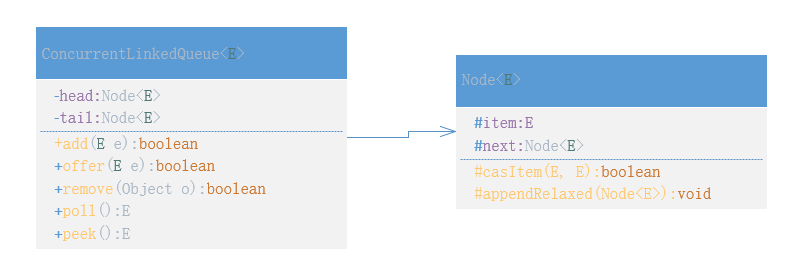
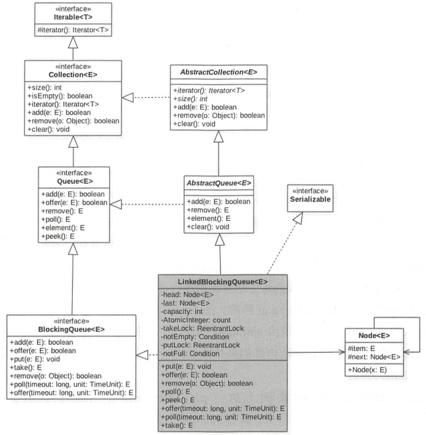
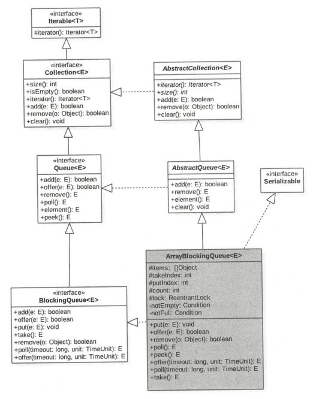
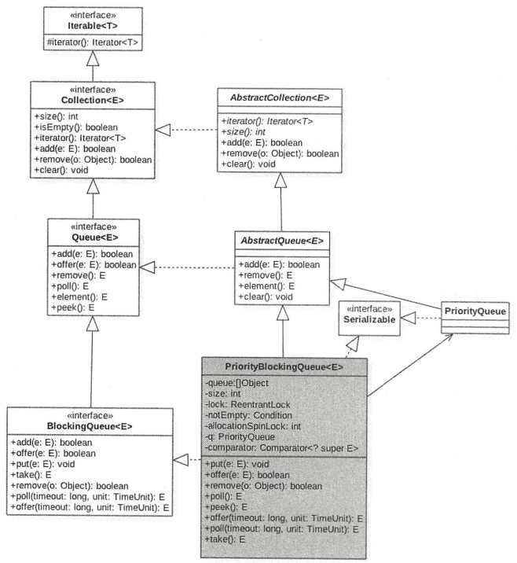
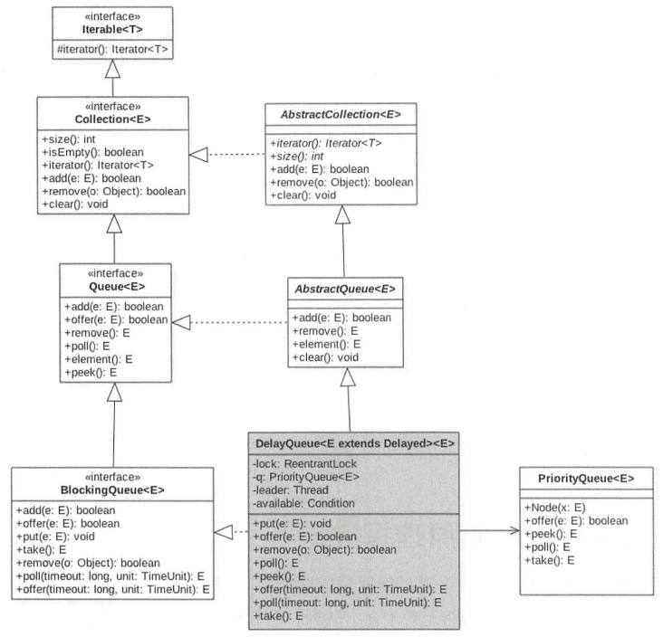

# 七.JUC并发队列原理剖析

## 1.ConcrrentLinkedQueue原理



ConcrrentLinkedQueue是一个安全的无界限非阻塞队列

内部队列使用单向链表方式实现，使用VarHandle工具类提供的CAS算法保证出入队时的原子性。

**无参构造**：

```java
public ConcurrentLinkedQueue() {
    head = tail = new Node<E>();
}
```

从代码可知，默认head、tail都指向一个item为null的哨兵节点。新元素被插入队列末尾，出队时从队列头部获取一个元素。

**offer(E e)：**

在队尾添加一个元素

```java
public boolean offer(E e) {
    // 创建一个Node，如果e为null，抛异常
    final Node<E> newNode = new Node<E>(Objects.requireNonNull(e));
	
    // 从尾节点进行插入
    for (Node<E> t = tail, p = t;;) {
        Node<E> q = p.next;
        // 为null说明p是尾节点，执行插入
        if (q == null) {
            // 使用CAS设置p节点的next节点
            if (NEXT.compareAndSet(p, null, newNode)) {
                // CAS成功，设置当前尾节点
                if (p != t)
                    TAIL.weakCompareAndSet(this, t, newNode);
                return true;
            }
        }
        else if (p == q)
			// 多线程操作时，由于poll操作移除元素后可能会把head变为自引用，
            // 所以这里需要重新找新的head
            p = (t != (t = tail)) ? t : head;
        else
            // 寻找尾节点
            p = (p != t && t != (t = tail)) ? t : q;
    }
}
```

**poll()：**

获取队头元素并移除，队列为空则返回null

```java
public E poll() {
    restartFromHead: for (;;) {
        for (Node<E> h = head, p = h, q;; p = q) {
            final E item;
            // 如果p.item不为null，且CAS设置p.item为null成功
            if ((item = p.item) != null && p.casItem(item, null)) {
         		// 当前节点从链表中移除
                if (p != h)
                    updateHead(h, ((q = p.next) != null) ? q : p);
                return item;
            }
            // 当前队列为空，返回null
            else if ((q = p.next) == null) {
                updateHead(h, p);
                return null;
            }
            // 如果当前节点被自引用了，重新寻找队列头节点
            else if (p == q)
                continue restartFromHead;
        }
    }
}

final void updateHead(Node<E> h, Node<E> p) {
    if (h != p && HEAD.compareAndSet(this, h, p))
        NEXT.setRelease(h, h);
}
```

**peek()：**

获取头部一个元素，不移除，如果队列为空返回null。

```java
public E peek() {
    restartFromHead: for (;;) {
        for (Node<E> h = head, p = h, q;; p = q) {
            final E item;
            // 如果p.item ！= null 且 p.next==null，说明该节点是头结点
            if ((item = p.item) != null
                || (q = p.next) == null) {
                updateHead(h, p);
                return item;
            }
            else if (p == q)
                continue restartFromHead;
        }
    }
}
```

**size()：**

获取元素大小快照，并没有加锁保护

```java
public int size() {
    restartFromHead: for (;;) {
        int count = 0;
        for (Node<E> p = first(); p != null;) {
            if (p.item != null)
                if (++count == Integer.MAX_VALUE)
                    break;  // @see Collection.size()
            if (p == (p = p.next))
                continue restartFromHead;
        }
        return count;
    }
}
```

**remove(Object o)：**

如果存在该元素则删除该元素，如果存在多个则删除第一个，并返回true，否则返回false

## 2.LinkedBlockingQueue原理



LinkedBlockingQueue是一个安全、有界的阻塞队列（队列为空时出队、队列满了入队时会阻塞）

内部使用单链表实现，head、last存放首、尾节点。

count是一个初始为0的原子变量count，记录元素个数。

putLock、takeLock用来控制入队和出队的原子性。

notEmpty、notFull是条件变量，内部有一个条件队列用来存放进队和出队时被阻塞的线程，是一个生产者消费者模型。

- 当线程获取到takeLock锁后要进行出队，如果队列为空，会使用notEmpty的await方法阻塞当前线程，并放入该条件队列
- 当线程获取到putLock锁后要进行入队，如果队列满了，调用notFull的await方法阻塞当前线程，并放入该条件队列

**构造函数：**

空参的最大队列容量是Integer.MAX_VALUE；

可以自定义最大容量。

```java
public LinkedBlockingQueue() {
    this(Integer.MAX_VALUE);
}

public LinkedBlockingQueue(int capacity) {
    if (capacity <= 0) throw new IllegalArgumentException();
    this.capacity = capacity;
    last = head = new Node<E>(null);
}
```

**offer(E e)：**

向队尾插入一个元素，成功返回true，如果队列满了则丢弃当前元素并返回false

```java
public boolean offer(E e) {
    if (e == null) throw new NullPointerException();
    final AtomicInteger count = this.count;
    // 如果队列满了，直接返回false
    if (count.get() == capacity)
        return false;
    final int c;
    final Node<E> node = new Node<E>(e);
    final ReentrantLock putLock = this.putLock;
    // 加锁
    putLock.lock();
    try {
        // 如果队列满了，直接返回false
        if (count.get() == capacity)
            return false;
        // 入队
        enqueue(node);
        // 元素个数递增，并将递增前的值赋值给c
        c = count.getAndIncrement();
        // 如果还有空闲位置，唤醒一个线程
        if (c + 1 < capacity)
            notFull.signal();
    } finally {
        putLock.unlock();
    }
    // 说明现在至少有一个元素
    if (c == 0)
        // 唤醒一个线程
        signalNotEmpty();
    return true;
}

private void signalNotEmpty() {
    final ReentrantLock takeLock = this.takeLock;
    takeLock.lock();
    try {
        notEmpty.signal();
    } finally {
        takeLock.unlock();
    }
}
```

**put(E e)：**阻塞

向队尾插入一个元素，如果队列中有空闲则插入后直接返回，如果队列满了则阻塞当前线程，直到有空闲位置后被唤醒。

如果获取锁时被设置了中断标志，会抛异常。

```java
public void put(E e) throws InterruptedException {
    if (e == null) throw new NullPointerException();
    final int c;
    final Node<E> node = new Node<E>(e);
    final ReentrantLock putLock = this.putLock;
    final AtomicInteger count = this.count;put(E e)
    // 获取锁，对中断响应
    putLock.lockInterruptibly();
    try {
        // 如果队列满了则阻塞
        while (count.get() == capacity) {
            notFull.await();
        }
        // 入队
        enqueue(node);
        // 元素个数递增，并将递增前的值赋值给c
        c = count.getAndIncrement();
        // 如果还有空闲位置，唤醒一个线程
        if (c + 1 < capacity)
            notFull.signal();
    } finally {
        putLock.unlock();
    }
    // 说明现在至少有一个元素
    if (c == 0)
        // 唤醒一个线程
        signalNotEmpty();
}
```

**poll()：**

获取并移除一个队头元素，如果队列为空则返回null

```java
public E poll() {
    final AtomicInteger count = this.count;
    if (count.get() == 0)
        return null;
    final E x;
    final int c;
    final ReentrantLock takeLock = this.takeLock;
    takeLock.lock();
    try {
        if (count.get() == 0)
            return null;
        // 出队
        x = dequeue();
        // 元素个数递减，并将递减前的值赋值给c
        c = count.getAndDecrement();
        // 说明至少还有一个元素，需要唤醒一个线程去获取元素
        if (c > 1)
            notEmpty.signal();
    } finally {
        takeLock.unlock();
    }
    // 说明移除队头元素前，队列时满的，唤醒一个线程进行入队操作
    if (c == capacity)
        signalNotFull();
    return x;
}
```

**peek()：**

获取队头元素，但不移除，如果队列为空则返回null

```java
public E peek() {
    final AtomicInteger count = this.count;
    if (count.get() == 0)
        return null;
    final ReentrantLock takeLock = this.takeLock;
    takeLock.lock();
    try {
        // 如果不为空，返回队头元素，否则返回null
        return (count.get() > 0) ? head.next.item : null;
    } finally {
        takeLock.unlock();
    }
}
```

**take()：**阻塞

获取队头元素并移除它，如果队列为空则阻塞当前线程直到队列不为空被唤醒

在获取锁时如果被设置了中断，则抛异常

```java
public E take() throws InterruptedException {
    final E x;
    final int c;
    final AtomicInteger count = this.count;
    final ReentrantLock takeLock = this.takeLock;
    // 获取锁，对中断响应
    takeLock.lockInterruptibly();
    try {
        // 如果队列为空，则阻塞当前线程
        while (count.get() == 0) {
            notEmpty.await();
        }
        // 出队
        x = dequeue();
        // 元素个数递减，并将递减前的值赋值给c
        c = count.getAndDecrement();
        // 说明出队前，至少有2个元素，唤醒一个线程去获取元素
        if (c > 1)
            notEmpty.signal();
    } finally {
        takeLock.unlock();
    }
    // 说明初读前，队列是满的，唤醒一个线程执行入队操作
    if (c == capacity)
        signalNotFull();
    return x;
}
```

**remove(Object o)：**

删除队列中的指定元素，有则删除并返回true，否则返回false

```java
public boolean remove(Object o) {
    if (o == null) return false;
    // 获取双重锁，其他线程不能入队和出队
    fullyLock();
    try {
        for (Node<E> pred = head, p = pred.next;
             p != null;
             pred = p, p = p.next) {
            // 找到指定元素，删除
            if (o.equals(p.item)) {
                unlink(p, pred);
                return true;
            }
        }
        return false;
    } finally {
        fullyUnlock();
    }
}

void fullyLock() {
    putLock.lock();
    takeLock.lock();
}
```

## 3.ArrayBlockingQueue原理



ArrayBlockingQueue是一个安全、有界的阻塞队列（队列为空时出队、队列满了入队时会阻塞）

items用于存放队列元素

putindex变量表示入队元素下标，takeindex是出队下标

count统计元素个数

notEmpty、notFull是条件变量，内部有一个条件队列用来存放进队和出队时被阻塞的线程，是一个生产者消费者模型。

- 当线程获取到lock锁后要进行出队，如果队列为空，会使用notEmpty的await方法阻塞当前线程，并放入该条件队列
- 当线程获取到lock锁后要进行入队，如果队列满了，调用notFull的await方法阻塞当前线程，并放入该条件队列

**构造函数：**

```java
// 初始化容量，默认使用非公平的独占锁
public ArrayBlockingQueue(int capacity) {
    this(capacity, false);
}

// 初始化容量，指定是否是公平锁
public ArrayBlockingQueue(int capacity, boolean fair) {
    if (capacity <= 0)
        throw new IllegalArgumentException();
    this.items = new Object[capacity];
    lock = new ReentrantLock(fair);
    notEmpty = lock.newCondition();
    notFull =  lock.newCondition();
}
```

**offer(E e)：**

向队尾插入一个元素，如果有空闲位置则插入成功后返回true，如果队列满了则丢弃元素然后返回false

```java
public boolean offer(E e) {
    // e为null则抛异常
    Objects.requireNonNull(e);
    final ReentrantLock lock = this.lock;
    lock.lock();
    try {
        // 如果队列满了则返回false
        if (count == items.length)
            return false;
        else {
            // 入队
            enqueue(e);
            return true;
        }
    } finally {
        lock.unlock();
    }
}

private void enqueue(E e) {
    final Object[] items = this.items;
    items[putIndex] = e;
    // 计算下一个元素应该存放的索引位
    if (++putIndex == items.length) putIndex = 0;
    count++;
    // 激活一个因获取元素而被阻塞的线程
    notEmpty.signal();
}
```

put(E e)：阻塞

向队尾插入一个元素，如果队列有空闲则插入后返回true，如果队列满了则使用notFull阻塞当前线程，直到有空闲位置并被唤醒；

```java
public void put(E e) throws InterruptedException {
    Objects.requireNonNull(e);
    final ReentrantLock lock = this.lock;
    // 获取锁，对中断响应
    lock.lockInterruptibly();
    try {
        // 如果队列满了，则把当前线程放入notFull管理的队列
        while (count == items.length)
            notFull.await();
        // 入队
        enqueue(e);
    } finally {
        lock.unlock();
    }
}
```

**poll()：**

获取并移除头节点，如果队列为空则返回null

```java
public E poll() {
    final ReentrantLock lock = this.lock;
    lock.lock();
    try {
        // 如果队列为空则返回null
        return (count == 0) ? null : dequeue();
    } finally {
        lock.unlock();
    }
}

private E dequeue() {
    final Object[] items = this.items;
    @SuppressWarnings("unchecked")
    E e = (E) items[takeIndex];
    items[takeIndex] = null;
    // 计算获取下一个元素的位置
    if (++takeIndex == items.length) takeIndex = 0;
    count--;
    if (itrs != null)
        itrs.elementDequeued();
    notFull.signal();
    return e;
}
```

**take()：**阻塞

获取头节点并移除，如果当前队列为空则阻塞当前线程直到队列不为空被其他线程唤醒

```java
public E take() throws InterruptedException {
    final ReentrantLock lock = this.lock;
    // 对中断响应
    lock.lockInterruptibly();
    try {
        while (count == 0)
            notEmpty.await();
        return dequeue();
    } finally {
        lock.unlock();
    }
}
```

**peek()：**

获取头节点但不移除，如果队列为空则返回null

```java
public E peek() {
    final ReentrantLock lock = this.lock;
    // 加锁，保证可见性
    lock.lock();
    try {
        return itemAt(takeIndex);
    } finally {
        lock.unlock();
    }
}
```

## 4.PriorityBlockingQueue原理



PriorityBlockingQueue是一个有优先级的无界阻塞队列，每次出队都返回优先级最高或最低的元素。内部使用平衡二叉树堆实现，所以不保证队列元素有序性。默认使用**compareTo**方法提供比较规则。

queue数组存放队列元素；

allocationSpinLock是一个自旋锁，使用CAS保证同时只有一个线程可以进行扩容队列，状态为0或1，0表示没有进行扩容，1表示当前正在扩容。

notEmpty条件变量用来实现take方法阻塞模式。**没有notFull是因为队列是无界队列**。

**构造函数：**

```java
public PriorityBlockingQueue() {
    this(DEFAULT_INITIAL_CAPACITY, null);
}

public PriorityBlockingQueue(int initialCapacity) {
    this(initialCapacity, null);
}

public PriorityBlockingQueue(int initialCapacity,
                             Comparator<? super E> comparator) {
    if (initialCapacity < 1)
        throw new IllegalArgumentException();
    this.comparator = comparator;
    this.queue = new Object[Math.max(1, initialCapacity)];
}
```

**offer(E e)：**

插入一个元素

```java
public boolean offer(E e) {
    if (e == null)
        throw new NullPointerException();
    final ReentrantLock lock = this.lock;
    lock.lock();
    int n, cap;
    Object[] es;
    // 如果当前元素个数 >= 队列容量，则扩容
    while ((n = size) >= (cap = (es = queue).length))
        tryGrow(es, cap);
    try {
        final Comparator<? super E> cmp;
        if ((cmp = comparator) == null)
            // 元素必须实现Comparable接口
            siftUpComparable(n, e, es);
        else
            // 使用传入的comparator
            siftUpUsingComparator(n, e, es, cmp);
        size = n + 1;
        // 唤醒一个线程去执行获取操作
        notEmpty.signal();
    } finally {
        lock.unlock();
    }
    return true;
}
```

```java
private void tryGrow(Object[] array, int oldCap) {
    lock.unlock(); // 释放锁
    Object[] newArray = null;
    // CAS成功则扩容
    if (allocationSpinLock == 0 &&
        ALLOCATIONSPINLOCK.compareAndSet(this, 0, 1)) {
        try {
            // 如果oldCap<64，执行oldCap+2，否则扩容50%，最大容量是MAX_ARRAY_SIZE
            int newCap = oldCap + ((oldCap < 64) ?
                                   (oldCap + 2) : // grow faster if small
                                   (oldCap >> 1));
            if (newCap - MAX_ARRAY_SIZE > 0) {    // possible overflow
                int minCap = oldCap + 1;
                if (minCap < 0 || minCap > MAX_ARRAY_SIZE)
                    throw new OutOfMemoryError();
                newCap = MAX_ARRAY_SIZE;
            }
            if (newCap > oldCap && queue == array)
                newArray = new Object[newCap];
        } finally {
            allocationSpinLock = 0;
        }
    }
    // 第一个线程CAS成功后，第二个线程会执行这段代码让出CPU，尽量让第一个线程获取锁，但不是必然的
    if (newArray == null) // back off if another thread is allocating
        Thread.yield();
    lock.lock();
    if (newArray != null && queue == array) {
        queue = newArray;
        System.arraycopy(array, 0, newArray, 0, oldCap);
    }
}
```

为什么扩容要先释放锁？其他也可以不释放锁，但扩容是需要花时间的，如果扩容期间占用锁，其他线程就不能进行入队和出队操作。

```java
private static <T> void siftUpComparable(int k, T x, Object[] es) {
    Comparable<? super T> key = (Comparable<? super T>) x;
    // size>0则判断插入位置，否则直接入队
    while (k > 0) {
        int parent = (k - 1) >>> 1;
        Object e = es[parent];
        if (key.compareTo((T) e) >= 0)
            break;
        es[k] = e;
        k = parent;
    }
    es[k] = key;
}
```

**poll()：**

获取队列内部堆树得到根节点元素，如果队列为空，则返回null

```java
public E poll() {
    final ReentrantLock lock = this.lock;
    lock.lock();
    try {
        return dequeue();
    } finally {
        lock.unlock();
    }
}
```

```java
private E dequeue() {
    // assert lock.isHeldByCurrentThread();
    final Object[] es;
    final E result;
	
    // 获取队头元素
    if ((result = (E) ((es = queue)[0])) != null) {
        final int n;
        // 获取队尾元素，并赋值为null
        final E x = (E) es[(n = --size)];
        es[n] = null;
        if (n > 0) {
            final Comparator<? super E> cmp;
            if ((cmp = comparator) == null) // 重新进行堆树排序
                siftDownComparable(0, x, es, n);
            else
                siftDownUsingComparator(0, x, es, n, cmp);
        }
    }
    return result;
}
```

**take()：**

获取队列内部堆的根节点元素，若队列为空则阻塞当前线程。

```java
public E take() throws InterruptedException {
    final ReentrantLock lock = this.lock;
    // 对中断响应
    lock.lockInterruptibly();
    E result;
    try {
        // 取出根节点，如果为null则阻塞当前线程
        // 使用while是防止虚假唤醒
        while ( (result = dequeue()) == null)
            notEmpty.await();
    } finally {
        lock.unlock();
    }
    return result;
}
```

## 5.DelayQueue原理

DelayQueue是一个无界、阻塞、延迟队列，每个元素都有过期时间，当队列获取元素时，只有过期元素才会出队，队头是最快过期的元素。



- available是lock锁的条件变量实例；

- leader是使用基于Leader-Follower模式的变体，用于尽量减少不必要的线程等待。

  当一个线程调用队列的take方法变为leader线程后，它会调用条件变量available.awaitNanos(delay)等到时间，其他follwer线程则会调用available.await()进行无限等待。leader线程到期后会退出take，并通过available.signal()方法唤醒一个follwer线程，被唤醒的线程被选举为leader线程。

**offer(E e)：**

插入元素到队列，元素要实现Delayed接口。

```java
public boolean offer(E e) {
    final ReentrantLock lock = this.lock;
    lock.lock();
    try {
        // 入队
        q.offer(e);
        // 由于q是优先级队列，peek()的元素就不一定就是e
        // 如果相等，说明当前元素e是最先过期的，重置leader线程
        if (q.peek() == e) {
            leader = null;
            // 唤醒一个线程
            available.signal();
        }
        return true;
    } finally {
        lock.unlock();
    }
}
```

**take()：**

获取并移除过期的元素，如果队列没有过期元素则等待。

```java
public E take() throws InterruptedException {
    final ReentrantLock lock = this.lock;
    lock.lockInterruptibly();
    try {
        for (;;) {
            // 获取但不移除队首元素
            E first = q.peek();
            if (first == null)
                // 阻塞当前线程
                available.await();
            else {
                // 获取头节点的剩余时间
                long delay = first.getDelay(NANOSECONDS);
                if (delay <= 0L)
                    return q.poll(); // 取出
                first = null; // 
                if (leader != null)
                    // 说明其他线程也在执行take，阻塞自己
                    available.await();
                else {
                    Thread thisThread = Thread.currentThread();
                    // 设置leader为自己
                    leader = thisThread;
                    try {
                        // 阻塞一定时间后自动唤醒
                        available.awaitNanos(delay);
                    } finally {
                        if (leader == thisThread)
                            leader = null;
                    }
                }
            }
        }
    } finally {
        if (leader == null && q.peek() != null)
            // 唤醒等待的线程
            available.signal();
        lock.unlock();
    }
}
```

**poll()：**

获取并移除队头过期元素，如果没有则返回null

```java
public E poll() {
    final ReentrantLock lock = this.lock;
    lock.lock();
    try {
        E first = q.peek();
        // 如果头节点为null或没有到期元素，返回null
        return (first == null || first.getDelay(NANOSECONDS) > 0)
            ? null
            : q.poll();
    } finally {
        lock.unlock();
    }
}
```
