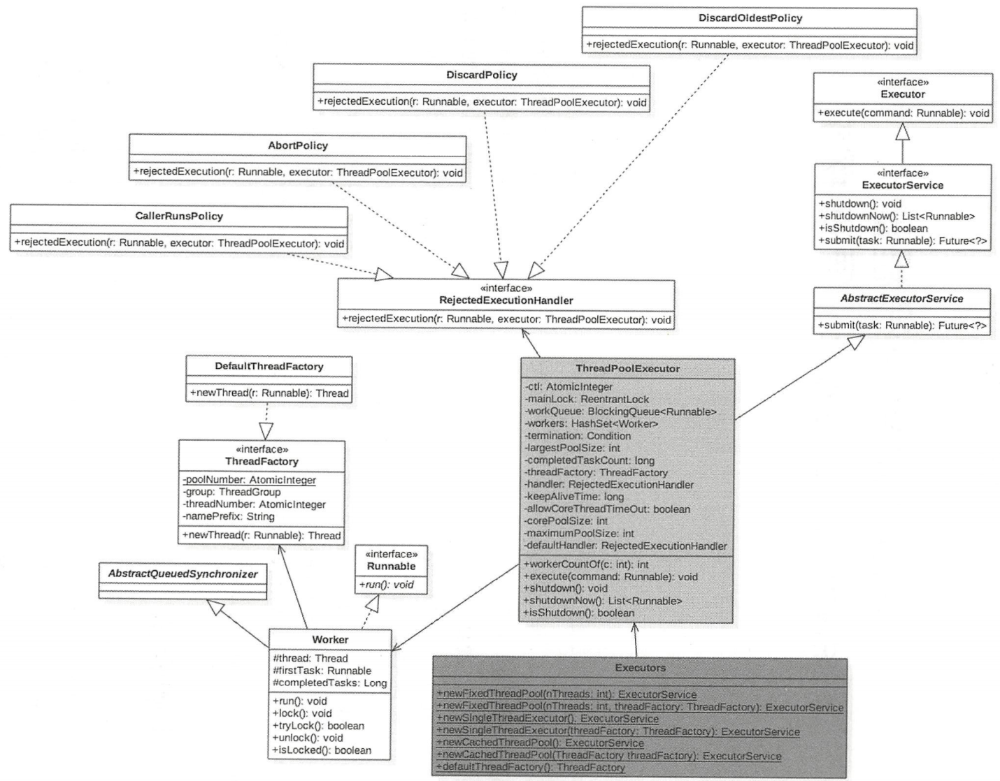
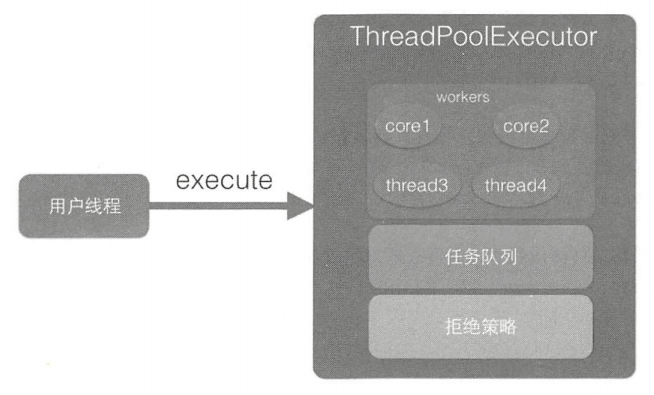
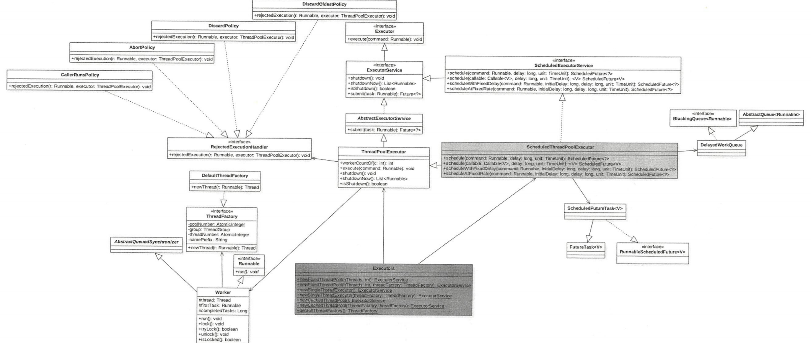

# 八.ThreadPoolExecutor线程池

## 1.介绍

线程池主要解决两个问题：

1. 当执行大量异步任务时线程池很好地重用线程。因为线程的创建与销毁都是很消耗资源的。
2. 线程池提供了资源限制、监控、管理手段。



Worker继承AQS和Runnable接口，是具体承载任务的对象。

- Worker自己实现了简单不可重入独占锁，state=0表示锁空闲，state=1表示锁被占有，创建时state=-1，是为了避免该线程在运行runWorker()方法前被中断。
- firstTask记录了第一个任务，thread是具体执行任务的线程。

DefaultThreadFactory是线程工厂，poolNumber统计线程工厂的个数，threadNumber记录每个线程工厂创建了多少个线程。

```java
// 高3位标识线程池状态，低29位表示线程个数
// 默认是RUNNING状态，线程个数为0
private final AtomicInteger ctl = new AtomicInteger(ctlOf(RUNNING, 0));

// 线程个数掩码位数，不是所有平台int都是32位，在具体平台地int地二进制位数-3后地剩余位数所表示地数才是线程个数
private static final int COUNT_BITS = Integer.SIZE - 3;

// 线程最大个数（低29位）
private static final int COUNT_MASK = (1 << COUNT_BITS) - 1;

// 线程池状态（高3位）
private static final int RUNNING    = -1 << COUNT_BITS;
private static final int SHUTDOWN   =  0 << COUNT_BITS;
private static final int STOP       =  1 << COUNT_BITS;
private static final int TIDYING    =  2 << COUNT_BITS;
private static final int TERMINATED =  3 << COUNT_BITS;

// 获取高3位（运行状态）
private static int runStateOf(int c)     { return c & ~COUNT_MASK; }
// 获取低29位（线程个数）
private static int workerCountOf(int c)  { return c & COUNT_MASK; }
// 计算ctl新值（线程状态与线程个数）
private static int ctlOf(int rs, int wc) { return rs | wc; }
```

线程池状态：

- RUNNING：接受新任务并且处理阻塞队列里的任务；
- SHUTDOWN：拒绝新任务但是处理阻塞队列里的任务；
- STOP：拒绝新任务并且抛弃阻塞队列里的任务；
- TIDYING：所有任务都执行完（包括阻塞队列里的任务）后当前线程池活动线程数为0，将要调用terminated方法；
- TERMINATED：终止状态。terminated方法调用完成后的状态；

线程池状态转换列举：

- RUNNING -> SHUTDOWN：显示调用shutdown()方法，或隐式调用finalize()方法里的shutdown()方法；
- RUNNING或SHUTDOWN -> STOP：显示调用shutdownNow()时；
- SHUTDOWN -> TIDYING：当线程池和任务队列都为空时；
- STOP -> TIDYING：当线程池为空时；
- TIDYING -> TERMINATED：当terminated()hook方法执行完时；

线程池参数：

- corePoolSize：核心线程数量。
- maximumPoolSize：最大线程数。
- workQueue：阻塞队列，存储等待执行的任务，很重要，会对线程池运行过程产生重大影响。
  - ArrayBlockingQueue有界队列
  - LinkedBlockingQueue无界队列
  - SynchronousQueue同步队列，只有一个元素
  - PriorityBlockingQueue无界优先级队列
- keepAliveTime：空闲线程最大存活时间。当线程池中的线程数量大于 corePoolSize 时，如果此时没有新的任务提交，核心线程外的线程不会立即销毁，需要等待，直到等待的时间超过了keepAliveTime 就会终止。
- unit：keepAliveTime的时间单位
- threadFactory：线程工厂，用来创建线程默认会提供一个默认的工厂来创建线程，当使用默认的工厂来创建线程时，会使新创建的线程具有相同的优先级，并且是非守护的线程，同时也设置了线程的名称。
- RejectedExecutionHandler：任务拒绝策略，如果任务数量超出了最大线程数+队列容量，则超出部分会被拒绝。
  - ThreadPoolExecutor.AbortPolicy()丢弃超出部分，并抛出异常
  - ThreadPoolExecutor.DiscardPolicy丢弃超出部分，不抛异常
  - ThreadPoolExecutor.DIscardOldestpolicy()丢弃在等待队列中等待最久的任务
  - ThreadPoolExecutor.CallerRunsPolicy()超出部分任务绕过线程池直接运行

线程池类型：

- newFixedThreadPool：核心线程数与最大线程数都为nThreads，阻塞队列长度是Integer.MAX_VALUE，keepAliveTime=0说明只要线程个数比核心线程数多就回收

  ```java
  public static ExecutorService newFixedThreadPool(int nThreads) {
      return new ThreadPoolExecutor(nThreads, nThreads,
                                    0L, TimeUnit.MILLISECONDS,
                                    new LinkedBlockingQueue<Runnable>());
  }
  ```

- newSingleThreadExecutor：核心线程数和最大线程数都为1，阻塞队列长度是Integer.MAX_VALUE，keepAliveTime=0说明只要线程个数比核心线程数多就回收

  ```java
  public static ExecutorService newSingleThreadExecutor() {
      return new FinalizableDelegatedExecutorService
          (new ThreadPoolExecutor(1, 1,
                                  0L, TimeUnit.MILLISECONDS,
                                  new LinkedBlockingQueue<Runnable>()));
  }
  ```

- newCachedThreadPool：加入同步队列的任务会被马上执行，同步队列只能由一个任务。

  核心线程数为0，最大线程数Integer.MAX_VALUE，阻塞队列为同步队列，keepAliveTime=60说明线程空闲60s就会被回收。

  ```java
  public static ExecutorService newCachedThreadPool() {
      return new ThreadPoolExecutor(0, Integer.MAX_VALUE,
                                    60L, TimeUnit.SECONDS,
                                    new SynchronousQueue<Runnable>());
  }
  ```

## 2.源码分析

### 2.1 **execute(Runnable command)**

提交任务commend到线程池进行执行。



ThreadPoolExecutor实际是一个生产消费模型，当用户添加任务到线程池时相当于生产者生产元素，workers线程工作集中的线程直接执行任务或从任务队列中获取任务来进行消费。

```java
public void execute(Runnable command) {
    // 任务为null，抛异常
    if (command == null)
        throw new NullPointerException();
    // 获取当前线程池的状态+线程个数的组合值
    int c = ctl.get();
    // 如果当前线程个数小于核心线程数，开启新线程执行任务
    if (workerCountOf(c) < corePoolSize) {
        if (addWorker(command, true))
            return;
        c = ctl.get();
    }
    // 如果线程池处于RUNNING状态，则添加任务到阻塞队列
    if (isRunning(c) && workQueue.offer(command)) {
        // 二次检查
        int recheck = ctl.get();
        // 如果当前线程池不是RUNNING状态，则从队列中删除任务，并执行拒绝策略
        if (! isRunning(recheck) && remove(command))
            reject(command);
        // 如果当前线程数为0，则添加一个线程
        else if (workerCountOf(recheck) == 0)
            addWorker(null, false);
    }
    // 如果队列满了，则新增线程，新增失败则执行拒绝策略
    else if (!addWorker(command, false))
        reject(command);
}
```

**boolean addWorker(Runnable firstTask, boolean core)**：

```java
private boolean addWorker(Runnable firstTask, boolean core) {
    retry:
    for (int c = ctl.get();;) {
        // 检查队列是否为空，在必要的时候
        if (runStateAtLeast(c, SHUTDOWN)
            && (runStateAtLeast(c, STOP)
                || firstTask != null
                || workQueue.isEmpty()))
            return false;
		// 循环CAS增加线程个数
        for (;;) {
            // 如果线程个数超过限制，返回false
            if (workerCountOf(c)
                >= ((core ? corePoolSize : maximumPoolSize) & COUNT_MASK))
                return false;
            // CAS增加线程数ctl的值，只有一个线程成功
            if (compareAndIncrementWorkerCount(c))
                break retry;
            // CAS失败了，查看线程池状态是否变化，变化了则跳到外层循环重新尝试获取线程池状态，否则内层循环重新CAS
            c = ctl.get();
            // c>SHUTDOWN说明状态已经改变
            if (runStateAtLeast(c, SHUTDOWN))
                continue retry;
        }
    }
	
    // 到这里说明CAS让ctl加1成功
    boolean workerStarted = false;
    boolean workerAdded = false;
    Worker w = null;
    try {
        // 创建worker
        w = new Worker(firstTask);
        final Thread t = w.thread;
        if (t != null) {
            final ReentrantLock mainLock = this.mainLock;
            // 加独占锁，为了实现worker同步，因为可能多个线程调用了线程池的execute方法
            mainLock.lock();
            try {
				// 重新检查线程池状态，避免在获取锁前其他线程调用shutdown接口
                int c = ctl.get();
                if (isRunning(c) ||
                    (runStateLessThan(c, STOP) && firstTask == null)) {
                    if (t.getState() != Thread.State.NEW)
                        throw new IllegalThreadStateException();
                    // 添加任务
                    workers.add(w);
                    workerAdded = true;
                    int s = workers.size();
                    if (s > largestPoolSize)
                        largestPoolSize = s;
                }
            } finally {
                mainLock.unlock();
            }
            // 添加成功后启动任务
            if (workerAdded) {
                t.start();
                workerStarted = true;
            }
        }
    } finally {
        if (! workerStarted)
            addWorkerFailed(w);
    }
    return workerStarted;
}
```

### 2.2 工作线程worker的执行

用户提交任务到线程池后，由worker执行。

```java
Worker(Runnable firstTask) {
    setState(-1); // 在调用runWorker前禁止中断
    this.firstTask = firstTask;
    this.thread = getThreadFactory().newThread(this); // 创建一个线程
}
```

设置state为-1，避免当前worker在调用runWorker方法前被中断（当其他线程调用了线程池shutdownNow时，如果Worker状态>=0则会中断该线程）

```java
final void runWorker(Worker w) {
    Thread wt = Thread.currentThread();
    Runnable task = w.firstTask;
    w.firstTask = null;
    w.unlock(); // 允许中断
    boolean completedAbruptly = true;
    try {
        // 如果task不为null，运行task，如果为null，去队列中取
        while (task != null || (task = getTask()) != null) {
            w.lock(); // 获取独占锁，防止在任务运行期间其他线程调用了shutdown后，正在执行的任务被中断
            if ((runStateAtLeast(ctl.get(), STOP) ||
                 (Thread.interrupted() &&
                  runStateAtLeast(ctl.get(), STOP))) &&
                !wt.isInterrupted())
                wt.interrupt();
            try {
                // 执行任务前做一些事情
                beforeExecute(wt, task);
                try {
                    // 运行任务
                    task.run();
                    // 执行任务完后做一些事情
                    afterExecute(task, null);
                } catch (Throwable ex) {
                    afterExecute(task, ex);
                    throw ex;
                }
            } finally {
                task = null;
                // 统计当前Worker完成了多少任务
                w.completedTasks++;
                w.unlock();
            }
        }
        completedAbruptly = false;
    } finally {
        // 执行清理工作
        processWorkerExit(w, completedAbruptly);
    }
}
```

```java
private void processWorkerExit(Worker w, boolean completedAbruptly) {
    if (completedAbruptly)
        decrementWorkerCount();
	// 统计整个线程池完成的任务个数，并从工作集中删除当前Worker
    final ReentrantLock mainLock = this.mainLock;
    mainLock.lock();
    try {
        completedTaskCount += w.completedTasks;
        workers.remove(w);
    } finally {
        mainLock.unlock();
    }
	// 尝试设置线程池状态为TERMINATED，
    // 如果当前是SHUTDOWN状态且工作队列为空，或者当前是STOP状态，当前线程池没有活动线程
    tryTerminate();
	
    // 如果当前线程个数小于核心线程个数，则增加
    int c = ctl.get();
    if (runStateLessThan(c, STOP)) {
        if (!completedAbruptly) {
            int min = allowCoreThreadTimeOut ? 0 : corePoolSize;
            if (min == 0 && ! workQueue.isEmpty())
                min = 1;
            if (workerCountOf(c) >= min)
                return; // replacement not needed
        }
        addWorker(null, false);
    }
}
```

### 2.3 shutdown操作

调用shutdown方法后，线程池不会再接受新的任务，但是工作队列的任务还是要执行的。

```java
public void shutdown() {
    final ReentrantLock mainLock = this.mainLock;
    mainLock.lock();
    try {
        // 权限检查，查看调用shutdown的线程是否由关闭权限
        checkShutdownAccess();
        // 设置线程池状态为SHUTDOWN
        advanceRunState(SHUTDOWN);
        // 设置所有空闲线程的中断标志
        interruptIdleWorkers();
        onShutdown(); // hook for ScheduledThreadPoolExecutor
    } finally {
        mainLock.unlock();
    }
    // 尝试将状态改变为TERMINATED
    tryTerminate();
}
```

```java
private void interruptIdleWorkers() {
    interruptIdleWorkers(false);
}

private void interruptIdleWorkers(boolean onlyOne) {
    final ReentrantLock mainLock = this.mainLock;
    mainLock.lock();
    try {
        // 设置所有空闲线程的中断标志
        for (Worker w : workers) {
            Thread t = w.thread;
            // 如果这个工作线程没有被中断，并且没有正在运行，则设置中断标志
            // 因为
            if (!t.isInterrupted() && w.tryLock()) {
                try {
                    t.interrupt();
                } catch (SecurityException ignore) {
                } finally {
                    w.unlock();
                }
            }
            if (onlyOne)
                break;
        }
    } finally {
        mainLock.unlock();
    }
}
```

```java
final void tryTerminate() {
    for (;;) {
        int c = ctl.get();
        if (isRunning(c) ||
            runStateAtLeast(c, TIDYING) ||
            (runStateLessThan(c, STOP) && ! workQueue.isEmpty()))
            return;
        if (workerCountOf(c) != 0) { // Eligible to terminate
            interruptIdleWorkers(ONLY_ONE);
            return;
        }

        final ReentrantLock mainLock = this.mainLock;
        mainLock.lock();
        try {
            // CAS设置当前线程池状态为TIDYING
            if (ctl.compareAndSet(c, ctlOf(TIDYING, 0))) {
                try {
                    terminated();
                } finally {
                    // 设置当前线程池状态为TERMINATED
                    ctl.set(ctlOf(TERMINATED, 0));
                    // 激活因为调用条件变量termination下被阻塞的线程
                    termination.signalAll();
                }
                return;
            }
        } finally {
            mainLock.unlock();
        }
    }
}
```

### 2.4 shutdownNow操作

调用shutdownNow后，线程池就不会再接受新的任务了，并且会丢弃工作队列中的任务，正在执行的任务会被中断，该方法会立即返回，不等待带激活的任务执行完成。返回值是这时候队列里面被丢弃的任务队列。

```java
public List<Runnable> shutdownNow() {
    List<Runnable> tasks;
    final ReentrantLock mainLock = this.mainLock;
    mainLock.lock();
    try {
        checkShutdownAccess(); // 权限检查
        advanceRunState(STOP); // 设置线程池状态为STOP
        interruptWorkers(); // 中断所有线程
        tasks = drainQueue(); // 将队列中所有任务移到tasks中
    } finally {
        mainLock.unlock();
    }
    tryTerminate();
    return tasks;
}
```

```java
private void interruptWorkers() {
    // assert mainLock.isHeldByCurrentThread();
    for (Worker w : workers)
        w.interruptIfStarted();
}
```

### 2.5 awaitTermination操作

当线程调用awaitTermination方法后，当前线程会被阻塞，直到线程池状态变为TERMINATED才返回，或等待超时才返回。

```java
public boolean awaitTermination(long timeout, TimeUnit unit)
    throws InterruptedException {
    long nanos = unit.toNanos(timeout);
    final ReentrantLock mainLock = this.mainLock;
    mainLock.lock();
    try {
        // 循环等待线程池状态变为TERMINATED
        while (runStateLessThan(ctl.get(), TERMINATED)) {
            if (nanos <= 0L)
                return false;
            // 阻塞，直到时间到了
            nanos = termination.awaitNanos(nanos);
        }
        return true;
    } finally {
        mainLock.unlock();
    }
}
```

# 九.ScheduledThreadPoolExecutor线程池

## 1.类图介绍

可以指定一定延迟时间后，或定时进行任务调度执行的线程池



Executors是一个工具类，提供了很多不同类型的线程池实例。

ScheduledThreadPoolExecutor继承了ThreadPoolExecutor并实现了ScheduledPoolExecutorService接口。线程池队列是DelayedWorkQueue延迟队列。

ScheduledFutureTask是一个具有返回值的任务，继承自FutureTask。FutureTask内部有一个变量state用来表示任务状态，一开始为NEW

```java
private volatile int state;
private static final int NEW          = 0; //初始状态
private static final int COMPLETING   = 1; //执行中状态
private static final int NORMAL       = 2; //正常运行结束状态
private static final int EXCEPTIONAL  = 3; //运行中异常
private static final int CANCELLED    = 4; //任务被取消
private static final int INTERRUPTING = 5; //任务正在被中断
private static final int INTERRUPTED  = 6; //任务已经被中断
```

任务状态可能的转化路径：

- NEW --> COMPLETING --> NORMAL
- NEW --> COMPLETING --> EXCEPTIONAL
- NEW --> CANCELLED
- NEW --> INTERRUPTING --> INTERRUPTED

ScheduledFutureTask内部还有一个变量period用来表示任务的类型：

- period=0，说明任务是一次性的，执行完后就退出了
- period<0，说明当前任务为fixed-delay任务，是固定延迟的定时可重复执行任务
- period>0，说明当前任务为fixed-rate任务，是固定频率的定时可重复执行任务

ScheduledThreadPoolExecutor构造：

```java
public ScheduledThreadPoolExecutor(int corePoolSize) {
    super(corePoolSize, Integer.MAX_VALUE,
          DEFAULT_KEEPALIVE_MILLIS, MILLISECONDS,
          new DelayedWorkQueue());
}
```

## 2.原理剖析

### 2.1 schedule(Runnable command, long delay, TimeUnit unit)

提交一个延迟执行的任务，任务从提交时间算起延迟delay时间后开始执行。提交的是一次性任务。

```java
public ScheduledFuture<?> schedule(Runnable command,
                                   long delay,
                                   TimeUnit unit) {
    if (command == null || unit == null)
        throw new NullPointerException();
    
    // 转化任务
    RunnableScheduledFuture<Void> t = decorateTask(command,
                                        new ScheduledFutureTask<Void>(
                                            command, null,
                                            triggerTime(delay, unit),
                                            sequencer.getAndIncrement()));
    delayedExecute(t);
    return t;
}
```

```java
ScheduledFutureTask(Runnable r, V result, long triggerTime,
                    long sequenceNumber) {
    super(r, result); // 父类FutureTask构造
    this.time = triggerTime;
    this.period = 0; // 一次性任务
    this.sequenceNumber = sequenceNumber;
}

// 父类FutureTask构造
public FutureTask(Runnable runnable, V result) {
    // 转化为Callable类型
    this.callable = Executors.callable(runnable, result);
    // 设置状态为NEW
    this.state = NEW;
}
```

```java
FutureTask方法：

public long getDelay(TimeUnit unit) {
    return unit.convert(time - System.nanoTime(), NANOSECONDS);
}

// 用于延迟队列的排序，最快过期的元素要放在队首
public int compareTo(Delayed other) {
    if (other == this)
        return 0;
    if (other instanceof ScheduledFutureTask) {
        ScheduledFutureTask<?> x = (ScheduledFutureTask<?>)other;
        long diff = time - x.time;
        if (diff < 0)
            return -1;
        else if (diff > 0)
            return 1;
        else if (sequenceNumber < x.sequenceNumber)
            return -1;
        else
            return 1;
    }
    long diff = getDelay(NANOSECONDS) - other.getDelay(NANOSECONDS);
    return (diff < 0) ? -1 : (diff > 0) ? 1 : 0;
}
```

```java
private void delayedExecute(RunnableScheduledFuture<?> task) {
    // 如果线程池关闭了，则执行线程池拒绝策略
    if (isShutdown())
        reject(task);
    else {
        // 添加任务到延迟队列
        super.getQueue().add(task);
        // 再次检查线程池状态
        // 如果线程池被关闭了，删除刚才添加的任务
        if (!canRunInCurrentRunState(task) && remove(task))
            task.cancel(false); // 取消任务，防止被其他线程执行
        else
            // 确保至少一个线程在处理任务
            ensurePrestart();
    }
}

void ensurePrestart() {
    int wc = workerCountOf(ctl.get());
    // 如果当前线程个数小于核心数，新增一个线程
    if (wc < corePoolSize)
        addWorker(null, true);
    else if (wc == 0)
        addWorker(null, false);
}
```

前面是向延迟队列添加任务，下面是看工作线程如何获取任务并执行。

```java
public void run() {
    // 检查当前线程池是否可用
    if (!canRunInCurrentRunState(this))
        cancel(false);
    // 判断是否是一次性任务，调用schedule方法的时候
    else if (!isPeriodic())
        super.run();
    // 定时执行
    else if (super.runAndReset()) {
        // 设置time = time+period
        setNextRunTime();
        // 重新加入该任务到delay队列
        reExecutePeriodic(outerTask);
    }
}
```

```java
public boolean isPeriodic() {
    return period != 0;
}

public void run() {
    // 判断任务是否是NEW状态，不是直接返回
    // 当前任务状态是NEW，尝试设置当前任务的持有者是当前线程
    if (state != NEW ||
        !RUNNER.compareAndSet(this, null, Thread.currentThread()))
        return;
    try {
        // 拿到具体的任务
        Callable<V> c = callable;
        // 再次判断状态是否为NEW，防止被其他线程修改
        if (c != null && state == NEW) {
            V result;
            boolean ran;
            try {
                result = c.call(); // 执行
                ran = true;
            } catch (Throwable ex) {
                result = null;
                ran = false;
                // 设置异常状态
                setException(ex);
            }
            if (ran)
                // 设置任务正常结束状态
                set(result);
        }
    } finally {
        runner = null;
        int s = state;
        if (s >= INTERRUPTING)
            handlePossibleCancellationInterrupt(s);
    }
}

protected void setException(Throwable t) {
    // 如果当前任务状态为NEW，设置为COMPLETING
    if (STATE.compareAndSet(this, NEW, COMPLETING)) {
        outcome = t;
        // 设置任务非正常结束
        STATE.setRelease(this, EXCEPTIONAL);
        finishCompletion();
    }
}

protected void set(V v) {
    // 如果当前任务状态为NEW，设置为COMPLETING
    if (STATE.compareAndSet(this, NEW, COMPLETING)) {
        outcome = v;
        // 设置任务正常结束
        STATE.setRelease(this, NORMAL); // final state
        finishCompletion();
    }
}
```

### 2.2 scheduleWithFixedDelay(Runnable command,

                                                 long initialDelay,
                                                 long delay,
                                                 TimeUnit unit) 

当任务执行完毕后，让其延迟固定时间后再次运行。任务会一直重复运行，直到任务运行中抛异常，被取消了，或者关闭了线程池。

initialDelay：提交任务后延迟多久时间开始执行任务

delay：当任务执行完毕后延迟多久时间后再次运行

```java
public ScheduledFuture<?> scheduleWithFixedDelay(Runnable command,
                                                 long initialDelay,
                                                 long delay,
                                                 TimeUnit unit) {
    if (command == null || unit == null)
        throw new NullPointerException();
    if (delay <= 0L)
        throw new IllegalArgumentException();
    // 任务转化，注意这里period=-delay < 0
    ScheduledFutureTask<Void> sft =
        new ScheduledFutureTask<Void>(command,
                                      null,
                                      triggerTime(initialDelay, unit),
                                      -unit.toNanos(delay),
                                      sequencer.getAndIncrement());
    RunnableScheduledFuture<Void> t = decorateTask(command, sft);
    sft.outerTask = t;
    // 添加到任务队列
    delayedExecute(t);
    return t;
}
```

将任务添加到延迟队列后，线程池线程会从队列中获取任务，然后调用ScheduledFutureTask的run方法执行，由于这里period<0，所以会执行到runAndReset（）

```java
protected boolean runAndReset() {
    if (state != NEW ||
        !RUNNER.compareAndSet(this, null, Thread.currentThread()))
        return false;
    boolean ran = false;
    int s = state;
    try {
        Callable<V> c = callable;
        if (c != null && s == NEW) {
            try {
                c.call();
                ran = true;
            } catch (Throwable ex) {
                setException(ex);
            }
        }
    } finally {
        runner = null;
        s = state;
        if (s >= INTERRUPTING)
            handlePossibleCancellationInterrupt(s);
    }
    // 如果当前任务执行完毕且任务状态为NEW，则返回true
    return ran && s == NEW;
}

// 设置下次执行时间
private void setNextRunTime() {
    long p = period;
    if (p > 0)
        time += p;
    else
        time = triggerTime(-p);
}
```

### 2.3 scheduleAtFixedRate(Runnable command,

                                              long initialDelay,
                                              long period,
                                              TimeUnit unit)

相对于起始时间以固定频率调用指定任务。当把任务提交到线程池并延迟initialDelay时间后开始执行任务。然后从initialDelay+period时间点再次执行，然后再initialDelay+2*period时间再次执行，循环往复，直到抛异常或者任务取消，或者线程池关闭。

```java
public ScheduledFuture<?> scheduleAtFixedRate(Runnable command,
                                              long initialDelay,
                                              long period,
                                              TimeUnit unit) {
    if (command == null || unit == null)
        throw new NullPointerException();
    if (period <= 0L)
        throw new IllegalArgumentException();
    // 任务转化，period>0
    ScheduledFutureTask<Void> sft =
        new ScheduledFutureTask<Void>(command,
                                      null,
                                      triggerTime(initialDelay, unit),
                                      unit.toNanos(period),
                                      sequencer.getAndIncrement());
    RunnableScheduledFuture<Void> t = decorateTask(command, sft);
    sft.outerTask = t;
    delayedExecute(t);
    return t;
}
```

因为period>0所以run()会执行到setNextRunTime()方法

```java
private void setNextRunTime() {
    long p = period;
    if (p > 0)
        time += p; // 设置
    else
        time = triggerTime(-p);
}
```
