# 四.虚拟机执行子系统

## 1.类文件结构 

### 1.1 无关性的基石 

实现语言无关性的基础仍然是虚拟机和字节码存储格式。Java虚拟机不与包括Java语言在内的任何程序语言绑定，它只与“Class文件”这种特定的二进制文件格式所关联，Class文件中包含了Java虚拟机指令集、符号表以及若干其他辅助信息。基于安全方面的考虑，《Java虚拟机规范》中要求在Class文件必须应用许多强制性的语法和结构化约束，但图灵完备的字节码格式，保证了任意一门功能性语言都可以表示为一个能被Java虚拟机所接受的有效的Class文件。作为一个通用的、与机器无关的执行平台，任何其他语言的实现者都可以将Java虚拟机作为他们语言的运行基础，以Class文件作为他们产品的交付媒介。例如，使用Java编译器可以把Java代码编译为存储字节码的Class文件，使用JRuby等其他语言的编译器一样可以把它们的源程序代码编译成Class文件。虚拟机丝毫不关心Class的来源是什么语言，它与程序语言之间的关系如图：

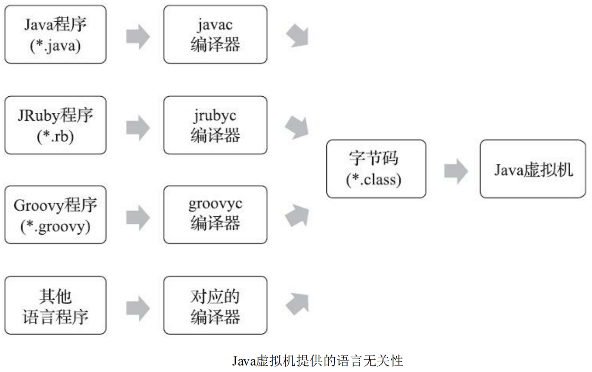

### 1.2 Class类文件的结构

Java技术能够一直保持着非常良好的向后兼容性，Class文件结构的稳定功不可没，任何一门程序语言能够获得商业上的成功，都不可能去做升级版本后，旧版本编译的产品就不再能够运行这种事情。

本章所讲述的关于Class文件结构的内容，绝大部分都是在第一版的《Java虚拟机规范》（1997年发布，对应于JDK 1.2时代的Java虚拟机）中就已经定义好的，内容虽然古老，但时至今日，Java发展经历了十余个大版本、无数小更新，那时定义的Class文件格式的各项细节几乎没有出现任何改变。尽管不同版本的《Java虚拟机规范》对Class文件格式进行了几次更新，但基本上只是在原有结构基础上新增内容、扩充功能，并未对已定义的内容做出修改。 

注意：任何一个Class文件都对应着唯一的一个类或接口的定义信息，但是反过来说，类或接口并不一定都得定义在文件里（譬如类或接口也可以动态生成，直接送入类加载器中）。

**Class文件是一组以8个字节为基础单位的二进制流，各个数据项目严格按照顺序紧凑地排列在文件之中，中间没有添加任何分隔符，这使得整个Class文件中存储的内容几乎全部是程序运行的必要数据，没有空隙存在**。当遇到需要占用8个字节以上空间的数据项时，则会按照高位在前的方式分割成若干个8个字节进行存储。 

根据《Java虚拟机规范》的规定，Class文件格式采用一种类似于C语言结构体的伪结构来存储数据，这种伪结构中只有两种数据类型：“无符号数”和“表”。

- 无符号数属于基本的数据类型，以u1、u2、u4、u8来分别代表1个字节、2个字节、4个字节和8个字节的无符号数，无符号数可以用来描述数字、索引引用、数量值或者按照UTF-8编码构成字符串值。

- 表是由多个无符号数或者其他表作为数据项构成的复合数据类型，为了便于区分，所有表的命名都习惯性地以“_info”结尾。表用于描述有层次关系的复合结构的数据，整个Class文件本质上也可以视作是一张表，下面这张表所示的数据项按严格顺序排列构成。 

  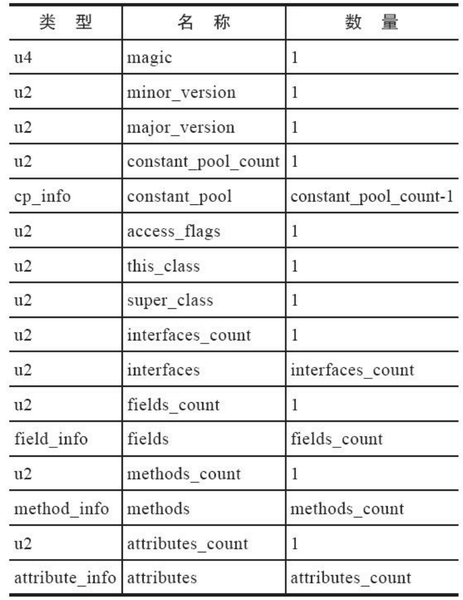

  无论是无符号数还是表，当需要描述同一类型但数量不定的多个数据时，经常会使用一个前置的容量计。

### 1.3 魔数与Class文件的版本 

每个Class文件的头4个字节被称为魔数（Magic Number），它的唯一作用是确定这个文件是否为一个能被虚拟机接受的Class文件。不仅是Class文件，很多文件格式标准中都有使用魔数来进行身份识别的习惯，譬如图片格式，如GIF或者JPEG等在文件头中都存有魔数。使用魔数而不是扩展名来进行识别主要是基于安全考虑，因为文件扩展名可以随意改动。文件格式的制定者可以自由地选择魔数 值，只要这个魔数值还没有被广泛采用过而且不会引起混淆。Class文件的魔数取得很有“浪漫气息”，值为0xCAFEBABE（咖啡宝贝？）。这个魔数值在Java还被称作“Oak”语言的时候（大约是1991年前后）就已经确定下来了。它还有一段很有趣的历史，据Java开发小组最初的关键成员Patrick Naughton所说：“我们一直在寻找一些好玩的、容易记忆的东西，选择0xCAFEBABE是因为它象征着著名咖啡品牌Peet’s Coffee深受欢迎的Baristas咖啡。”这个魔数似乎也预示着日后“Java”这个商标名称的出现。

紧接着魔数的4个字节存储的是Class文件的版本号：第5和第6个字节是次版本号（Minor Version），第7和第8个字节是主版本号（Major Version）。Java的版本号是从45开始的，JDK 1.1之后的每个JDK大版本发布主版本号向上加1（JDK 1.0～1.1使用了45.0～45.3的版本号），高版本的JDK能向下兼容以前版本的Class文件，但不能运行以后版本的Class文件，因为《Java虚拟机规范》在Class文件校验部分明确要求了即使文件格式并未发生任何变化，虚拟机也必须拒绝执行超过其版本号的Class文件。

下图显示的是使用十六进制编辑器WinHex打开这个Class文件的结果，可以清楚地看见开头4个字节的十六进制表示是0xCAFEBABE，代表次版本号的第5个和第6个字节值为0x0000，而主版本号的值为0x0032，也即是十进制的50，该版本号说明这个是可以被JDK 6或以上版本虚拟机执行的Class文件。


### 1.4 常量池

紧接着主、次版本号之后的是常量池入口，常量池可以比喻为Class文件里的资源仓库，它是Class文件结构中与其他项目关联最多的数据，通常也是占用Class文件空间最大的数据项目之一，另外，它还是在Class文件中第一个出现的表类型数据项目。 

由于常量池中常量的数量是不固定的，所以在常量池的入口需要放置一项u2类型的数据，代表常量池容量计数值（constant_pool_count）。与Java中语言习惯不同，这个容量计数是从1而不是0开始的，如图所示，常量池容量（偏移地址：0x00000008）为十六进制数0x0016，即十进制的22，这就代表常量池中有21项常量，索引值范围为1～21。在Class文件格式规范制定之时，设计者将第0项常量空出来是有特殊考虑的，这样做的目的在于，如果后面某些指向常量池的索引值的数据在特定情况下需要表达“不引用任何一个常量池项目”的含义，可以把索引值设置为0来表示。Class文件结构中只有常量池的容量计数是从1开始，对于其他集合类型，包括接口索引集合、字段表集合、方法表集合等的容量计数都与一般习惯相同，是从0开始。

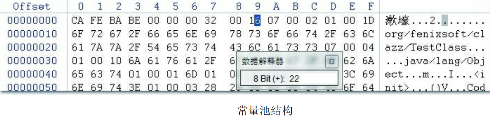

常量池中主要存放两大类常量：字面量（Literal）和符号引用（Symbolic References）。字面量比较接近于Java语言层面的常量概念，如文本字符串、被声明为final的常量值等。而符号引用则属于编译原理方面的概念，主要包括下面几类常量： 

- 被模块导出或者开放的包（Package） 
- 类和接口的全限定名（Fully Qualified Name） 
- 字段的名称和描述符（Descriptor） 
- 方法的名称和描述符 
- 方法句柄和方法类型（Method Handle、Method Type、Invoke Dynamic）
- 动态调用点和动态常量（Dynamically-Computed Call Site、Dynamically-Computed Constant） 

在Class文件中不会保存各个方法、字段最终在内存中的布局信息，这些字段、方法的符号引用不经过虚拟机在运行期转换的话是无法得到真正的内存入口地址，也就无法直接被虚拟机使用的。当虚拟机做类加载时，将会从常量池获得对应的符号引用，再在类创建时或运行时解析、翻译到具体的内存地址之中。

### 1.5 访问标志 

在常量池结束之后，紧接着的2个字节代表访问标志（**access_flags**），这个标志用于识别一些类或者接口层次的访问信息，包括：这个Class是类还是接口；是否定义为public类型；是否定义为abstract类型；如果是类的话，是否被声明为final；等等。

### 1.6 类索引、父类索引与接口索引集合 

类索引（this_class）和父类索引（super_class）都是一个u2类型的数据，而接口索引集合（interfaces）是一组u2类型的数据的集合，Class文件中由这三项数据来确定该类型的继承关系。

类索引用于确定这个类的全限定名，父类索引用于确定这个类的父类的全限定名。由于Java语言不允许多重继承，所以父类索引只有一个，除了java.lang.Object之外，所有的Java类都有父类，因此除了java.lang.Object外，所有Java类的父类索引都不为0。接口索引集合就用来描述这个类实现了哪些接 口，这些被实现的接口将按implements关键字（如果这个Class文件表示的是一个接口，则应当是extends关键字）后的接口顺序从左到右排列在接口索引集合中。 

类索引、父类索引和接口索引集合都按顺序排列在访问标志之后，类索引和父类索引用两个u2类型的索引值表示，它们各自指向一个类型为CONSTANT_Class_info的类描述符常量，通过CONSTANT_Class_info类型的常量中的索引值可以找到定义在CONSTANT_Utf8_info类型的常量中的全限定名字符串。

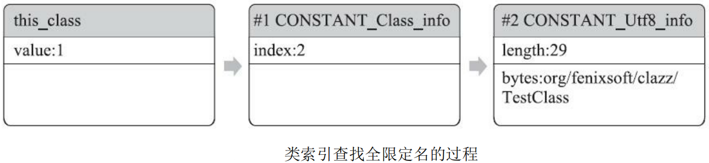

对于接口索引集合，入口的第一项u2类型的数据为接口计数器（interfaces_count），表示索引表的容量。如果该类没有实现任何接口，则该计数器值为0，后面接口的索引表不再占用任何字节。

### 1.7 字段表集合

字段表（field_info）用于描述接口或者类中声明的变量。Java语言中的“字段”（Field）包括类级变量以及实例级变量，但不包括在方法内部声明的局部变量。

字段可以包括的修饰符有字段的作用域（public、private、protected修饰符）、是实例变量还是类变量（static修饰符）、可变性（final）、并发可见性（volatile修饰符，是否强制从主内存读写）、可否被序列化（transient修饰符）、字段数据类型（基本类型、对象、数组）、字段名称。上述这些信息中，各个修饰符都是布尔值，要么有某个修饰符，要么没有，很适合使用标志位来表示。而字段叫做什么名字、字段被定义为什么数据类型，这些都是无法固定的，只能引用常量池中的常量来描述。

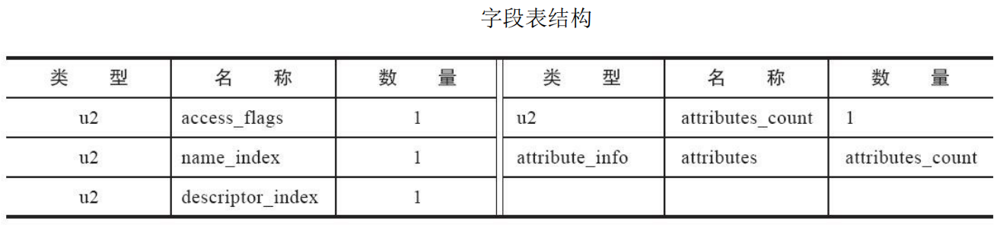

跟随access_flags标志的是两项索引值：name_index和descriptor_index。它们都是对常量池项的引用，分别代表着**字段的简单名称**以及**字段和方法的描述符**。

### 1.7 方法表集合

Class文件存储格式中对方法的描述与对字段的描述采用了几乎完全一致的方式，方法表的结构如同字段表一样，依次包括访问标志（access_flags）、名称索引（name_index）、描述符索引（descriptor_index）、属性表集合（attributes）几项。

因为volatile关键字和transient关键字不能修饰方法，所以方法表的访问标志中没有了ACC_VOLATILE标志和ACC_TRANSIENT标志。与之相对，synchronized、native、strictfp和abstract关键字可以修饰方法，方法表的访问标志中也相应地增加了ACC_SYNCHRONIZED、ACC_NATIVE、ACC_STRICTFP和ACC_ABSTRACT标志。

方法里的Java代码，经过Javac编译器编译成字节码指令之后，存放在方法属性表集合中一个名为“Code”的属性里面，属性表作为Class文件格式中最具扩展性的 一种数据项目。

### 1.8 属性表集合

属性表（attribute_info）在前面的讲解之中已经出现过数次，Class文件、字段表、方法表都可以携带自己的属性表集合，以描述某些场景专有的信息。

与Class文件中其他的数据项目要求严格的顺序、长度和内容不同，属性表集合的限制稍微宽松一些，不再要求各个属性表具有严格顺序，并且《Java虚拟机规范》允许只要不与已有属性名重复，任何人实现的编译器都可以向属性表中写入自己定义的属性信息，Java虚拟机运行时会忽略掉它不认识的属性。为了能正确解析Class文件，《Java虚拟机规范》最初只预定义了9项所有Java虚拟机实现都应当能识别的属性，而在最新的《Java虚拟机规范》的Java SE 12版本中，预定义属性已经增加到29项。

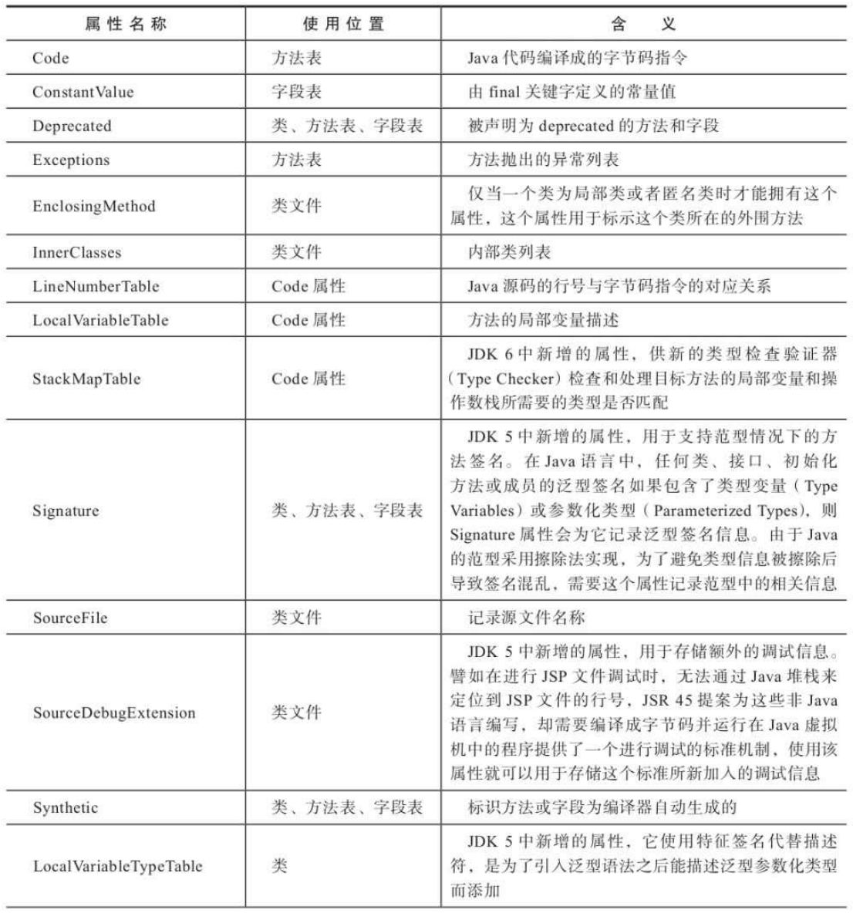

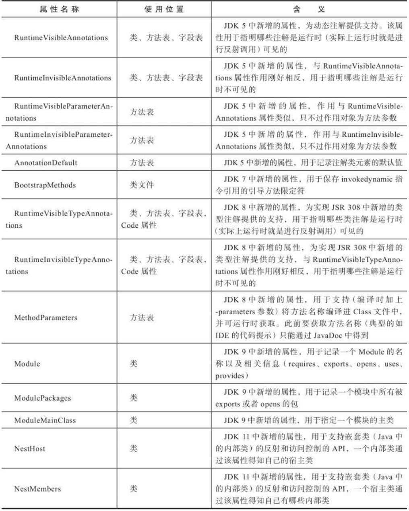

**Code属性**

Java程序方法体里面的代码经过Javac编译器处理之后，最终变为字节码指令存储在Code属性内。Code属性出现在方法表的属性集合之中，但并非所有的方法表都必须存在这个属性，譬如接口或者抽象类中的方法就不存在Code属性。

**Exceptions属性** 

这里的Exceptions属性是在方法表中与Code属性平级的一项属性，不要与前面刚刚讲解完的异常表产生混淆。Exceptions属性的作用是列举出方法中可能抛出的受查异常（Checked Excepitons），也就是方法描述时在throws关键字后面列举的异常。

# 五.虚拟机类加载机制

Java虚拟机把描述类的数据从Class文件加载到内存，并对数据进行校验、转换解析和初始化，最终形成可以被虚拟机直接使用的Java类型，这个过程被称作虚拟机的类加载机制。与那些在编译时需要进行连接的语言不同，在Java语言里面，类型的加载、连接和初始化过程都是在程序运行期间完成的，这种策略让Java语言进行提前编译会面临额外的困难，也会让类加载时稍微增加一些性能开销，但是却为Java应用提供了极高的扩展性和灵活性，Java天生可以动态扩展的语言特性就是依赖运行期动态加载和动态连接这个特点实现的。例如，编写一个面向接口的应用程序，可以等到运行时再指定其实际的实现类，用户可以通过Java预置的或自定义类加载器，让某个本地的应用程序在运行时从网络或其他地方上加载一个二进制流作为其程序代码的一部分。

## 1.类加载的时机

一个类型从被加载到虚拟机内存中开始，到卸载出内存为止，它的整个生命周期将会经历加载（Loading）、验证（Verification）、准备（Preparation）、解析（Resolution）、初始化（Initialization）、使用（Using）和卸载（Unloading）七个阶段，其中验证、准备、解析三个部分统称为连接（Linking）。

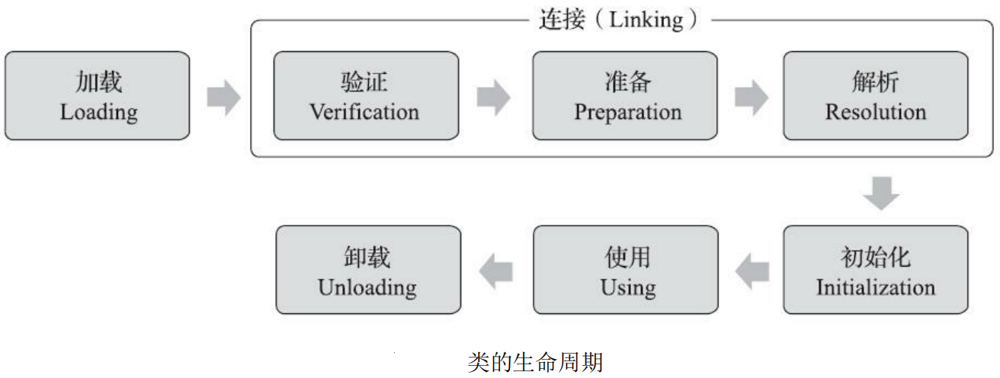

加载、验证、准备、初始化和卸载这五个阶段的顺序是确定的，类型的加载过程必须按照这种顺序**按部就班地开始**。

而解析阶段则不一定：它在某些情况下可以在初始化阶段之后再开始，这是为了支持Java语言的运行时绑定特性（也称为动态绑定或晚期绑定）。

请注意，这里写的是按部就班地“开始”，而不是按部就班地“进行”或按部就班地“完成”，强调这点是因为这些阶段通常都是互相交叉地混合进行的，会在一个阶段执行的过程中调用、激活另一个阶段。 

关于在什么情况下需要开始类加载过程的第一个阶段“加载”，《Java虚拟机规范》中并没有进行强制约束，这点可以交给虚拟机的具体实现来自由把握。但是对于初始化阶段，《Java虚拟机规范》则是严格规定了有且只有六种情况必须立即对类进行“初始化”（而加载、验证、准备自然需要在此之前开始）： 

1. 遇到new、getstatic、putstatic或invokestatic这四条字节码指令时，如果类型没有进行过初始化，则需要先触发其初始化阶段。能够生成这四条指令的典型Java代码场景有：
   - 使用new关键字实例化对象的时候。 
   - 读取或设置一个类型的静态字段（被final修饰、已在编译期把结果放入常量池的静态字段除外） 的时候。
   - 调用一个类型的静态方法的时候。
2. 使用java.lang.reflect包的方法对类型进行反射调用的时候，如果类型没有进行过初始化，则需要先触发其初始化。
3. 当初始化类的时候，如果发现其父类还没有进行过初始化，则需要先触发其父类的初始化。 
4. 当虚拟机启动时，用户需要指定一个要执行的主类（包含main()方法的那个类），虚拟机会先初始化这个主类。 
5. 当使用JDK 7新加入的动态语言支持时，如果一个java.lang.invoke.MethodHandle实例最后的解析结果为REF_getStatic、REF_putStatic、REF_invokeStatic、REF_newInvokeSpecial四种类型的方法句柄，并且这个方法句柄对应的类没有进行过初始化，则需要先触发其初始化。 
6. 当一个接口中定义了JDK 8新加入的默认方法（被default关键字修饰的接口方法）时，如果有这个接口的实现类发生了初始化，那该接口要在其之前被初始化。 

## 2.类加载的过程

### 2.1 加载 

“加载”（Loading）阶段是整个“类加载”（Class Loading）过程中的一个阶段，希望读者没有混淆这两个看起来很相似的名词。在加载阶段，Java虚拟机需要完成以下三件事情： 

- 通过一个类的全限定名来获取定义此类的二进制字节流。 
- 将这个字节流所代表的静态存储结构转化为方法区的运行时数据结构。 
- 在内存中生成一个代表这个类的java.lang.Class对象，作为方法区这个类的各种数据的访问入口。

《Java虚拟机规范》对这三点要求其实并不是特别具体，留给虚拟机实现与Java应用的灵活度都是相当大的。例如“通过一个类的全限定名来获取定义此类的二进制字节流”这条规则，它并没有指明二进制字节流必须得从某个Class文件中获取，确切地说是根本没有指明要从哪里获取、如何获取。仅仅这一点空隙，Java虚拟机的使用者们就可以在加载阶段搭构建出一个相当开放广阔的舞台，Java发展历程中，充满创造力的开发人员则在这个舞台上玩出了各种花样，许多举足轻重的Java技术都建立在这一基础之上，例如：

- 从ZIP压缩包中读取，这很常见，最终成为日后JAR、EAR、WAR格式的基础。
- 从网络中获取，这种场景最典型的应用就是Web Applet。
- 运行时计算生成，这种场景使用得最多的就是动态代理技术，在java.lang.reflect.Proxy中，就是用了ProxyGenerator.generateProxyClass()来为特定接口生成形式为“*$Proxy”的代理类的二进制字节流。
- 由其他文件生成，典型场景是JSP应用，由JSP文件生成对应的Class文件。 
- 从数据库中读取，这种场景相对少见些，例如有些中间件服务器（如SAP Netweaver）可以选择把程序安装到数据库中来完成程序代码在集群间的分发。 
- 可以从加密文件中获取，这是典型的防Class文件被反编译的保护措施，通过加载时解密Class文件来保障程序运行逻辑不被窥探。
- ... ...

相对于类加载过程的其他阶段，非数组类型的加载阶段（准确地说，是加载阶段中获取类的二进制字节流的动作）是开发人员可控性最强的阶段。加载阶段既可以使用Java虚拟机里内置的引导类加载器来完成，也可以由用户自定义的类加载器去完成，开发人员通过定义自己的类加载器去控制字节流的获取方式（重写一个类加载器的findClass()或loadClass()方法），实现根据自己的想法来赋予应用 程序获取运行代码的动态性。 

对于**数组类而言，情况就有所不同，数组类本身不通过类加载器创建，它是由Java虚拟机直接在内存中动态构造出来的**。但数组类与类加载器仍然有很密切的关系，因为数组类的元素类型（ElementType，指的是数组去掉所有维度的类型）最终还是要靠类加载器来完成加载，一个数组类（下面简称为C）创建过程遵循以下规则： 

- 如果数组的组件类型（Component Type，指的是数组去掉一个维度的类型，注意和前面的元素类型区分开来）是引用类型，那就递归采用本节中定义的加载过程去加载这个组件类型，数组C将被标识在加载该组件类型的类加载器的类名称空间上（这点很重要，一个类型必须与类加载器一起确定唯一性）。 
- 如果数组的组件类型不是引用类型（例如int[]数组的组件类型为int），Java虚拟机将会把数组C标记为与引导类加载器关联。 
- 数组类的可访问性与它的组件类型的可访问性一致，如果组件类型不是引用类型，它的数组类的可访问性将默认为public，可被所有的类和接口访问到。

加载阶段结束后，Java虚拟机外部的二进制字节流就按照虚拟机所设定的格式存储在方法区之中了，方法区中的数据存储格式完全由虚拟机实现自行定义，《Java虚拟机规范》未规定此区域的具体数据结构。类型数据妥善安置在方法区之后，会在Java堆内存中实例化一个java.lang.Class类的对象，这个对象将作为程序访问方法区中的类型数据的外部接口。

加载阶段与连接阶段的部分动作（如一部分字节码文件格式验证动作）是交叉进行的，加载阶段尚未完成，连接阶段可能已经开始，但这些夹在加载阶段之中进行的动作，仍然属于连接阶段的一部分，这两个阶段的开始时间仍然保持着固定的先后顺序。

### 2.2 验证

验证是连接阶段的第一步，这一阶段的目的是确保Class文件的字节流中包含的信息符合《Java虚拟机规范》的全部约束要求，保证这些信息被当作代码运行后不会危害虚拟机自身的安全。 

Java语言本身是相对安全的编程语言（起码对于C/C++来说是相对安全的），使用纯粹的Java代码无法做到诸如访问数组边界以外的数据、将一个对象转型为它并未实现的类型、跳转到不存在的代码行之类的事情，如果尝试这样去做了，编译器会毫不留情地抛出异常、拒绝编译。但前面也曾说过，Class文件并不一定只能由Java源码编译而来，它可以使用包括靠键盘0和1直接在二进制编辑器中敲出Class文件在内的任何途径产生。Java虚拟机如果不检查输入的字节流，对其完全信任的话，很可能会因为载入了有错误或有恶意企图的字节码流而导致整个系统受攻击甚至崩溃，所以验证字节码是Java虚拟机保护自身的一项必要措施。 

验证阶段是非常重要的，这个阶段是否严谨，直接决定了Java虚拟机是否能承受恶意代码的攻击，从代码量和耗费的执行性能的角度上讲，验证阶段的工作量在虚拟机的类加载过程中占了相当大的比重。

**文件格式验证** 

第一阶段要验证字节流是否符合Class文件格式的规范，并且能被当前版本的虚拟机处理。这一阶段可能包括下面这些验证点： 

- 是否以魔数0xCAFEBABE开头。 
- 主、次版本号是否在当前Java虚拟机接受范围之内。
- 常量池的常量中是否有不被支持的常量类型（检查常量tag标志）。
- 指向常量的各种索引值中是否有指向不存在的常量或不符合类型的常量。 
- CONSTANT_Utf8_info型的常量中是否有不符合UTF-8编码的数据。 
- Class文件中各个部分及文件本身是否有被删除的或附加的其他信息。
- ... ...

实际上第一阶段的验证点还远不止这些，该验证阶段的主要目的是保证输入的字节流能正确地解析并存储于方法区之内，格式上符合描述一个Java类型信息的要求。这阶段的验证是基于二进制字节流进行的，只有通过了这个阶段的验证之后，这段字节流才被允许进入Java虚拟机内存的方法区中进行存储，所以后面的三个验证阶段全部是基于方法区的存储结构上进行的，不会再直接读取、操作字节流了。 

**元数据验证** 

第二阶段是对字节码描述的信息进行语义分析，以保证其描述的信息符合《Java语言规范》的要求，这个阶段可能包括的验证点如下：

- 这个类是否有父类（除了java.lang.Object之外，所有的类都应当有父类）。 
- 这个类的父类是否继承了不允许被继承的类（被final修饰的类）。 
- 如果这个类不是抽象类，是否实现了其父类或接口之中要求实现的所有方法。 
- 类中的字段、方法是否与父类产生矛盾（例如覆盖了父类的final字段，或者出现不符合规则的方法重载，例如方法参数都一致，但返回值类型却不同等）。 
-  ... ...

第二阶段的主要目的是对类的元数据信息进行语义校验，保证不存在与《Java语言规范》定义相悖的元数据信息。 

**字节码验证**

第三阶段是整个验证过程中最复杂的一个阶段，主要目的是通过数据流分析和控制流分析，确定程序语义是合法的、符合逻辑的。在第二阶段对元数据信息中的数据类型校验完毕以后，这阶段就要对类的方法体（Class文件中的Code属性）进行校验分析，保证被校验类的方法在运行时不会做出危害虚拟机安全的行为，例如： 

- 保证任意时刻操作数栈的数据类型与指令代码序列都能配合工作，例如不会出现类似于“在操作栈放置了一个int类型的数据，使用时却按long类型来加载入本地变量表中”这样的情况。
- 保证任何跳转指令都不会跳转到方法体以外的字节码指令上。
- 保证方法体中的类型转换总是有效的，例如可以把一个子类对象赋值给父类数据类型，这是安全的，但是把父类对象赋值给子类数据类型，甚至把对象赋值给与它毫无继承关系、完全不相干的一个数据类型，则是危险和不合法的。
- ... ...

如果一个类型中有方法体的字节码没有通过字节码验证，那它肯定是有问题的；但如果一个方法体通过了字节码验证，也仍然不能保证它一定就是安全的。即使字节码验证阶段中进行了再大量、再严密的检查，也依然不能保证这一点。这里涉及了离散数学中一个很著名的问题——“停机问题”（Halting Problem），即不能通过程序准确地检查出程序是否能在有限的时间之内结束运行。在我们讨论字节码校验的上下文语境里，通俗一点的解释是通过程序去校验程序逻辑是无法做到绝对准确的，不可能用程序来准确判定一段程序是否存在Bug。 

由于数据流分析和控制流分析的高度复杂性，Java虚拟机的设计团队为了避免过多的执行时间消耗在字节码验证阶段中，在JDK 6之后的Javac编译器和Java虚拟机里进行了一项联合优化，把尽可能多的校验辅助措施挪到Javac编译器里进行。具体做法是给方法体Code属性的属性表中新增加了一项名为“StackMapTable”的新属性，这项属性描述了方法体所有的基本块（Basic Block，指按照控制流拆分 的代码块）开始时本地变量表和操作栈应有的状态，在字节码验证期间，Java虚拟机就不需要根据程序推导这些状态的合法性，只需要检查StackMapTable属性中的记录是否合法即可。这样就将字节码验证的类型推导转变为类型检查，从而节省了大量校验时间。理论上StackMapTable属性也存在错误或被篡改的可能，所以是否有可能在恶意篡改了Code属性的同时，也生成相应的StackMapTable属性来骗过虚拟机的类型校验，则是虚拟机设计者们需要仔细思考的问题。 

JDK 6的HotSpot虚拟机中提供了-XX：-UseSplitVerifier选项来关闭掉这项优化，或者使用参数-XX：+FailOverToOldVerifier要求在类型校验失败的时候退回到旧的类型推导方式进行校验。而到了JDK 7之后，尽管虚拟机中仍然保留着类型推导验证器的代码，但是对于主版本号大于50（对应JDK 6）的Class文件，使用类型检查来完成数据流分析校验则是唯一的选择，不允许再退回到原来的类型推导的校验方式。 

**符号引用验证** 

最后一个阶段的校验行为发生在虚拟机**将符号引用转化为直接引用**的时候，这个转化动作将在连接的第三阶段——解析阶段中发生。符号引用验证可以看作是对类自身以外（常量池中的各种符号引用）的各类信息进行匹配性校验，通俗来说就是，**该类是否缺少或者被禁止访问它依赖的某些外部类、方法、字段等资源**。本阶段通常需要校验下列内容：

- 符号引用中通过字符串描述的全限定名是否能找到对应的类。
- 在指定类中是否存在符合方法的字段描述符及简单名称所描述的方法和字段。 
- 符号引用中的类、字段、方法的可访问性（private、protected、public、`<package>`）是否可被当前类访问。
- ... ...

符号引用验证的主要目的是确保解析行为能正常执行，如果无法通过符号引用验证，Java虚拟机将会抛出一个java.lang.IncompatibleClassChangeError的子类异常，典型的如：java.lang.IllegalAccessError、java.lang.NoSuchFieldError、java.lang.NoSuchMethodError等。  

### 2.3 准备 

准备阶段是正式为类中定义的变量（**即静态变量，被static修饰的变量**）分配内存并设置类变量初始值的阶段，从概念上讲，这些变量所使用的内存都应当在方法区中进行分配，但必须注意到方法区本身是一个逻辑上的区域，在JDK 7及之前，HotSpot使用永久代来实现方法区时，实现是完全符合这种逻辑概念的；而在JDK 8及之后，类变量则会随着Class对象一起存放在Java堆中，这时候“类变量在方法区”就完全是一种对逻辑概念的表述了。

关于准备阶段，还有两个容易产生混淆的概念笔者需要着重强调，首先是这时候进行内存分配的**仅包括类变量，而不包括实例变量**，实例变量将会在对象实例化时随着对象一起分配在Java堆中。其次是这里所说的初始值“**通常情况**”下是数据类型的零值，假设一个类变量的定义为： 

```java
public static int value = 123;
```

那变量value在准备阶段过后的初始值为0而不是123，因为这时尚未开始执行任何Java方法，而把value赋值为123的putstatic指令是程序被编译后，存放于类构造器`<clinit>()`方法之中，所以把value赋值为123的动作要到类的初始化阶段才会被执行。

上面提到在“通常情况”下初始值是零值，那言外之意是相对的会有某些“特殊情况”：**如果类字段的字段属性表中存在ConstantValue属性，那在准备阶段变量值就会被初始化为ConstantValue属性所指定的初始值**，假设上面类变量value的定义修改为： 

```java
public static final int value = 123;
```

编译时Javac将会为value生成ConstantValue属性，在准备阶段虚拟机就会根据Con-stantValue的设置将value赋值为123。

### 2.4 解析

解析阶段是Java虚拟机将常量池内的符号引用替换为直接引用的过程，在解Class 文件格式的时候已经出现过多次，在Class文件中它以CONSTANT_Class_info、CONSTANT_Fieldref_info、CONSTANT_Methodref_info等类型的常量出现，那解析阶段中所说的直接引用与符号引用又有什么关联呢？ 

- 符号引用（Symbolic References）：符号引用以一组符号来描述所引用的目标，符号可以是任何形式的字面量，只要使用时能无歧义地定位到目标即可。符号引用与虚拟机实现的内存布局无关，引用的目标并不一定是已经加载到虚拟机内存当中的内容。各种虚拟机实现的内存布局可以各不相同，但是它们能接受的符号引用必须都是一致的，因为符号引用的字面量形式明确定义在《Java虚拟机规范》的Class文件格式中。 
- 直接引用（Direct References）：直接引用是可以直接指向目标的指针、相对偏移量或者是一个能间接定位到目标的句柄。直接引用是和虚拟机实现的内存布局直接相关的，同一个符号引用在不同虚拟机实例上翻译出来的直接引用一般不会相同。如果有了直接引用，那引用的目标必定已经在虚拟机的内存中存在。

《Java虚拟机规范》之中并未规定解析阶段发生的具体时间，只要求了在执行ane-warray、checkcast、getfield、getstatic、instanceof、invokedynamic、invokeinterface、invoke-special、invokestatic、invokevirtual、ldc、ldc_w、ldc2_w、multianewarray、new、putfield和putstatic这17个用于操作符号引用的字节码指令之前，先对它们所使用的符号引用进行解析。所以虚拟机实现可以根据需要来自行判断，到底是在类被加载器加载时就对常量池中的符号引用进行解析，还是等到一个符号引用将要被使用前才去解析它。

类似地，对方法或者字段的访问，也会在解析阶段中对它们的可访问性（public、protected、private、`<package>`）进行检查，至于其中的约束规则已经是Java语言的基本常识。对同一个符号引用进行多次解析请求是很常见的事情，**除invokedynamic指令以外，虚拟机实现可以对第一次解析的结果进行缓存，譬如在运行时直接引用常量池中的记录，并把常量标识为已解析状态，从而避免解析动作重复进行**。无论是否真正执行了多次解析动作，Java虚拟机都需要保证的是在同一个实体中，如果一个符号引用之前已经被成功解析过，那么后续的引用解析请求就应当一直能够成功；同样地，如果第一次解析失败了，其他指令对这个符号的解析请求也应该收到相同的异常，哪怕这个请求的符号在后来已成功加载进Java虚拟机内存之中。 

不过对于invokedynamic指令，上面的规则就不成立了。当碰到某个前面已经由invokedynamic指令触发过解析的符号引用时，并不意味着这个解析结果对于其他invokedynamic指令也同样生效。因为invokedynamic指令的目的本来就是用于**动态语言支持**，它对应的引用称为“动态调用点限定符（Dynamically-Computed Call Site Specifier）”，这里“动态”的含义是指必须等到程序实际运行到这条指令时，解析动作才能进行。相对地，其余可触发解析的指令都是“静态”的，可以在刚刚完成加载阶段，还没有开始执行代码时就提前进行解析。

> invokedynamic指令是在JDK 7时加入到字节码中的，当时确实只为了做动态语言（如JRuby、Scala）支持，Java语言本身并不会用到它。而到了JDK 8时代，Java有了Lambda表达式和接口的默认方法，它们在底层调用时就会用到invokedynamic指令，这时再提动态语言支持其实已不完全切合，我们 就只把它当个代称吧。

解析动作主要针对类或接口、字段、类方法、接口方法、方法类型、方法句柄和调用点限定符这7类符号引用进行，分别对应于常量池的CONSTANT_Class_info、CON-STANT_Fieldref_info、CONSTANT_Methodref_info、CONSTANT_InterfaceMethodref_info、 CONSTANT_MethodType_info、CONSTANT_MethodHandle_info、CONSTANT_Dyna-mic_info和CONSTANT_InvokeDynamic_info 8种常量类型。

**类或接口的解析**

假设当前代码所处的类为D，如果要把一个从未解析过的符号引用N解析为一个类或接口C的直接引用，那虚拟机完成整个解析的过程需要包括以下3个步骤： 

1. 如果C不是一个数组类型，那虚拟机将会把代表N的全限定名传递给D的类加载器去加载这个类C。在加载过程中，由于元数据验证、字节码验证的需要，又可能触发其他相关类的加载动作，例如加载这个类的父类或实现的接口。一旦这个加载过程出现了任何异常，解析过程就将宣告失败。
2. 如果C是一个数组类型，并且数组的元素类型为对象，也就是N的描述符会是类似“[Ljava/lang/Integer”的形式，那将会按照第一点的规则加载数组元素类型。如果N的描述符如前面所假设的形式，需要加载的元素类型就是“java.lang.Integer”，接着由虚拟机生成一个代表该数组维度和元素的数组对象。
3. 如果上面两步没有出现任何异常，那么C在虚拟机中实际上已经成为一个有效的类或接口了，但在解析完成前还要进行符号引用验证，确认D是否具备对C的访问权限。如果发现不具备访问权限，将抛出java.lang.IllegalAccessError异常。 

针对上面第3点访问权限验证，在JDK 9引入了模块化以后，一个public类型也不再意味着程序任何位置都有它的访问权限，我们还必须检查模块间的访问权限。 

如果我们说一个D拥有C的访问权限，那就意味着以下3条规则中至少有其中一条成立：

- 被访问类C是public的，并且与访问类D处于同一个模块。 
- 被访问类C是public的，不与访问类D处于同一个模块，但是被访问类C的模块允许被访问类D的模块进行访问。 
- 被访问类C不是public的，但是它与访问类D处于同一个包中。

**字段解析** 

要解析一个未被解析过的字段符号引用，首先将会对字段表内class_index项中索引的CONSTANT_Class_info符号引用进行解析，也就是字段所属的类或接口的符号引用。如果在解析这个类或接口符号引用的过程中出现了任何异常，都会导致字段符号引用解析的失败。如果解析成功完成，那把这个字段所属的类或接口用C表示，《Java虚拟机规范》要求按照如下步骤对C进行后续字段的搜索：

1. 如果C本身就包含了简单名称和字段描述符都与目标相匹配的字段，则返回这个字段的直接引用，查找结束。 
2. 否则，如果在C中实现了接口，将会按照继承关系从下往上递归搜索各个接口和它的父接口，如果接口中包含了简单名称和字段描述符都与目标相匹配的字段，则返回这个字段的直接引用，查找结束。
3. 否则，如果C不是java.lang.Object的话，将会按照继承关系从下往上递归搜索其父类，如果在父类中包含了简单名称和字段描述符都与目标相匹配的字段，则返回这个字段的直接引用，查找结束。
4. 否则，查找失败，抛出java.lang.NoSuchFieldError异常。 

如果查找过程成功返回了引用，将会对这个字段进行权限验证，如果发现不具备对字段的访问权限，将抛出java.lang.IllegalAccessError异常。 以上解析规则能够确保Java虚拟机获得字段唯一的解析结果，但在实际情况中，Javac编译器往往 会采取比上述规范更加严格一些的约束，譬如有一个同名字段同时出现在某个类的接口和父类当中，或者同时在自己或父类的多个接口中出现，按照解析规则仍是可以确定唯一的访问字段，但Javac编译器就可能直接拒绝其编译为Class文件。

**方法解析** 

方法解析的第一个步骤与字段解析一样，也是需要先解析出方法表的class_index项中索引的方法所属的类或接口的符号引用，如果解析成功，那么我们依然用C表示这个类，接下来虚拟机将会按照如下步骤进行后续的方法搜索： 

1. 由于Class文件格式中类的方法和接口的方法符号引用的常量类型定义是分开的，如果在类的方法表中发现class_index中索引的C是个接口的话，那就直接抛出java.lang.IncompatibleClassChangeError异常。
2. 如果通过了第一步，在类C中查找是否有简单名称和描述符都与目标相匹配的方法，如果有则返回这个方法的直接引用，查找结束。
3. 否则，在类C的父类中递归查找是否有简单名称和描述符都与目标相匹配的方法，如果有则返回这个方法的直接引用，查找结束。 
4. 否则，在类C实现的接口列表及它们的父接口之中递归查找是否有简单名称和描述符都与目标相匹配的方法，如果存在匹配的方法，说明类C是一个抽象类，这时候查找结束，抛出java.lang.AbstractMethodError异常。 
5. 否则，宣告方法查找失败，抛出java.lang.NoSuchMethodError。 

最后，如果查找过程成功返回了直接引用，将会对这个方法进行权限验证，如果发现不具备对此方法的访问权限，将抛出java.lang.IllegalAccessError异常。

**接口方法解析** 

接口方法也是需要先解析出接口方法表的class_index项中索引的方法所属的类或接口的符号引用，如果解析成功，依然用C表示这个接口，接下来虚拟机将会按照如下步骤进行后续的接口方法搜索：

1. 与类的方法解析相反，如果在接口方法表中发现class_index中的索引C是个类而不是接口，那么就直接抛出java.lang.IncompatibleClassChangeError异常。
2. 否则，在接口C中查找是否有简单名称和描述符都与目标相匹配的方法，如果有则返回这个方法的直接引用，查找结束。 
3. 否则，在接口C的父接口中递归查找，直到java.lang.Object类（接口方法的查找范围也会包括Object类中的方法）为止，看是否有简单名称和描述符都与目标相匹配的方法，如果有则返回这个方法的直接引用，查找结束。
4. 对于规则3，由于Java的接口允许多重继承，如果C的不同父接口中存有多个简单名称和描述符都与目标相匹配的方法，那将会从这多个方法中返回其中一个并结束查找，《Java虚拟机规范》中并没有进一步规则约束应该返回哪一个接口方法。但与之前字段查找类似地，不同发行商实现的Javac编译器有可能会按照更严格的约束拒绝编译这种代码来避免不确定性。
5. 否则，宣告方法查找失败，抛出java.lang.NoSuchMethodError异常。

在JDK 9之前，Java接口中的所有方法都默认是public的，也没有模块化的访问约束，所以不存在访问权限的问题，接口方法的符号解析就不可能抛出java.lang.IllegalAccessError异常。但在JDK 9中增加了接口的静态私有方法，也有了模块化的访问约束，所以从JDK 9起，接口方法的访问也完全有可能因访问权限控制而出现java.lang.IllegalAccessError异常。 

### 2.5 初始化

类的初始化阶段是类加载过程的最后一个步骤，之前介绍的几个类加载的动作里，除了在加载阶段用户应用程序可以通过自定义类加载器的方式局部参与外，其余动作都完全由Java虚拟机来主导控制。直到初始化阶段，Java虚拟机才真正开始执行类中编写的Java程序代码，将主导权移交给应用程序。

进行准备阶段时，变量已经赋过一次系统要求的初始零值，而在初始化阶段，则会根据程序员通过程序编码制定的主观计划去初始化类变量和其他资源。我们也可以从另外一种更直接的形式来表达：初始化阶段就是执行类构造器`<clinit>()`方法的过程。`<clinit>()`并不是程序员在Java代码中直接编写的方法，它是Javac编译器的自动生成物，但我们非常有必要了解这个方法具体是如何产生的，以及`<clinit>()`方法执行过程中各种可能会影响程序运行行为的细节，这部分比起其他类加载过程更贴近于普通的程序开发人员的实际工作。

- `<clinit>()`方法是由编译器自动收集类中的所有类变量的赋值动作和静态语句块（static{}块）中的语句合并产生的，编译器收集的顺序是由语句在源文件中出现的顺序决定的，静态语句块中只能访问到定义在静态语句块之前的变量，定义在它之后的变量，在前面的静态语句块可以赋值，但是不能访问。

  ```java
  public class Test {
    static {
      i = 0; // 给变量复制可以正常编译通过
      System.out.print(i); // 这句编译器会提示“非法向前引用”
    }
    static int i = 1;
  }
  ```

- `<clinit>()`方法与类的构造函数（即在虚拟机视角中的实例构造器`<init>()`方法）不同，它不需要显式地调用父类构造器，Java虚拟机会保证在子类的`<clinit>()`方法执行前，父类的`<clinit>()`方法已经执行完毕。因此在Java虚拟机中第一个被执行的`<clinit>()`方法的类型肯定是java.lang.Object。 

- 由于父类的<clinit>()方法先执行，也就意味着父类中定义的静态语句块要优先于子类的变量赋值操作。

- `<clinit>()`方法对于类或接口来说并不是必需的，如果一个类中没有静态语句块，也没有对变量的赋值操作，那么编译器可以不为这个类生成`<clinit>()`方法。

- 接口中不能使用静态语句块，但仍然有变量初始化的赋值操作，因此接口与类一样都会生成 <clinit>()方法。但接口与类不同的是，执行接口的<clinit>()方法不需要先执行父接口的<clinit>()方法，因为只有当父接口中定义的变量被使用时，父接口才会被初始化。此外，接口的实现类在初始化时也一样不会执行接口的<clinit>()方法。 

- Java虚拟机必须保证一个类的<clinit>()方法在多线程环境中被正确地加锁同步，如果多个线程同时去初始化一个类，那么只会有其中一个线程去执行这个类的<clinit>()方法，其他线程都需要阻塞等待，直到活动线程执行完毕<clinit>()方法。如果在一个类的<clinit>()方法中有耗时很长的操作，那就可能造成多个进程阻塞，在实际应用中这种阻塞往往是很隐蔽的。

## 3.类加载器

### 3.1 类与类加载器

类加载器虽然只用于实现类的加载动作，但它在Java程序中起到的作用却远超类加载阶段。对于任意一个类，都必须由加载它的类加载器和这个类本身一起共同确立其在Java虚拟机中的唯一性，每一个类加载器，都拥有一个独立的类名称空间。这句话可以表达得更通俗一些：**比较两个类是否“相等”，只有在这两个类是由同一个类加载器加载的前提下才有意义**，否则，即使这两个类来源于同一个Class文件，被同一个Java虚拟机加载，只要加载它们的类加载器不同，那这两个类就必定不相等。

这里所指的“相等”，包括代表类的Class对象的equals()方法、isAssignableFrom()方法、isInstance()方法的返回结果，也包括了使用instanceof关键字做对象所属关系判定等各种情况。如果没有注意到类加载器的影响，在某些情况下可能会产生具有迷惑性的结果，下面代码清单中演示了不同的类加载器对instanceof关键字运算的结果的影响。

```java
/**
 * 类加载器与instanceof关键字演示
 * 
 * 这是因为Java虚拟机中同时存在了两个ClassLoaderTest类，一个是由虚拟 机的应用程序类加载器所加载的，另外一个是由我们自定义的类加载器加载的，
 * 虽然它们都来自同一 个Class文件，但在Java虚拟机中仍然是两个互相独立的类，做对象所属类型检查时的结果自然为 false。
 */
public class ClassLoaderTest {
    public static void main(String[] args) throws Exception {
        ClassLoader myLoader = new ClassLoader() {
            @Override
            public Class<?> loadClass(String name) throws ClassNotFoundException {
                try {
                    String fileName = name.substring(name.lastIndexOf(".") + 1) + ".class";
                    InputStream is = getClass().getResourceAsStream(fileName);
                    if (is == null) {
                        return super.loadClass(name);
                    }
                    byte[] b = new byte[is.available()];
                    is.read(b);
                    return defineClass(name, b, 0, b.length);
                } catch (IOException e) {
                    throw new ClassNotFoundException(name);
                }
            }
        };
        Object obj = myLoader.loadClass("dzh.com.JavaSE.com.characteristic.classloader.ClassLoaderTest").newInstance();
        System.out.println(obj.getClass());
        System.out.println(obj instanceof ClassLoaderTest);
    }
}
```

### 3.2 双亲委派模型

站在Java虚拟机的角度来看，只存在两种不同的类加载器：一种是启动类加载器（Bootstrap ClassLoader），这个类加载器使用C++语言实现，是虚拟机自身的一部分；另外一种就是其他所有的类加载器，这些类加载器都由Java语言实现，独立存在于虚拟机外部，并且全都继承自抽象类 java.lang.ClassLoader。 

站在Java开发人员的角度来看，类加载器就应当划分得更细致一些。自JDK 1.2以来，Java一直保持着三层类加载器、双亲委派的类加载架构，尽管这套架构在Java模块化系统出现后有了一些调整变动，但依然未改变其主体结构。

本节内容将针对JDK 8及之前版本的Java来介绍什么是三层类加载器，以及什么是双亲委派模型。对于这个时期的Java应用，绝大多数Java程序都会使用到以下3个系统提供的类加载器来进行加载。 

- 启动类加载器（Bootstrap Class Loader）：前面已经介绍过，这个类加载器负责加载存放在<JAVA_HOME>\lib目录，或者被-Xbootclasspath参数所指定的路径中存放的，而且是Java虚拟机能够识别的（按照文件名识别，如rt.jar、tools.jar，名字不符合的类库即使放在lib目录中也不会被加载）类库加载到虚拟机的内存中。启动类加载器无法被Java程序直接引用，用户在编写自定义类加载器时，如果需要把加载请求委派给引导类加载器去处理，那直接使用null代替即可。
- 扩展类加载器（Extension Class Loader）：这个类加载器是在类sun.misc.Launcher$ExtClassLoader中以Java代码的形式实现的。它负责加载<JAVA_HOME>\lib\ext目录中，或者被java.ext.dirs系统变量所 指定的路径中所有的类库。根据“扩展类加载器”这个名称，就可以推断出这是一种Java系统类库的扩展机制，JDK的开发团队允许用户将具有通用性的类库放置在ext目录里以扩展Java SE的功能，在JDK 9之后，这种扩展机制被模块化带来的天然的扩展能力所取代。由于扩展类加载器是由Java代码实现的，开发者可以直接在程序中使用扩展类加载器来加载Class文件。
- 应用程序类加载器（Application Class Loader）：这个类加载器由 sun.misc.Launcher$AppClassLoader来实现。由于应用程序类加载器是ClassLoader类中的getSystem-ClassLoader()方法的返回值，所以有些场合中也称它为“系统类加载器”。它负责加载用户类路径（ClassPath）上所有的类库，开发者同样可以直接在代码中使用这个类加载器。如果应用程序中没有自定义过自己的类加载器，一般情况下这个就是程序中默认的类加载器。 

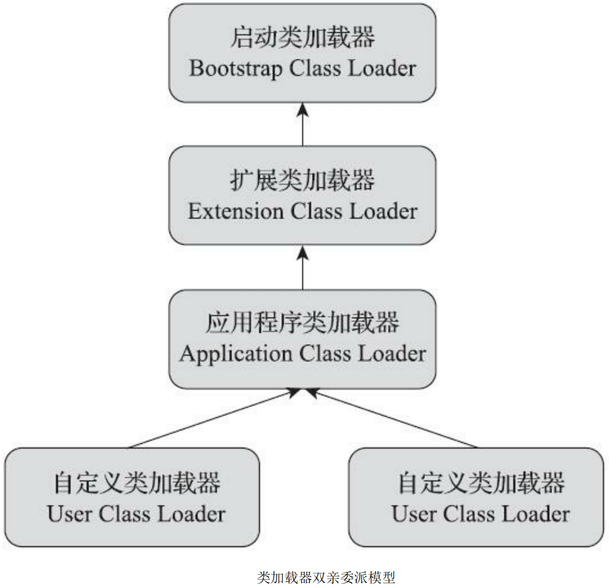

JDK 9之前的Java应用都是由这三种类加载器互相配合来完成加载的，如果用户认为有必要，还可以加入自定义的类加载器来进行拓展，典型的如增加除了磁盘位置之外的Class文件来源，或者通过类加载器实现类的隔离、重载等功能。

双亲委派模型要求除了顶层的启动类加载器外，其余的类加载器都应有自己的父类加载器。不过这里类加载器之间的父子关系一般不是以继承（Inheritance）的关系来实现的，而是通常使用组合（Composition）关系来复用父加载器的代码。 

双亲委派模型的工作过程是：如果一个类加载器收到了类加载的请求，它首先不会自己去尝试加载这个类，而是把这个请求委派给父类加载器去完成，每一个层次的类加载器都是如此，因此所有的加载请求最终都应该传送到最顶层的启动类加载器中，只有当父加载器反馈自己无法完成这个加载请求（它的搜索范围中没有找到所需的类）时，子加载器才会尝试自己去完成加载。

使用双亲委派模型来组织类加载器之间的关系，一个显而易见的好处就是Java中的类随着它的类加载器一起具备了一种带有优先级的层次关系。例如类java.lang.Object，它存放在rt.jar之中，无论哪一个类加载器要加载这个类，最终都是委派给处于模型最顶端的启动类加载器进行加载，因此Object类在程序的各种类加载器环境中都能够保证是同一个类。

反之，如果没有使用双亲委派模型，都由各个类加载器自行去加载的话，如果用户自己也编写了一个名为java.lang.Object的类，并放在程序的 ClassPath中，那系统中就会出现多个不同的Object类，Java类型体系中最基础的行为也就无从保证，应用程序将会变得一片混乱。

# 六.虚拟机字节码执行引擎 

执行引擎是Java虚拟机核心的组成部分之一。“虚拟机”是一个相对于“物理机”的概念，这两种机器都有代码执行能力，其区别是物理机的执行引擎是直接建立在处理器、缓存、指令集和操作系统层面上的，而虚拟机的执行引擎则是由软件自行实现的，因此可以不受物理条件制约地定制指令集与执行引擎的结构体系，能够执行那些不被硬件直接支持的指令集格式。 

在《Java虚拟机规范》中制定了Java虚拟机字节码执行引擎的概念模型，这个概念模型成为各大发行商的Java虚拟机执行引擎的统一外观（Facade）。在不同的虚拟机实现中，执行引擎在执行字节码的时候，通常会有解释执行（通过解释器执行）和编译执行（通过即时编译器产生本地代码执行）两种 选择，也可能两者兼备，还可能会有同时包含几个不同级别的即时编译器一起工作的执行引擎。但从外观上来看，所有的Java虚拟机的执行引擎输入、输出都是一致的：输入的是字节码二进制流，处理过程是字节码解析执行的等效过程，输出的是执行结果

## 1.运行时栈帧结构

Java虚拟机以方法作为最基本的执行单元，“栈帧”（Stack Frame）则是用于支持虚拟机进行方法调用和方法执行背后的数据结构，它也是虚拟机运行时数据区中的虚拟机栈（Virtual Machine Stack）的栈元素。栈帧存储了方法的局部变量表、操作数栈、动态连接和方法返回地址等信息。每一个方法从调用开始至执行结束的过程，都对应着一个栈帧在虚拟机栈里面从入栈到出栈的过程。

每一个栈帧都包括了局部变量表、操作数栈、动态连接、方法返回地址和一些额外的附加信息。在编译Java程序源码的时候，栈帧中需要多大的局部变量表，需要多深的操作数栈就已经被分析计算出来，并且写入到方法表的Code属性之中。换言之，一个栈帧需要分配多少内存，并不会受到程序运行期变量数据的影响，而仅仅取决于程序源码和具体的虚拟机实现的栈内存布局形式。 

一个线程中的方法调用链可能会很长，以Java程序的角度来看，同一时刻、同一条线程里面，在调用堆栈的所有方法都同时处于执行状态。而对于执行引擎来讲，在活动线程中，只有位于栈顶的方法才是在运行的，只有位于栈顶的栈帧才是生效的，其被称为“当前栈帧”（Current Stack Frame），与 这个栈帧所关联的方法被称为“当前方法”（Current Method）。执行引擎所运行的所有字节码指令都只针对当前栈帧进行操作，在概念模型上，典型的栈帧结构如图。

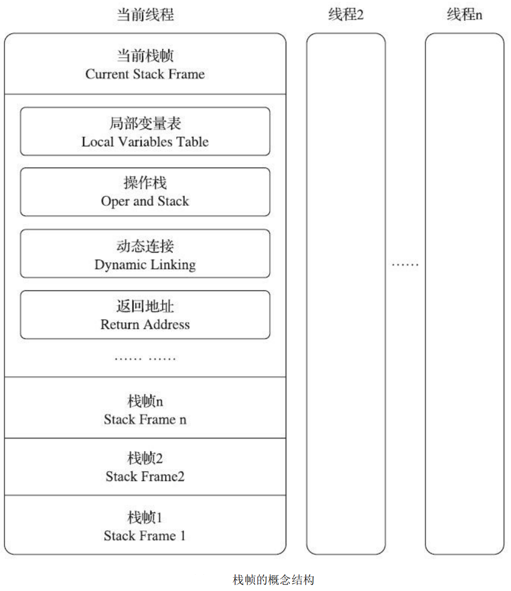

### 1.1 局部变量表

局部变量表（Local Variables Table）是一组变量值的存储空间，用于存放方法参数和方法内部定义的局部变量。在Java程序被编译为Class文件时，就在方法的Code属性的max_locals数据项中确定了该方法所需分配的局部变量表的最大容量。 

局部变量表的容量以变量槽（Variable Slot，可以存放一个32位以内的数据类型）为最小单位，《Java虚拟机规范》中并没有明确指出一个变量槽应占用的内存空间大小，只是很有导向性地说到每个变量槽都应该能存放一个boolean、byte、char、short、int、float、reference或returnAddress类型的数据，这8种数据类型，都可以使用32位或更小的物理内存来存储，但这种描述与明确指出“每个变量槽应占用32位长度的内存空间”是有本质差别的，它允许变量槽的长度可以随着处理器、操作系统或虚拟机实现的不同而发生变化，保证了即使在64位虚拟机中使用了64位的物理内存空间去实现一个变量槽，虚拟机仍要使用对齐和补白的手段让变量槽在外观上看起来与32位虚拟机中的一致。

对于64位的数据类型，Java虚拟机会以高位对齐的方式为其分配两个连续的变量槽空间。Java语言中明确的64位的数据类型只有long和double两种。这里把long和double数据类型分割存储的做法与“long和double的非原子性协定”中允许把一次long和double数据类型读写分割为两次32位读写的做法有些类似。不过，由于局部变量表是建立在线程堆栈中的，属于线程私有的数据，无论读写两个连续的变量槽是否为原子操作，都不会引起数据竞争和线程安全问题。 

Java虚拟机通过索引定位的方式使用局部变量表，索引值的范围是从0开始至局部变量表最大的变量槽数量。如果访问的是32位数据类型的变量，索引N就代表了使用第N个变量槽，如果访问的是64位数据类型的变量，则说明会同时使用第N和N+1两个变量槽。对于两个相邻的共同存放一个64位数据 的两个变量槽，虚拟机不允许采用任何方式单独访问其中的某一个，《Java虚拟机规范》中明确要求了如果遇到进行这种操作的字节码序列，虚拟机就应该在类加载的校验阶段中抛出异常。 

当一个方法被调用时，Java虚拟机会使用局部变量表来完成参数值到参数变量列表的传递过程，即实参到形参的传递。如果执行的是实例方法（没有被static修饰的方法），那局部变量表中第0位索引的变量槽默认是用于传递方法所属对象实例的引用，在方法中可以通过关键字“this”来访问到这个隐含的参数。其余参数则按照参数表顺序排列，占用从1开始的局部变量槽，参数表分配完毕后，再根据方法体内部定义的变量顺序和作用域分配其余的变量槽。 

**为了尽可能节省栈帧耗用的内存空间，局部变量表中的变量槽是可以重用的**，方法体中定义的变量，其作用域并不一定会覆盖整个方法体，如果当前字节码PC计数器的值已经超出了某个变量的作用域，那这个变量对应的变量槽就可以交给其他变量来重用。不过，这样的设计除了节省栈帧空间以外，还会伴随有少量额外的副作用，例如在某些情况下变量槽的复用会直接影响到系统的垃圾收集行为。

### 1.2 操作数栈 

操作数栈（Operand Stack）也常被称为操作栈，它是一个后入先出（Last In First Out，LIFO）栈。同局部变量表一样，操作数栈的最大深度也在编译的时候被写入到Code属性的max_stacks数据项之中。操作数栈的每一个元素都可以是包括long和double在内的任意Java数据类型。32位数据类型所占 的栈容量为1，64位数据类型所占的栈容量为2。Javac编译器的数据流分析工作保证了在方法执行的任何时候，操作数栈的深度都不会超过在max_stacks数据项中设定的最大值。 

当一个方法刚刚开始执行的时候，这个方法的操作数栈是空的，在方法的执行过程中，会有各种字节码指令往操作数栈中写入和提取内容，也就是出栈和入栈操作。譬如在做算术运算的时候是通过将运算涉及的操作数栈压入栈顶后调用运算指令来进行的，又譬如在调用其他方法的时候是通过操作数栈来进行方法参数的传递。举个例子，例如整数加法的字节码指令iadd，这条指令在运行的时候要求操作数栈中最接近栈顶的两个元素已经存入了两个int型的数值，当执行这个指令时，会把这两个int值出栈并相加，然后将相加的结果重新入栈。 

操作数栈中元素的数据类型必须与字节码指令的序列严格匹配，在编译程序代码的时候，编译器必须要严格保证这一点，在类校验阶段的数据流分析中还要再次验证这一点。再以上面的iadd指令为例，这个指令只能用于整型数的加法，它在执行时，最接近栈顶的两个元素的数据类型必须为int型，不能出现一个long和一个float使用iadd命令相加的情况。另外在概念模型中，两个不同栈帧作为不同方法的虚拟机栈的元素，是完全相互独立的。但是在大多虚拟机的实现里都会进行一些优化处理，令两个栈帧出现一部分重叠。让下面栈帧的部分操作数栈与上面栈帧的部分局部变量表重叠在一起，这样做不仅节约了一些空间，更重要的是在进行方法调用时就可以直接共用一部分数据，无须进行额外的参数复制传递了，重叠的过程如图。

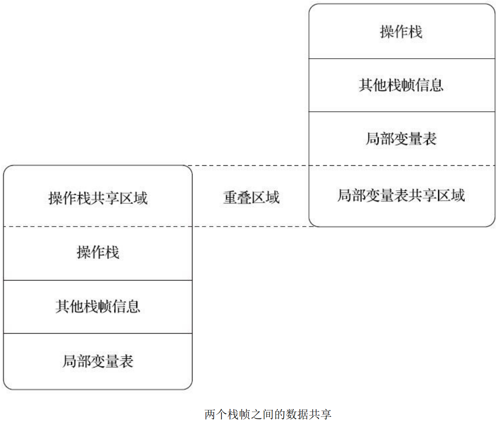

### 1.3 动态连接

每个栈帧都包含一个指向运行时常量池中该栈帧所属方法的引用，持有这个引用是为了支持方法调用过程中的动态连接（Dynamic Linking）。我们知道Class文件的常量池中存有大量的符号引用，字节码中的方法调用指令就以常量池里指向方法的符号引用作为参数。这些符号 引用一部分会在类加载阶段或者第一次使用的时候就被转化为直接引用，这种转化被称为静态解析。 另外一部分将在每一次运行期间都转化为直接引用，这部分就称为动态连接。

### 1.4 方法返回地址

当一个方法开始执行后，只有两种方式退出这个方法。

1. 第一种方式是执行引擎遇到任意一个方法 返回的字节码指令，这时候可能会有返回值传递给上层的方法调用者（调用当前方法的方法称为调用者或者主调方法），方法是否有返回值以及返回值的类型将根据遇到何种方法返回指令来决定，这种退出方法的方式称为“正常调用完成”（Normal Method Invocation Completion）。
2. 另外一种退出方式是在方法执行的过程中遇到了异常，并且这个异常没有在方法体内得到妥善处理。无论是Java虚拟机内部产生的异常，还是代码中使用athrow字节码指令产生的异常，只要在本方法的异常表中没有搜索到匹配的异常处理器，就会导致方法退出，这种退出方法的方式称为“异常调用 完成（Abrupt Method Invocation Completion）”。一个方法使用异常完成出口的方式退出，是不会给它的上层调用者提供任何返回值的。

无论采用何种退出方式，在方法退出之后，都必须返回到最初方法被调用时的位置，程序才能继续执行，方法返回时可能需要在栈帧中保存一些信息，用来帮助恢复它的上层主调方法的执行状态。

一般来说，方法正常退出时，主调方法的PC计数器的值就可以作为返回地址，栈帧中很可能会保存这 个计数器值。而方法异常退出时，返回地址是要通过异常处理器表来确定的，栈帧中就一般不会保存这部分信息。

方法退出的过程实际上等同于把当前栈帧出栈，因此退出时可能执行的操作有：恢复上层方法的局部变量表和操作数栈，把返回值（如果有的话）压入调用者栈帧的操作数栈中，调整PC计数器的值以指向方法调用指令后面的一条指令等。

## 2.方法调用

方法调用并不等同于方法中的代码被执行，方法调用阶段唯一的任务就是确定被调用方法的版本（即调用哪一个方法），暂时还未涉及方法内部的具体运行过程。

在程序运行时，进行方法调用是最 普遍、最频繁的操作之一，Class文件的编译过程中不包含传统程序语言编译的连接步骤，一切方法调用在Class文件里面存储的都只是符号引用，而不是方法在实际运行时内存布局中的入口地址（也就是之前说的直接引用）。

这个特性给Java带来了更强大的动态扩展能力，但也使 得Java方法调用过程变得相对复杂，某些调用需要在类加载期间，甚至到运行期间才能确定目标方法的直接引用。

### 2.1 解析

所有方法调用的目标方法在Class文件里面都是一个常量池中的符号引用，在类加载的解析阶段，会将其中的一部分符号引用转化为直接引用，这种解析能够成立的前提是：方法在程序真正运行之前就有一个可确定的调用版本，并且这个方法的调用版本在运行期是不可改变的。换句话说，调用目标在程序代码写好、编译器进行编译那一刻就已经确定下来。这类方法的调用被称为解析（Resolution）。

在Java语言中符合“编译期可知，运行期不可变”这个要求的方法，主要有**静态方法**和**私有方法**两大类，前者与类型直接关联，后者在外部不可被访问，这两种方法各自的特点决定了它们都不可能通过继承或别的方式重写出其他版本，因此它们都适合在类加载阶段进行解析。

调用不同类型的方法，字节码指令集里设计了不同的指令。在Java虚拟机支持以下5条方法调用字节码指令，分别是：

- invokestatic。用于调用静态方法。

- invokespecial。用于调用实例构造器`<init>()`方法、私有方法和父类中的方法。

- invokevirtual。用于调用所有的虚方法。

- invokeinterface。用于调用接口方法，会在运行时再确定一个实现该接口的对象。

- invokedynamic。先在运行时动态解析出调用点限定符所引用的方法，然后再执行该方法。

  前面4条调用指令，分派逻辑都固化在Java虚拟机内部，而invokedynamic指令的分派逻辑是由用户设定的引导方法来决定的。

只要能被invokestatic和invokespecial指令调用的方法，都可以在解析阶段中确定唯一的调用版本，Java语言里符合这个条件的方法共有静态方法、私有方法、实例构造器、父类方法4种，再加上被final修饰的方法（尽管它使用invokevirtual指令调用），这5种方法调用会在类加载的时候就可以把符号引用解析为该方法的直接引用。这些方法统称为“非虚方法”（Non-Virtual Method），与之相反，其他方法就被称为“虚方法”（Virtual Method）。

解析调用一定是个静态的过程，在编译期间就完全确定，在类加载的解析阶段就会把涉及的符号引用全部转变为明确的直接引用，不必延迟到运行期再去完成。而另一种主要的方法调用形式：分派（Dispatch）调用则要复杂许多，它可能是静态的也可能是动态的，按照分派依据的宗量数可分为单分派和多分派。这两类分派方式两两组合就构成了静态单分派、静态多分派、动态单分派、动态多分派4种分派组合情况。

### 2.2 分派（多态）

#### 2.2.1 静态分派

虚拟机（或者准确地说是编译器）在重载时是通过参数的静态类型而不是实际类型作为判定依据的。

由于静态类型在编译期可知，所以在编译阶段，Javac编译器就根据参数的静态类型决定了会使用哪个重载版本。并把这个方法的符号引用写到 main()方法里的两条invokevirtual指令的参数中。

```java
public class ExtendMethodOverload {

    static abstract class Human {
    }

    static class Man extends Human {
    }

    static class Woman extends Human {
    }

    public void sayHello(Human guy) {
        System.out.println("hello,guy!");
    }

    public void sayHello(Man guy) {
        System.out.println("hello,gentleman!");
    }

    public void sayHello(Woman guy) {
        System.out.println("hello,lady!");
    }

    public static void main(String[] args) {
        Human man = new Man();
        Human woman = new Woman();
        ExtendMethodOverload extendMethodOverload = new ExtendMethodOverload();
        extendMethodOverload.sayHello(man);
        extendMethodOverload.sayHello(woman);
    }
}
```

结果

```java
hello,guy!
hello,guy!
```

代码中的“Human”称为变量的“静态类型”（Static Type），或者叫“外观类型”（Apparent Type），后面的“Man”则被称为变量的“实际类型”（Actual Type）或者叫“运行时类型”（Runtime Type）。静态类型和实际类型在程序中都可能会发生变化，区别是静态类型的变化仅仅在使用时发生，变量本身的静态类型不会被改变，并且最终的静态类型是在编译期可知的；而实际类型变化的结果在运行期才可确定，编译器在编译程序的时候并不知道一个对象的实际类型是什么。

所有依赖静态类型来决定方法执行版本的分派动作，都称为**静态分派**。静态分派的最典型应用表现就是方法重载。

---

```java
public class Suitable {
    public static void sayHello(Object arg) {
        System.out.println("hello Object");
    }

    public static void sayHello(int arg) {
        System.out.println("hello int");
    }

    public static void sayHello(long arg) {
        System.out.println("hello long");
    }

    public static void sayHello(Character arg) {
        System.out.println("hello Character");
    }

    public static void sayHello(char arg) {
        System.out.println("hello char");
    }

    public static void sayHello(char... arg) {
        System.out.println("hello char ...");
    }

    public static void sayHello(Serializable arg) {
        System.out.println("hello Serializable");
    }

    public static void main(String[] args) {
        sayHello('a');
    }
}
```

结果：

```java
hello char
```

> * 'a'是一个char类型的数据，自然会寻找参数类型为char的重载方法，如果注释掉sayHello(char arg)方法，就会找sayHello(int arg)方法，因为'a'还能代表数字97。
> * 如果继续注释掉sayHello(int arg)方法，就会找sayHello(long arg)方法，'a'转型为整数97之后，进一步转型为长整数97L。
> * 如果继续注释掉sayHello(long arg)方法，就会找sayHello(Character arg)方法，因为'a'被包装为它的封装类型java.lang.Character，这时发生了一次自动装箱。
> * 继续注释掉sayHello(Serializable arg)方法，就会找sayHello(Object arg)，这是因为char装箱后转型为父类了，如果有多个父类，那将在继承关系中从下往上开始搜索，越接上层的优先级越低。
> * 继续注释掉sayHello(Serializable arg)方法，就会找sayHello(char... arg)，这时候字符'a'被当 作了一个char[]数组的元素。

当自动装箱之后发现还是找不到装箱类，但是找到了装箱类所实现的接口类型，所以紧接着又发生一次自动转型。

Character还实现 了另外一个接口`java.lang.Comparable<Character>`，如果同时出现两个参数分别为Serializable和`Comparable<Character>`的重载方法，那它们在此时的优先级是一样的。编译器无法确定要自动转型为 哪种类型，会提示“类型模糊”（Type Ambiguous），并拒绝编译。程序必须在调用时显式地指定字面 量的静态类型，如：`sayHello((Comparable<Character>)'a')`，才能编译通过。

#### 2.2.2 动态分派

```java
public class DynamicDispatch {
    static abstract class Human {
        protected abstract void sayHello();
    }

    static class Man extends Human {
        @Override
        protected void sayHello() {
            System.out.println("man say hello");
        }
    }

    static class Woman extends Human {
        @Override
        protected void sayHello() {
            System.out.println("woman say hello");
        }
    }

    public static void main(String[] args) {
        Human man = new Man();
        Human woman = new Woman();
        man.sayHello();
        woman.sayHello();
        man = new Woman();
        man.sayHello();
    }
}
```

结果：

```java
man say hello
woman say hello
woman say hello
```

导致这个现象的原因很明显，是因为这两个变量的实际类型不同。

```java
public static void main(java.lang.String[]);
    Code:
        Stack=2, Locals=3, Args_size=1
         0:   new     #16; //class org/fenixsoft/polymorphic/DynamicDispatch$Man
         3:   dup
         4:   invokespecial   #18; //Method org/fenixsoft/polymorphic/Dynamic Dispatch$Man."<init>":()V
         7:   astore_1
         8:   new     #19; //class org/fenixsoft/polymorphic/DynamicDispatch$Woman
        11:  dup
        12:  invokespecial   #21; //Method org/fenixsoft/polymorphic/DynamicDispatch$Woman."<init>":()V
        15:  astore_2
        16:  aload_1
        17:  invokevirtual   #22; //Method org/fenixsoft/polymorphic/Dynamic Dispatch$Human.sayHello:()V
        20:  aload_2
        21:  invokevirtual   #22; //Method org/fenixsoft/polymorphic/Dynamic Dispatch$Human.sayHello:()V
        24:  new     #19; //class org/fenixsoft/polymorphic/DynamicDispatch$Woman
        27:  dup
        28:  invokespecial   #21; //Method org/fenixsoft/polymorphic/DynamicDispatch$Woman."<init>":()V
        31:  astore_1
        32:  aload_1
        33:  invokevirtual   #22; //Method org/fenixsoft/polymorphic/Dynamic Dispatch$Human.sayHello:()V
        36:  return
```

 0～15行的字节码是准备动作，作用是建立man和woman的内存空间、调用Man和Woman类型的实例构造器，将这两个实例的引用存放在第1、2个局部变量表的变量槽中，这些动作实际对应了Java源码中的这两行：

```java
Human man = new Man();
Human woman = new Woman();
```

接下来的16～21行是关键部分，16和20行的aload指令分别把刚刚创建的两个对象的引用压到栈顶，这两个对象是将要执行的sayHello()方法的所有者，称为接收者（Receiver）；17和21行是方法调用指令，这两条调用指令单从字节码角度来看，无论是指令（都是invokevirtual）还是参数（都是常量池中第22项的常量，注释显示了这个常量是Human.sayHello()的符号引用）都完全一样，但是这两句指令最终执行的目标方法并不相同。那看来解决问题的关键还必须从invokevirtual指令本身入手，要弄清楚它是如何确定调用方法版本、如何实现多态查找来着手分析才行。

根据《Java虚拟机规范》，invokevirtual指令的运行时解析过程大致分为以下几步：

1. 找到操作数栈顶的第一个元素所指向的对象的实际类型，记作C。
2. 如果在类型C中找到与常量中的描述符和简单名称都相符的方法，则进行访问权限校验，如果通过则返回这个方法的直接引用，查找过程结束；不通过则返回java.lang.IllegalAccessError异常。
3. 否则，按照继承关系从下往上依次对C的各个父类进行第二步的搜索和验证过程。
4. 如果始终没有找到合适的方法，则抛出java.lang.AbstractMethodError异常。

正是因为invokevirtual指令执行的第一步就是在运行期确定接收者的实际类型，所以两次调用中的invokevirtual指令并不是把常量池中方法的符号引用解析到直接引用上就结束了，还会根据方法接收者的实际类型来选择方法版本，这个过程就是Java语言中**方法重写的本质**。我们把这种在运行期根据实际类型确定方法执行版本的分派过程称为动态分派。

---

既然这种多态性的根源在于虚方法调用指令invokevirtual的执行逻辑，那自然我们得出的结论就**只会对方法有效，对字段是无效的，因为字段不使用这条指令**。

事实上，在Java里面只有虚方法存在，字段永远不可能是虚的，换句话说，字段永远不参与多态，哪个类的方法访问某个名字的字段时，该名字指的就是这个类能看到的那个字段。当子类声明了与父类同名的字段时，虽然在子类的内存中两个字段都会存在，但是子类的字段会遮蔽父类的同名字段。

```java
public class FieldHasNoPolymorphic {

    static class Father {
        public int money = 1;

        public Father() {
            money = 2;
            showMeTheMoney();
        }

        public void showMeTheMoney() {
            System.out.println("I am Father, i have $" + money);
        }
    }

    static class Son extends Father {
        public int money = 3;

        public Son() {
            money = 4;
            showMeTheMoney();
        }

        public void showMeTheMoney() {
            System.out.println("I am Son,  i have $" + money);
        }
    }

    public static void main(String[] args) {
        Father gay = new Son();
        System.out.println("This gay has $" + gay.money);
    }
}
```

结果：

```java
I am Son,  i have $0
I am Son,  i have $4
This gay has $2
```

输出两句都是“I am Son”，这是因为Son类在创建的时候，首先隐式调用了Father的构造函数，而Father构造函数中对showMeTheMoney()的调用是一次虚方法调用，实际执行的版本是Son::showMeTheMoney()方法，所以输出的是“I am Son”。

而这时候虽然父类的money字段已经被初始化成2了，但Son::showMeTheMoney()方法中访问的却是子类的money字段，这时候结果自然还是0，因为它要到子类的构造函数执行时才会被初始化。

main()的最后一句通过静态类型访问到了父类中的money，输出了2。

#### 2.2.3 单分派与多分派

方法的接收者与方法的参数统称为方法的**宗量**，根据分派基于多少种宗量，可以将分派划分为单分派和多分派两种。

- 单分派是根据一个宗量对目标方法进行选择
- 多分派则是根据多于一个宗量对目标方法进行选择

```java
public class Dispatch {
    static class QQ {
    }

    static class _360 {
    }

    public static class Father {
        public void hardChoice(QQ arg) {
            System.out.println("father choose qq");
        }

        public void hardChoice(_360 arg) {
            System.out.println("father choose 360");
        }
    }

    public static class Son extends Father {
        public void hardChoice(QQ arg) {
            System.out.println("son choose qq");
        }

        public void hardChoice(_360 arg) {
            System.out.println("son choose 360");
        }
    }

    public static void main(String[] args) {
        Father father = new Father();
        Father son = new Son();
        father.hardChoice(new _360());
        son.hardChoice(new QQ());
    }
}
```

结果：

```java
father choose 360
son choose qq
```

首先编译阶段中编译器的选择过程，也就是静态分派的过程。这时候选择目标方法的依据有两点：一是静态类型是Father还是Son，二是方法参数是QQ还是360。

这次选择结果的最终产物是产生了两条invokevirtual指令，两条指令的参数分别为常量池中指向Father::hardChoice(360)及Father::hardChoice(QQ)方法的符号引用。因为是根据两个宗量进行选择，所以Java语言的**静态分派属于多分派类型**。

再看看运行阶段中虚拟机的选择，也就是动态分派的过程。在执行“son.hardChoice(new QQ())”这行代码时，更准确地说，是在执行这行代码所对应的invokevirtual指令时，由于编译期已经决定目标方法的签名必须为hardChoice(QQ)，虚拟机此时不会关心传递过来的参数“QQ”到底是“腾讯QQ”还是“奇瑞QQ”，因为这时候参数的静态类型、实际类型都对方法的选择不会构成任何影响，唯一可以影响虚拟机选择的因素只有该方法的接受者的实际类型是Father还是Son。因为只有一个宗量作为选择依据，所以**Java语言的动态分派属于单分派类型**。

结论：Java语言是一门静态多分派、动态单分派的语言。

#### 2.2.4 虚拟机动态分派的实现

动态分派是执行非常频繁的动作，而且动态分派的方法版本选择过程需要运行时在接收者类型的方法元数据中搜索合适的目标方法，因此，Java虚拟机实现基于执行性能的考虑，真正运行时一般不会如此频繁地去反复搜索类型元数据。

面对这种情况，一种基础而且常见的优化手段是为类型在方法区中建立一个虚方法表（Virtual Method Table，也称为vtable，与此对应的，在invokeinterface执行时也会用到接口方法表——Interface Method Table，简称itable），使用虚方法表索引来代替元数据查找以提高性能。


虚方法表中存放着各个方法的实际入口地址。如果某个方法在子类中没有被重写，那子类的虚方法表中的地址入口和父类相同方法的地址入口是一致的，都指向父类的实现入口。如果子类中重写了这个方法，子类虚方法表中的地址也会被替换为指向子类实现版本的入口地址。

Son重写了来自Father的全部方法，因此Son的方法表没有指向Father类型数据的箭头。但是Son和Father都没有重写来自Object的方法，所以它们的方法表中所有从Object继承来的方法都指向了Object的数据类型。

为了程序实现方便，具有相同签名的方法，在父类、子类的虚方法表中都应当具有一样的索引序号，这样当类型变换时，仅需要变更查找的虚方法表，就可以从不同的虚方法表中按索引转换出所需的入口地址。虚方法表一般在类加载的连接阶段进行初始化，准备了类的变量初始值后，虚拟机会把该类的虚方法表也一同初始化完毕。

## 3.动态类型语言支持

Java虚拟机的字节码指令集的数量自从Sun公司的第一款Java虚拟机问世至今，二十余年间只新增过一条指令，它就是随着JDK 7的发布的字节码首位新成员——invokedynamic指令。

这条新增加的指令是JDK 7的项目目标：实现动态类型语言（Dynamically Typed Language）支持而进行的改进之一，也是为JDK 8里可以顺利实现Lambda表达式而做的技术储备。

动态类型语言的关键特征是它的类型检查的主体过程是在运行期而不是编译期进行的，满足这个特征的语言有很多，常用的包括：Erlang、Groovy、JavaScript、Lua、PHP、Python、Ruby等等。那相对地，在编译期就进行类型检查过程的语言，譬如C++和Java等就是最常用的静态类型语言。

# 七.前端编译与优化

## 1.概述

- 前端编译器（叫“编译器的前端”更准确一些）把`*.java`文件转变成`*.class`文件的过程。

- Java虚拟机的即时编译器（常称JIT编译器，Just In Time Compiler）运行期把字节码转变成本地机器码的过程；

- 使用静态的提前编译器（常称AOT编译器，Ahead Of Time Compiler）直接把程序编译成与目标机器指令集相关的二进制代码的过程。

## 2.Javac编译器

### 2.1 Javac的源码与调试

从Javac代码的总体结构来看，编译过程大致可以分为1个准备过程和3个处理过程：

1. 准备过程：初始化插入式注解处理器。
2. 解析与填充符号表过程，包括：
   - 词法、语法分析。将源代码的字符流转变为标记集合，构造出抽象语法树。
   - 填充符号表。产生符号地址和符号信息。

3. 插入式注解处理器的注解处理过程。
4. 分析与字节码生成过程，包括：
   - 标注检查。对语法的静态信息进行检查。
   - 数据流及控制流分析。对程序动态运行过程进行检查。
   - 解语法糖。将简化代码编写的语法糖还原为原有的形式。
   - 字节码生成。将前面各个步骤所生成的信息转化成字节码。

上述3个处理过程里，执行插入式注解时又可能会产生新的符号，如果有新的符号产生，就必须转回到之前的解析、填充符号表的过程中重新处理这些新符号，从总体来看，三者之间的关系与交互顺序如图


我们可以把上述处理过程对应到代码中，Javac编译动作的入口是com.sun.tools.javac.main.JavaCompiler类，上述3个过程的代码逻辑集中在这个类的compile()和compile2()方法里，其中主体代码，整个编译过程主要的处理由图中标注的8个方法来完成。


### 2.2 解析与填充符号表

#### 2.2.1 词法、语法分析

词法分析是将源代码的字符流转变为标记（Token）集合的过程，单个字符是程序编写时的最小元素，但标记才是编译时的最小元素。关键字、变量名、字面量、运算符都可以作为标记，如“int a=b+2”这句代码中就包含了6个标记，分别是int、a、=、b、+、2，虽然关键字int由3个字符构成，但是它只是一个独立的标记，不可以再拆分。在Javac的源码中，词法分析过程由com.sun.tools.javac.parser.Scanner类来实现。

语法分析是根据标记序列构造抽象语法树的过程，抽象语法树（Abstract Syntax Tree，AST）是一种用来描述程序代码语法结构的树形表示方式，抽象语法树的每一个节点都代表着程序代码中的一个语法结构（Syntax Construct），例如包、类型、修饰符、运算符、接口、返回值甚至连代码注释等都可以是一种特定的语法结构。

是Eclipse AST View插件分析出来的某段代码的抽象语法树视图，读者可以通过这个插件工具生成的可视化界面对抽象语法树有一个直观的认识。在Javac的源码中，语法分析过程由com.sun.tools.javac.parser.Parser类实现，这个阶段产出的抽象语法树是以com.sun.tools.javac.tree.JCTree类表示的。


经过词法和语法分析生成语法树以后，编译器就不会再对源码字符流进行操作了，后续的操作都建立在抽象语法树之上。

#### 2.2.2 填充符号表

完成了语法分析和词法分析之后，下一个阶段是对符号表进行填充的过程。符号表（Symbol Table）是由一组符号地址和符号信息构成的数据结构。符号表中所登记的信息在编译的不同阶段都要被用到。譬如在语义分析的过程中，符号表所登记的内容将用于语义检查（如检查一个名字的使用和原先的声明是否一致）和产生中间代码，在目标代码生成阶段，当对符号名进行地址分配时，符号表是地址分配的直接依据。

在Javac源代码中，填充符号表的过程由com.sun.tools.javac.comp.Enter类实现，该过程的产出物是一个待处理列表，其中包含了每一个编译单元的抽象语法树的顶级节点，以及package-info.java（如果存在的话）的顶级节点。

#### 2.2.3 注解处理器

JDK 5之后，Java语言提供了对注解（Annotations）的支持，注解在设计上原本是与普通的Java代码一样，都只会在程序运行期间发挥作用的。

但在JDK 6中又提出并通过了JSR-269提案，该提案设计了一组被称为“插入式注解处理器”的标准API，可以提前至编译期对代码中的特定注解进行处理，从而影响到前端编译器的工作过程。

我们可以把插入式注解处理器看作是一组编译器的插件，当这些插件工作时，允许读取、修改、添加抽象语法树中的任意元素。如果这些插件在处理注解期间对语法树进行过修改，编译器将回到解析及填充符号表的过程重新处理，直到所有插入式注解处理器都没有再对语法树进行修改为止，每一次循环过程称为一个轮次（Round），这也就对应着图"Javac的编译过程"的那个回环过程。

有了编译器注解处理的标准API后，程序员的代码才有可能干涉编译器的行为，由于语法树中的任意元素，甚至包括代码注释都可以在插件中被访问到，所以通过插入式注解处理器实现的插件在功能上有很大的发挥空间。只要有足够的创意，程序员能使用插入式注解处理器来实现许多原本只能在编码中由人工完成的事情。譬如Java著名的编码效率工具Lombok，它可以通过注解来实现自动产生getter/setter方法、进行空置检查、生成受查异常表、产生equals()和hashCode()方法，等等，帮助开发人员消除Java的冗长代码，这些都是依赖插入式注解处理器来实现的。

在Javac源码中，插入式注解处理器的初始化过程是在initPorcessAnnotations()方法中完成的，而它的执行过程则是在processAnnotations()方法中完成。这个方法会判断是否还有新的注解处理器需要执行，如果有的话，通过com.sun.tools.javac.processing.JavacProcessing-Environment类的doProcessing()方法来生成一个新的JavaCompiler对象，对编译的后续步骤进行处理。

#### 2.2.4 语义分析与字节码生成

经过语法分析之后，编译器获得了程序代码的抽象语法树表示，抽象语法树能够表示一个结构正确的源程序，但无法保证源程序的语义是符合逻辑的。而语义分析的主要任务则是对结构上正确的源程序进行上下文相关性质的检查，譬如进行类型检查、控制流检查、数据流检查，等等。

##### 2.2.4.1 标注检查

Javac在编译过程中，语义分析过程可分为标注检查和数据及控制流分析两个步骤，对应图"Javac编译过程的主体代码" 3.1、3.2

标注检查步骤要检查的内容包括诸如变量使用前是否已被声明、变量与赋值之间的数据类型是否能够匹配，等等，刚才3个变量定义的例子就属于标注检查的处理范畴。在标注检查中，还会顺便进行一个称为常量折叠（Constant Folding）的代码优化，这是Javac编译器会对源代码做的极少量优化措施之一（代码优化几乎都在即时编译器中进行）。

```java
int a = 1 + 2;
```


在抽象语法树上仍然能看到字面量“1”“2”和操作符“+”号，但是在经过常量折叠优化之后，它们将会被折叠为字面量“3”，这个插入式表达式（Infix Expression）的值已经在语法树上标注出来了（ConstantExpressionValue：3）。由于编译期间进行了常量折叠，所以在代码里面定义“a=1+2”比起直接定义“a=3”来，并不会增加程序运行期哪怕仅仅一个处理器时钟周期的处理工作量。

标注检查步骤在Javac源码中的实现类是com.sun.tools.javac.comp.Attr类和com.sun.tools.javac.comp.Check类。

##### 2.2.4.2 数据及控制流分析

在Javac的源码中，数据及控制流分析的入口是图"Javac编译过程的主体代码"的flow()方法，具体操作由com.sun.tools.javac.comp.Flow类来完成。

数据流分析和控制流分析是对程序上下文逻辑更进一步的验证，它可以检查出诸如程序局部变量在使用前是否有赋值、方法的每条路径是否都有返回值、是否所有的受查异常都被正确处理了等问题。

编译时期的数据及控制流分析与类加载时的数据及控制流分析的目的基本上可以看作是一致的，但校验范围会有所区别，有一些校验项只有在编译期或运行期才能进行。

举一个关于final修饰符的数据及控制流分析的例子：

```java
// 方法一带有final修饰
public void foo(final int arg) {
	final int var = 0;
	// do something
}
// 方法二没有final修饰
public void foo(int arg) {
	int var = 0;
	// do something
}
```

> 在代码编写时程序肯定会受到final修饰符的影响，不能再改变arg和var变量的值，但是如果观察这两段代码编译出来的字节码，会发现它们是没有任何一点区别的，每条指令，甚至每个字节都一模一样。
>
> 通过Class文件结构我们已经知道，局部变量与类的字段（实例变量、类变量）的存储是有显著差别的，局部变量在常量池中并没有CONSTANT_Fieldref_info的符号引用，自然就不可能存储有访问标志（access_flags）的信息，甚至可能连变量名称都不一定会被保留下来（这取决于编译时的编译器的参数选项），自然在Class文件中就不可能知道一个局部变量是不是被声明为final了。
>
> 因此，可以肯定地推断出把局部变量声明为final，对运行期是完全没有影响的，变量的不变性仅仅由Javac编译器在编译期间来保障，这就是一个只能在编译期而不能在运行期中检查的例子。

##### 2.2.4.3 解语法糖

语法糖（Syntactic Sugar），也称糖衣语法，是由英国计算机科学家Peter J.Landin发明的一种编程术语，指的是在计算机语言中添加的某种语法，这种语法对语言的编译结果和功能并没有实际影响，但是却能更方便程序员使用该语言。通常来说使用语法糖能够减少代码量、增加程序的可读性，从而减少程序代码出错的机会。

Java中最常见的语法糖包括了泛型、变长参数、自动装箱拆箱，等等，Java虚拟机运行时并不直接支持这些语法，它们在编译阶段被还原回原始的基础语法结构，这个过程就称为解语法糖。

在Javac的源码中，解语法糖的过程由desugar()方法触发，在com.sun.tools.javac.comp.TransTypes类和com.sun.tools.javac.comp.Lower类中完成。

##### 2.2.4.4 字节码生成

字节码生成是Javac编译过程的最后一个阶段，在Javac源码里面由com.sun.tools.javac.jvm.Gen类来完成。字节码生成阶段不仅仅是把前面各个步骤所生成的信息（语法树、符号表）转化成字节码指令写到磁盘中，编译器还进行了少量的代码添加和转换工作。

实例构造器`<init>()`方法和类构造器`<clinit>()`方法就是在这个阶段被添加到语法树之中的。请注意这里的实例构造器并不等同于默认构造函数，如果用户代码中没有提供任何构造函数，那编译器将会添加一个没有参数的、可访问性（public、protected、private或）与当前类型一致的默认构造函数，这个工作在填充符号表阶段中就已经完成。`<init>()`和`<clinit>()`这两个构造器的产生实际上是一种代码收敛的过程，编译器会把语句块（对于实例构造器而言是“{}”块，对于类构造器而言是“static{}”块）、变量初始化（实例变量和类变量）、调用父类的实例构造器（仅仅是实例构造器，`<clinit>()`方法中经常会生成调用java.lang.Object的`<init>()`方法的代码）等操作收敛到<init>()和`<clinit>()`方法之中，并且保证无论源码中出现的顺序如何，都一定是按先执行父类的实例构造器，然后初始化变量，最后执行语句块的顺序进行，上面所述的动作由Gen::normalizeDefs()方法来实现。

除了生成构造器以外，还有其他的一些代码替换工作用于优化程序某些逻辑的实现方式，如把字符串的加操作替换为StringBuffer或StringBuilder（取决于目标代码的版本是否大于或等于JDK 5）的append()操作，等等。

完成了对语法树的遍历和调整之后，就会把填充了所有所需信息的符号表交到com.sun.tools.javac.jvm.ClassWriter类手上，由这个类的writeClass()方法输出字节码，生成最终的Class文件，到此，整个编译过程宣告结束。

## 3.Java语法糖的味道

几乎所有的编程语言都或多或少提供过一些语法糖来方便程序员的代码开发，这些语法糖虽然不会提供实质性的功能改进，但是它们或能提高效率，或能提升语法的严谨性，或能减少编码出错的机会。现在也有一种观点认为语法糖并不一定都是有益的，大量添加和使用含糖的语法，容易让程序员产生依赖，无法看清语法糖的糖衣背后，程序代码的真实面目。

### 3.1 泛型

泛型的本质是参数化类型（Parameterized Type）或者参数化多态（Parametric Polymorphism）的应用，即可以将操作的数据类型指定为方法签名中的一种特殊参数，这种参数类型能够用在类、接口和方法的创建中，分别构成泛型类、泛型接口和泛型方法。

#### 3.1.1 类型擦除

泛型擦除前：

```java
public static void main(String[] args) {
    Map<String, String> map = new HashMap<String, String>();
    map.put("hello", "你好");
    map.put("how are you?", "吃了没？");
    System.out.println(map.get("hello"));
    System.out.println(map.get("how are you?"));
}
```

把这段Java代码编译成Class文件，然后再用字节码反编译工具进行反编译后，将会发现泛型都不见了，泛型类型都变回了裸类型，只在元素访问时插入了从Object到String的强制转型代码

```java
public static void main(String[] args) {
    Map map = new HashMap();
    map.put("hello", "你好");
    map.put("how are you?", "吃了没？");
    System.out.println((String) map.get("hello"));
    System.out.println((String) map.get("how are you?"));
}
```

强转这就不支持int、long与Object之间的强制转型。当时Java给出的解决方案一如既往的简单粗暴：既然没法转换那就索性别支持原生类型的泛型了吧，你们都用ArrayList、ArrayList，反正都做了自动的强制类型转换，遇到原生类型时把装箱、拆箱也自动做了得了。

这个决定后面导致了无数构造包装类和装箱、拆箱的开销，成为Java泛型慢的重要原因，也成为今天Valhalla项目要重点解决的问题之一。

泛型也不能重载。

#### 3.1.2 值类型与未来的泛型

在2014年，刚好是Java泛型出现的十年之后，Oracle建立了一个名为Valhalla的语言改进项目希望改进Java语言留下的各种缺陷（解决泛型的缺陷就是项目主要目标其中之一）。

在Valhalla项目中规划了几种不同的新泛型实现方案，被称为Model 1到Model 3，在这些新的泛型设计中，泛型类型有可能被具现化，也有可能继续维持类型擦除以保持兼容（取决于采用哪种实现方案），即使是继续采用类型擦除的方案，泛型的参数化类型也可以选择不被完全地擦除掉，而是相对完整地记录在Class文件中，能够在运行期被使用，也可以指定编译器默认要擦除哪些类型。

相对于使用不同方式实现泛型，目前比较明确的是未来的Java应该会提供“值类型”（Value Type）的语言层面的支持。

值类型可以与引用类型一样，具有构造函数、方法或是属性字段，等等，而它与引用类型的区别在于它在赋值的时候通常是整体复制，而不是像引用类型那样传递引用的。更为关键的是，值类型的实例很容易实现分配在方法的调用栈上的，这意味着值类型会随着当前方法的退出而自动释放，不会给垃圾收集子系统带来任何压力。

在Valhalla项目中，Java的值类型方案被称为“内联类型”，计划通过一个新的关键字inline来定义，字节码层面也有专门与原生类型对应的以Q开头的新的操作码（譬如iload对应qload）来支撑。

### 3.2 自动装箱、拆箱与遍历循环

```java
List<Integer> list = Arrays.asList(1, 2, 3, 4);
int sum = 0;
for (int i : list) {
    sum += i;
}
System.out.println(sum);
```

编译后：

```java
List list = Arrays.asList(new Integer[]{
        Integer.valueOf(1),
        Integer.valueOf(2),
        Integer.valueOf(3),
        Integer.valueOf(4)});
int sum = 0;
for (Iterator localIterator = list.iterator(); localIterator.hasNext(); ) {
    int i = ((Integer) localIterator.next()).intValue();
    sum += i;
}
System.out.println(sum);
```

前面的代码中一共包含了泛型、自动装箱、自动拆箱、遍历循环与变长参数5种语法糖。泛型、自动装箱、自动拆箱就不用说了，而遍历循环则是把代码还原成了迭代器的实现，这也是为何遍历循环需要被遍历的类实现Iterable接口的原因。最后的变长参数，它在调用的时候变成了一个数组类型的参数。

### 3.3 条件编译

许多程序设计语言都提供了条件编译的途径，如C、C++中使用预处理器指示符（#ifdef）来完成条件编译。C、C++的预处理器最初的任务是解决编译时的代码依赖关系（如极为常用的#include预处理命令），而在Java语言之中并没有使用预处理器，因为Java语言天然的编译方式（编译器并非一个个地编译Java文件，而是将所有编译单元的语法树顶级节点输入到待处理列表后再进行编译，因此各个文件之间能够互相提供符号信息）就无须使用到预处理器。

Java语言当然也可以进行条件编译，方法就是使用条件为常量的if语句。

```java
if (true) {
    System.out.println("block 1");
} else {
    System.out.println("block 2");
}
```

该代码编译后Class文件的反编译结果：

```java
System.out.println("block 1");
```

只能使用条件为常量的if语句才能达到上述效果，如果使用常量与其他带有条件判断能力的语句搭配，则可能在控制流分析中提示错误，被拒绝编译，如代码：

```java
// 编译器将会提示“Unreachable code”
while (false) {
    System.out.println("");
}
```

 Java语言中条件编译的实现，也是Java语言的一颗语法糖，根据布尔常量值的真假，编译器将会把分支中不成立的代码块消除掉，这一工作将在编译器解除语法糖阶段（com.sun.tools.javac.comp.Lower类中）完成。

由于这种条件编译的实现方式使用了if语句，所以它必须遵循最基本的Java语法，只能写在方法体内部，因此它只能实现语句基本块（Block）级别的条件编译，而没有办法实现根据条件调整整个Java类的结构。

## 2.实战：插入式注解处理器

### 2.1 实战目标

通过Javac编译器的源码可以知道前端编译器在把Java程序源码编译为字节码的时候，会对Java程序源码做各方面的检查校验。这些校验主要是以程序“写得对不对”为出发点，虽然也会产生一些警告和提示类的信息，但总体来讲还是较少去校验程序“写得好不好”。

有鉴于此，业界出现了许多针对程序“写得好不好”的辅助校验工具，如CheckStyle、FindBug、Klocwork等。这些代码校验工具有一些是基于Java的源码进行校验，有一些是通过扫描字节码来完成。

在本节的实战中，我们将会使用注解处理器API来编写一款拥有自己编码风格的校验工具：NameCheckProcessor。

- 类（或接口）：符合驼式命名法，首字母大写。
- 方法：符合驼式命名法，首字母小写。
- 字段：
  - 类或实例变量。符合驼式命名法，首字母小写。
  - 常量。要求全部由大写字母或下划线构成，并且第一个字符不能是下划线。

### 2.2 代码实现

要通过注解处理器API实现一个编译器插件，首先需要了解这组API的一些基本知识。实现注解处理器的代码需要继承抽象类javax.annotation.processing.AbstractProcessor，这个抽象类中只有一个子类必须实现的抽象方法：“process()”，它是Javac编译器在执行注解处理器代码时要调用的过程。可以从这个方法的第一个参数“annotations”中获取到此注解处理器所要处理的注解集合，从第二个参数“roundEnv”中访问到当前这个轮次（Round）中的抽象语法树节点，每个语法树节点在这里都表示为一个Element。

在javax.lang.model.ElementKind中定义了18类Element，已经包括了Java代码中可能出现的全部元素，如：

> “包（PACKAGE）、枚举（ENUM）、类（CLASS）、注解（ANNOTATION_TYPE）、接口（INTERFACE）、枚举值（ENUM_CONSTANT）、字段（FIELD）、参数（PARAMETER）、本地变量（LOCAL_VARIABLE）、异常（EXCEPTION_PARAMETER）、方法（METHOD）、构造函数（CONSTRUCTOR）、静态语句块（STATIC_INIT，即static{}块）、实例语句块（INSTANCE_INIT，即{}块）、参数化类型（TYPE_PARAMETER，泛型尖括号内的类型）、资源变量（RESOURCE_VARIABLE，try-resource中定义的变量）、模块（MODULE）和未定义的其他语法树节点（OTHER）”。

除了process()方法的传入参数之外，还有一个很重要的实例变量“processingEnv”，它是AbstractProcessor中的一个protected变量，在注解处理器初始化的时候（init()方法执行的时候）创建，继承了AbstractProcessor的注解处理器代码可以直接访问它。它代表了注解处理器框架提供的一个上下文环境，要创建新的代码、向编译器输出信息、获取其他工具类等都需要用到这个实例变量。

注解处理器除了process()方法及其参数之外，还有两个经常配合着使用的注解，分别是：@SupportedAnnotationTypes和@SupportedSourceVersion，前者代表了这个注解处理器对哪些注解感兴趣，可以使用星号“*”作为通配符代表对所有的注解都感兴趣，后者指出这个注解处理器可以处理哪些版本的Java代码。

每一个注解处理器在运行时都是单例的，如果不需要改变或添加抽象语法树中的内容，process()方法就可以返回一个值为false的布尔值，通知编译器这个轮次中的代码未发生变化，无须构造新的JavaCompiler实例，在这次实战的注解处理器中只对程序命名进行检查，不需要改变语法树的内容，因此process()方法的返回值一律都是false。


